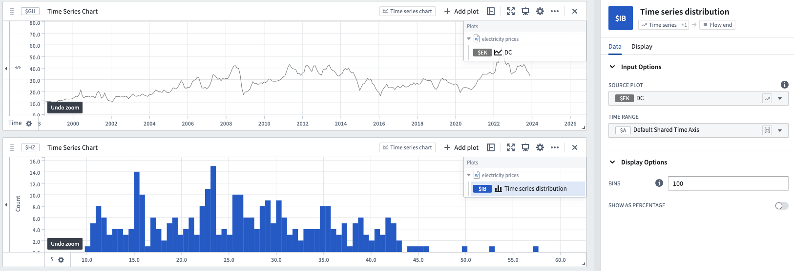

<!-- source: https://palantir.com/docs/foundry/quiver/card-time-series-distribution/ · mirrored 2026-08-22 from Palantir Foundry docs -->

# Time series distribution

Distribution charts show the aggregate counts of the y-axis value of series.

* By default, the entire time range is used, but a [time range parameter](/docs/foundry/quiver/card-datetime-range-parameter/) can be used to specify a certain time range.
* The number of bins can also be specified to change the frequency of the graph.

## Input type

Time series

## Output type

Flow end

## Examples

## Usage information

| Functionality | Availability |
| --- | --- |
| [Standard Quiver card](/docs/foundry/quiver/core-concepts/#cards) | Supported |
| [Transform table transform](/docs/foundry/quiver/cards-transform-table/) | Unsupported |
