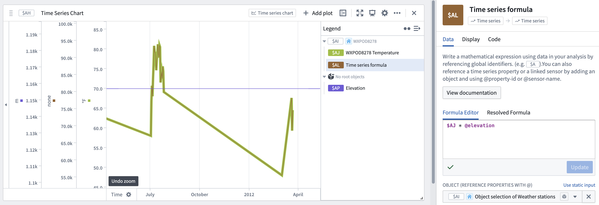

<!-- source: https://palantir.com/docs/foundry/quiver/card-time-series-formula/ · mirrored 2026-08-22 from Palantir Foundry docs -->

# Time series formula

In the formula box, use any of the assigned plot variable names to type in a mathematical formula returning a numerical value.

* Basic arithmetic operations are supported (multiplication, division, addition, or subtraction, for example), along with more complex mathematical expressions.
* Quiver’s autocomplete will suggest built-in functions along with existing series based on parameter name or series properties.
* Quiver uses a custom mathematical expression language for formulas. More details about supported expressions are available in the [formula documentation](/docs/foundry/quiver/cards-formula-syntax/).
* The Object selector is optional and must only be filled out when using the '@' symbol to reference properties.

[Learn more about how interpolation affects this operation.](/docs/foundry/quiver/cards-interpolation-usage/#time-series-formula)

## Input type

Time series

## Output type

Time series

## Examples

## Usage information

| Functionality | Availability |
| --- | --- |
| [Standard Quiver card](/docs/foundry/quiver/core-concepts/#cards) | Supported |
| [Transform table transform](/docs/foundry/quiver/cards-transform-table/) | Supported |
