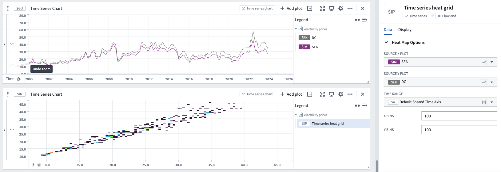

<!-- source: https://palantir.com/docs/foundry/quiver/card-time-series-heat-grid/ · mirrored 2026-08-18 from Palantir Foundry docs -->

# Time series heat grid

Heat grids display a two-dimensional aggregate value grid of two time series. Heat grids are similar to scatter plots, but instead color by the density of points appearing in the same bucket.

## Input type

Time series

## Output type

Flow end

## Examples

## Usage information

| Functionality | Availability |
| --- | --- |
| [Standard Quiver card](/docs/foundry/quiver/core-concepts/#cards) | Supported |
| [Transform table transform](/docs/foundry/quiver/cards-transform-table/) | Unsupported |

## See also

[Time series scatter plot](/docs/foundry/quiver/card-time-series-scatter-plot/)
