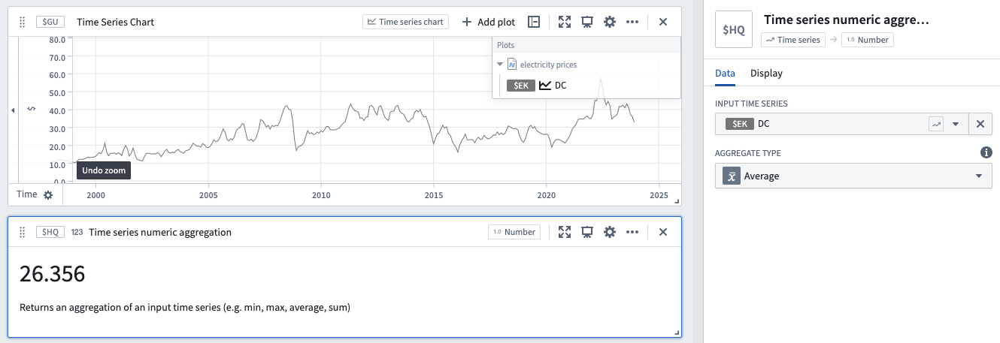

<!-- source: https://palantir.com/docs/foundry/quiver/card-time-series-numeric-aggregation/ · mirrored 2026-08-18 from Palantir Foundry docs -->

# Time series numeric aggregation

Returns a single number that represents an aggregation of an input numeric time series. To show the units of the series, use the [Time series unit card](/docs/foundry/quiver/card-time-series-unit/). To find the value of a numeric time series at a specific time, use the [Value at time card](/docs/foundry/quiver/card-value-at-time/).

The available aggregations are:

* Sum
* Average
* Standard deviation
* Maximum
* Minimum
* Relative difference
* Difference
* Product
* Count
* First point
* Last point
* Time-weighted average
* Integral

For details on the time-weighted options and their additional configuration, see [Time-weighted aggregates](/docs/foundry/quiver/timeseries-aggregations/#time-weighted-aggregates).

## Input type

Time series

## Output type

Number

## Examples

## Usage information

| Functionality | Availability |
| --- | --- |
| [Standard Quiver card](/docs/foundry/quiver/core-concepts/#cards) | Supported |
| [Transform table transform](/docs/foundry/quiver/cards-transform-table/) | Supported |

## See also

* [Rolling aggregate](/docs/foundry/quiver/card-rolling-aggregate/)
* [Value at time](/docs/foundry/quiver/card-value-at-time/)
