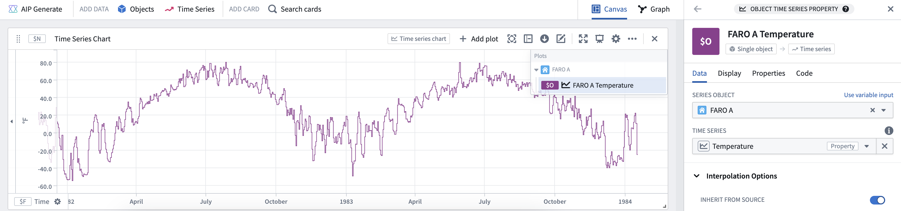
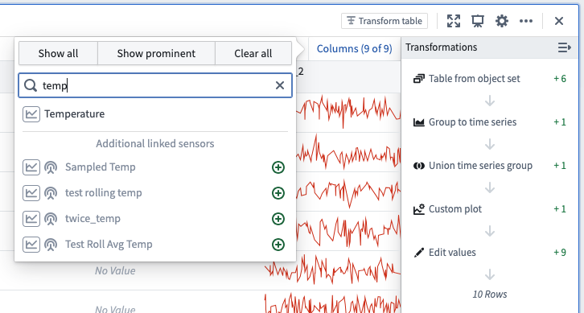

<!-- source: https://palantir.com/docs/foundry/quiver/card-time-series-property/ · mirrored 2026-08-18 from Palantir Foundry docs -->

# Time series property

Get a time series property or linked sensor associated with an object. To add a linked sensor, follow the steps below:
1\. Select a root object type (for example: `Weather Station`).
2\. Select a specific object instance (for example: `FARO A`).
3\. Select a time series property or sensor from the dropdown showing available sensors. Once a sensor is selected it is rendered as a time series plot.

## Input type

Object

## Output type

Time series

### Example

## Usage information

| Functionality | Availability |
| --- | --- |
| [Standard Quiver card](/docs/foundry/quiver/core-concepts/#cards) | Supported |
| [Transform table transform](/docs/foundry/quiver/cards-transform-table/) | Supported\* |

\* In the transform table, time series properties are added as columns by default. However, you can also use the *linked time series sensor* transform to add a time series sensor object type (a time series attached to a root object). You can also use the **Columns** button in the upper-right corner of the table to add time series properties or sensors.

