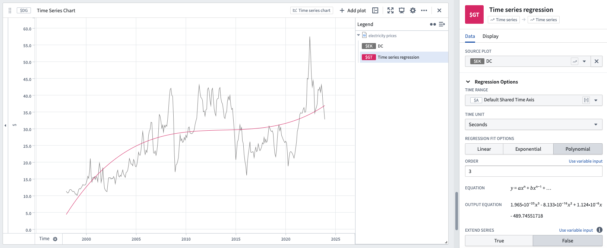

<!-- source: https://palantir.com/docs/foundry/quiver/card-time-series-regression/ · mirrored 2026-08-22 from Palantir Foundry docs -->

# Time series regression

Regression is used to view the best-fit regression line over a selected time series.

* Linear, polynomial (of degree 0-13), or exponential regression fits can be chosen.
* The [time range](/docs/foundry/quiver/timeseries-ranges/) must be configured and can reference a [time range parameter](/docs/foundry/quiver/card-datetime-range-parameter/).

## Input type

Time series

## Output type

Time series

## Examples

## Usage information

| Functionality | Availability |
| --- | --- |
| [Standard Quiver card](/docs/foundry/quiver/core-concepts/#cards) | Supported |
| [Transform table transform](/docs/foundry/quiver/cards-transform-table/) | Supported |

## See also

* [Scatter plot regression](/docs/foundry/quiver/card-scatter-plot-regression/)

* [Scatter plot regression coefficients](/docs/foundry/quiver/card-scatter-plot-regression-coefficients/)

* [Time series regression coefficients](/docs/foundry/quiver/card-time-series-regression-coefficients/)
