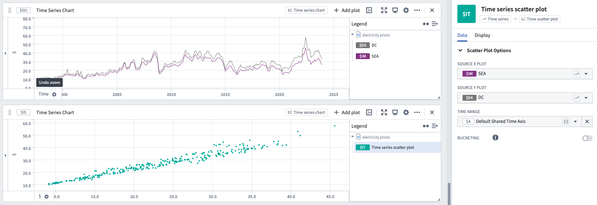

<!-- source: https://palantir.com/docs/foundry/quiver/card-time-series-scatter-plot/ · mirrored 2026-08-18 from Palantir Foundry docs -->

# Time series scatter plot

Scatter plots can be used to plot two series against each other. Points of the underlying series will automatically be aggregated (using the average value over buckets that are 1/1000 of the underlying time range) before plotting.

* Both the bucketing strategy (the number of buckets and points per bucket), and the bucket value (for example, average, sum, max) can be specified.
* The range for each series included in the cross plot is automatically set to underlying the plot zoom range, but can be modified to a manual [range](/docs/foundry/quiver/timeseries-ranges/) instead.

## Input type

Time series

## Output type

Time series scatter plot

## Examples

## Usage information

| Functionality | Availability |
| --- | --- |
| [Standard Quiver card](/docs/foundry/quiver/core-concepts/#cards) | Supported |
| [Transform table transform](/docs/foundry/quiver/cards-transform-table/) | Supported |

## See also

* [Scatter plot regression](/docs/foundry/quiver/card-scatter-plot-regression/)
* [Time series heat grid](/docs/foundry/quiver/card-time-series-heat-grid/)
