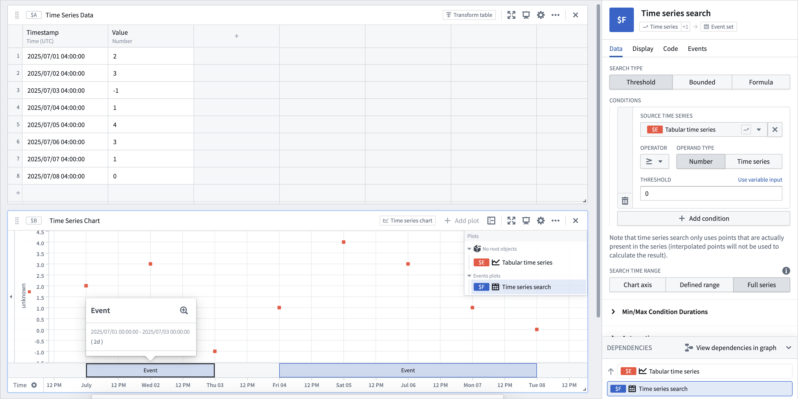
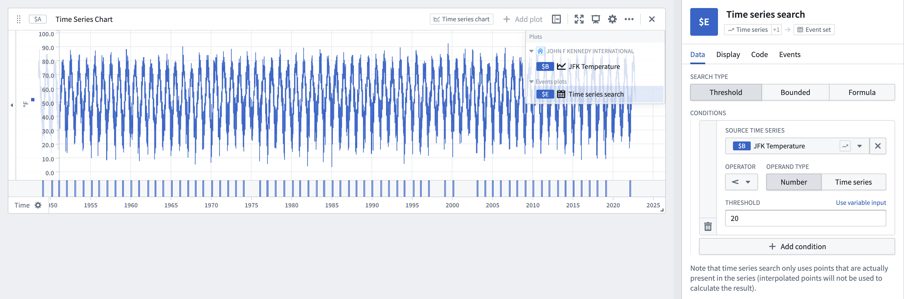
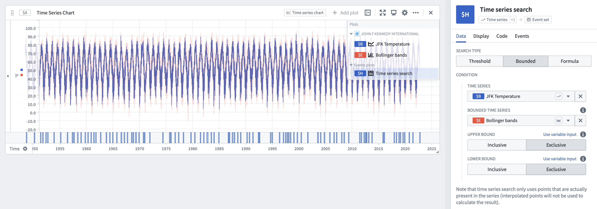
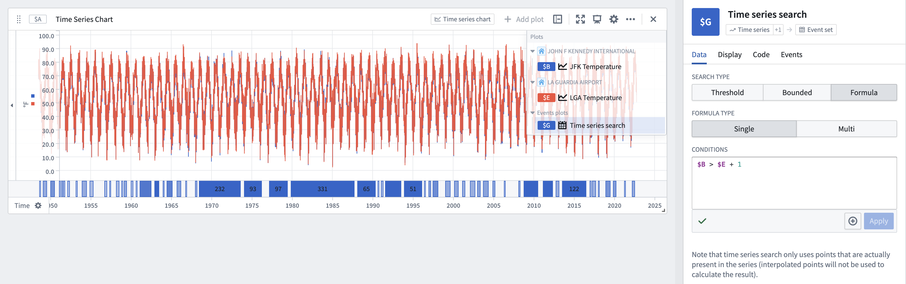

<!-- source: https://palantir.com/docs/foundry/quiver/card-time-series-search/ · mirrored 2026-08-22 from Palantir Foundry docs -->

# Time series search

Visually display when certain conditions are met on one or more time series plots; for example, when a series exceeds value 100 and another series hits a specified threshold. Time series search returns an event set containing one event for each time interval that satisfies the specified conditions. This event set is displayed as an *events plot* and can be [analyzed further](/docs/foundry/quiver/timeseries-analyze-events-data/) in Quiver.

The search works by scanning through the input time series one point at a time to find intervals where the data matches the search conditions. An event starts ("opens") when a point meets these conditions and continues as long as each subsequent point also satisfies them. The event ends ("closes") if a point no longer meets the conditions, or when the time series ends. Note that the point that closes the event is not part of the event, unless it is the very last point in the series and it satisfies the search conditions.

You can optionally set a minimum or maximum condition so that the search only matches events that are longer or shorter than a specified duration. For example, you can find only events that are `longer than one hour` or `shorter than one day`.

## Search types

### Threshold

The default search type. Generates events when the source time series meets specified threshold criteria.

* Allows selecting a numeric or enum time series as the **Source Time Series**. For numeric time series, supports greater than (`>`), greater than or equal to (`>=`), less than (`<`), less than or equal to (`<=`), equal to (`=`), and not equal to (`!=`) operators; for enum time series, supports equal to (`=`) and not equal to (`!=`) operators.
* Provides the ability to compare the source time series against another time series by changing the operand type to `Time series`.
* Optionally add multiple threshold conditions with the **Add condition** button. Values that match all conditions will be included by default. Change the search to match *any* condition by switching the **Join type** from `AND` to `OR`.

### Bounded

Compare a time series against a *bounded time series* and find periods where the time series is outside the bounds of the bounded time series. By default, an event is not generated when the time series equals the upper or lower bound of the bounded time series. You can configure this behavior for each bound manually or control it using a boolean parameter. The bounded search type does not support enum time series.

### Formula

Flexibly represent your search logic using a formula. The formula should return a Boolean value, and an event will be created for every time interval in which this Boolean value is true.

* Run a single search or multiple searches:
  * **Single:** Performs a search on one or more time series plots referenced in the formula.
  * **Multi:** Performs a search across each row of a transform table (limited to 1,000 rows). Search properties in the table using `@property` syntax. Returns one event for each time interval that satisfies the specified conditions.
* Optionally set multiple search conditions by selecting **+** next to **Apply**. Values that match all conditions will be included by default. Change the search to match *any* condition by switching the **Join type** from `AND` to `OR`.
* Reference any time series plot or parameters in your analysis when writing the formula in the **Conditions** text box (for example, `$AN < 5 && $W = $X`).

## Interpolation

[Learn more about how interpolation affects this operation.](/docs/foundry/quiver/cards-interpolation-usage/#time-series-search)

## Performance considerations

When working with large time series datasets, the search operation may take longer to complete. Searching the full extent of the input plots can negatively affect performance for large series. To improve performance, set **Search time range** in the card configuration to one of the following options instead of **Full data range**:

* **Chart axis:** Synchronizes the search range with the axis on which the time series search plot is displayed.
* **Defined range:** Sets the search range to a static range or a variable.

## Alerting

The events identified through time series search can be saved as objects in the Ontology using [time series alerting](/docs/foundry/time-series/alerting-overview/). This allows you to track and monitor specific conditions of interest across your time series data.

## Input type

Time series, bounded time series, transform table

## Output type

Event set

## Usage information

| Functionality | Availability |
| --- | --- |
| [Standard Quiver card](/docs/foundry/quiver/core-concepts/#cards) | Supported |
| [Transform table transform](/docs/foundry/quiver/cards-transform-table/) | Unsupported |
