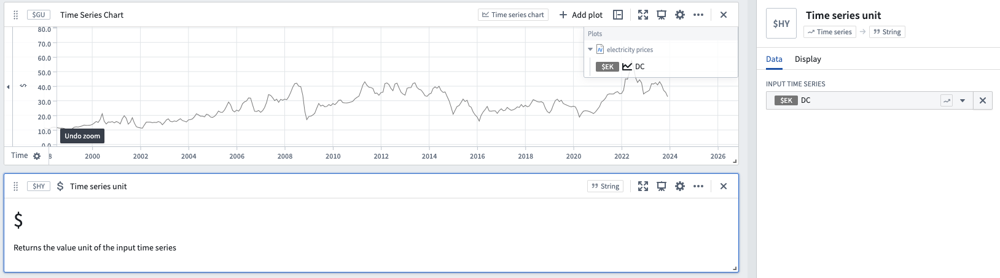

<!-- source: https://palantir.com/docs/foundry/quiver/card-time-series-unit/ · mirrored 2026-08-22 from Palantir Foundry docs -->

# Time series unit

Returns the value unit of the input time series.

## Input type

Time series

## Output type

String

## Examples

## Usage information

| Functionality | Availability |
| --- | --- |
| [Standard Quiver card](/docs/foundry/quiver/core-concepts/#cards) | Supported |
| [Transform table transform](/docs/foundry/quiver/cards-transform-table/) | Supported |
