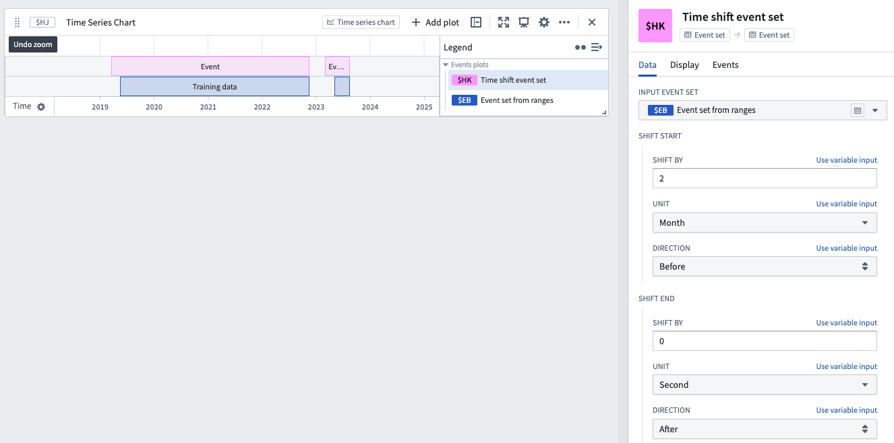

<!-- source: https://palantir.com/docs/foundry/quiver/card-time-shift-event-set/ · mirrored 2026-08-18 from Palantir Foundry docs -->

# Time shift event set

Modify an existing event set by shifting the start and end timestamps forwards or backwards by a duration.

## Input type

Event set

## Output type

Event set

## Examples

## Usage information

| Functionality | Availability |
| --- | --- |
| [Standard Quiver card](/docs/foundry/quiver/core-concepts/#cards) | Supported |
| [Transform table transform](/docs/foundry/quiver/cards-transform-table/) | Unsupported |

## See also

* [Shift time series](/docs/foundry/quiver/card-shift-time-series/)
