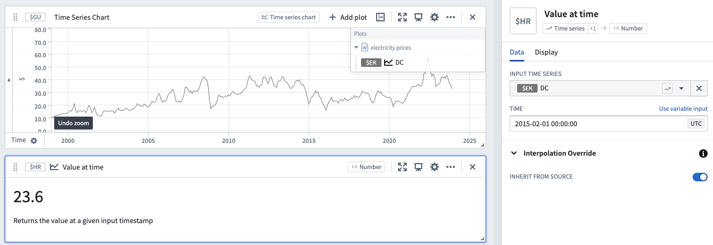

<!-- source: https://palantir.com/docs/foundry/quiver/card-value-at-time/ · mirrored 2026-08-18 from Palantir Foundry docs -->

# Value at time

Returns the value of an input numeric time series at a given input timestamp. If your time series values are strings, you must use the [Enum value at time card](/docs/foundry/quiver/card-enum-value-at-time/). If you would like to return the first or last value of a numeric time series, you should use the [Time series numeric aggregation card](/docs/foundry/quiver/card-time-series-numeric-aggregation/). To show the units of the series, use the [Time series unit card](/docs/foundry/quiver/card-time-series-unit/).

[Learn more about how interpolation affects this operation.](/docs/foundry/quiver/cards-interpolation-usage/#value-at-time)

## Input type

Time series

## Output type

Number

## Examples

## Usage information

| Functionality | Availability |
| --- | --- |
| [Standard Quiver card](/docs/foundry/quiver/core-concepts/#cards) | Supported |
| [Transform table transform](/docs/foundry/quiver/cards-transform-table/) | Supported |

## See also

* [Enum value at time](/docs/foundry/quiver/card-enum-value-at-time/)
* [Latest value for enum time series](/docs/foundry/quiver/card-latest-value-for-enum-time-series/)
* [Time series numeric aggregation](/docs/foundry/quiver/card-time-series-numeric-aggregation/)
* [Time series unit](/docs/foundry/quiver/card-time-series-unit/)
