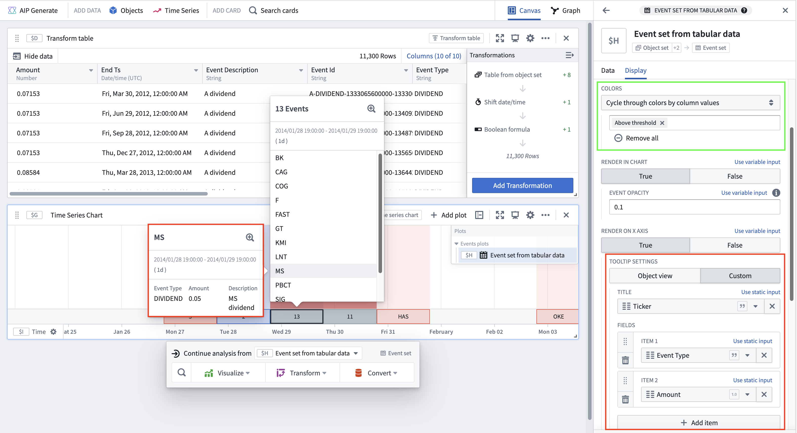

<!-- source: https://palantir.com/docs/foundry/quiver/cards-index-event-sets/ · mirrored 2026-08-18 from Palantir Foundry docs -->

# Event set cards

Back to: [Index of cards](/docs/foundry/quiver/cards-index/)

Cards in this section are used to visualize and analyze events in bulk. An *event* consists of a start and end timestamp, similar to a [time range](/docs/foundry/quiver/timeseries-ranges/), but can also be enriched with other data to support analysis. To learn more about common events-based workflows, see the [Analyze events data](/docs/foundry/quiver/timeseries-analyze-events-data/) page.

:::callout{theme="neutral"}
It is no longer required to configure an object set with event capabilities in [Ontology Manager](/docs/foundry/ontology-manager/overview/) for event visualizations. Any object set with a timestamp property can be converted to an event set using the [event set from tabular data](/docs/foundry/quiver/card-event-set-from-tabular-data/) card.
:::

The following cards accept an event set and return an event set:

* [Time shift event set](/docs/foundry/quiver/card-time-shift-event-set/)
* [Deduplicate event set](/docs/foundry/quiver/card-deduplicate-event-set/)

The following cards accept time ranges and return an event set:

* [Event set from ranges](/docs/foundry/quiver/card-event-set-from-ranges/)

The following cards accept a table and return an event set:

* [Event set from tabular data](/docs/foundry/quiver/card-event-set-from-tabular-data/)

The following cards accept a time series and return an event set:

* [Linked event set](/docs/foundry/quiver/card-linked-event-set/) - this card also accepts an object as an input
* [Time series search](/docs/foundry/quiver/card-time-series-search/)

The following are available visualizations for events:

* [Events plots](#events-plots)
* [Events timeline](#events-timeline)

## Events plots

Every event set is visualized using an *Events plot*, which plots events on a time axis at the bottom of the chart. This feature can help to contextualize a time series plot or correlate events with observed phenomenon in the time series.

* Hovering over each event will show the details of that event. You can configure what details to display for each event through the **Tooltip settings**.
* Events are grouped based on the zoom level of the chart. Hovering over an event group shows a list of events in that group.
* The input data must have a date or timestamp property or column for it to be plottable as multiple events.

Event sets and events plots are backed by [transform tables](/docs/foundry/quiver/cards-transform-table/), where each row is treated as a single event. The backing transform table can be accessed through the [next actions menu](/docs/foundry/quiver/analysis-toolbars/#next-actions-menu) of the event set by selecting **Convert > New transform table**. You can use the backing transform table to modify or enrich the underlying event data. For example, you may want to compute a color label column for each event. You can then use the column to color code in the **Colors** settings under **Event Options** in the **Display** tab of the Editor panel.

### Display options

From the **Display** tab of any events plot configuration, you can control how events are rendered on the chart, including the color, opacity, tooltip content, and location. Most settings can be applied at the individual event level by selecting an event column to supply the value, allowing for granular customization.

* **Time series chart visibility:** Quickly toggle the event set onto multiple time series charts to maintain context across visualizations. This is especially useful when comparing different time series over the same set of events. Note that as an events plot is only present on one time series chart, toggling it off of that chart will remove the plot from your analysis. [Learn more](/docs/foundry/quiver/timeseries-ranges/#use-the-same-range-with-multiple-charts).
* **Colors:** Configure how the color for each event is determined.
  * **Select color**
    * **Single:** Apply one color to all events in the event set.
    * **Variable:** Use a property or column of the event set to supply the color for each event (represented by a hexadecimal color string).
  * **Cycle through colors by column value:** Assign a different color for each value of a chosen property or column; colors are automatically assigned.
* **Render in chart:** Display events as highlights on the chart, with customizable opacity to control the visual prominence of events.
* **Render on X axis:** Show an events axis and customizable tooltips for each event on-hover. All tooltips show the event range and duration. The following tooltip options are available:
  * **Object view:** Display the title and prominent properties of the object, as configured in the Ontology. This option is only supported if the event set is based on an object set or includes an object column.
  * **Custom:** Select from the event set's columns to define the title and description for the event tooltip. Additional fields can be shown, along with event range and duration.

## Events timeline

View an object set of events through time, segmented into categories if desired.

Does not support transform tables and only takes in [an object set](/docs/foundry/quiver/analysis-data-model/#list-of-input-and-output-types) as input. Consider using [Vega plots](/docs/foundry/quiver/cards-vega-plot/) as an alternative visualization for an events timeline.

:::callout{theme="warning"}
The events timeline chart only supports coloring if the number of events does not exceed the configured single event threshold. To adjust the event threshold, navigate to the **Data** tab and adjust the number in the **Single event threshold** field. Note that raising the threshold number may impact performance.

Alternatively, you can zoom in to a selected time frame to reduce the number of events in the chart view.
:::
