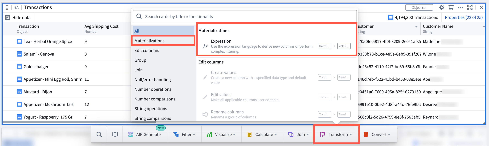
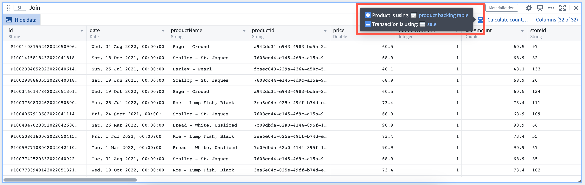

<!-- source: https://palantir.com/docs/foundry/quiver/cards-index-materializations/ · mirrored 2026-08-22 from Palantir Foundry docs -->

# Materializations cards

Back to: [Index of cards](/docs/foundry/quiver/cards-index/)

Cards in this section support the analysis of Ontology [materializations](/docs/foundry/object-edits/materializations/).

[Materialization](/docs/foundry/object-edits/materializations/) is a [data type](/docs/foundry/quiver/analysis-data-model/#list-of-input-and-output-types) in Quiver that provides a way to transform, visualize and analyze Ontology data at scale, with the capacity to surpass the 50k row constraint on data joins and transformations present in transform tables.

Specifically, Materializations cards allow you to:

* Perform joins (left/right/inner/full) on objects data
* Derive new columns, filter, or aggregate objects data
* Plot data using [categorical charts](/docs/foundry/quiver/cards-index-charts/)
* Convert to a transform table and use [Vega plots](/docs/foundry/quiver/cards-vega-plot/)

Use Materializations cards for large-scale analyses that take object sets as inputs, letting Quiver convert object sets seamlessly behind-the-scenes. From an object set, use any of the cards located under the **Materializations** next actions, or perform an explicit conversion with the Object set materialization card.

To find out which backing dataset primitives are powering a Materializations card, simply hover over the datasource icon.

The following cards are available:

* [Expression](/docs/foundry/quiver/card-expression/)
* [Filter materialization](/docs/foundry/quiver/card-filter-materialization/)
* [Join materializations](/docs/foundry/quiver/card-join-materializations/)
* [Materialization SQL](/docs/foundry/quiver/card-materialization-sql/)
* [Numeric aggregation (materialization)](/docs/foundry/quiver/card-numeric-aggregation-materialization/)
* [Object set materialization](/docs/foundry/quiver/card-object-set-materialization/)
* [Set math (materialization)](/docs/foundry/quiver/card-set-math-materialization/)
* [Unique column values (materialization)](/docs/foundry/quiver/card-unique-column-values-materialization/)
* [Categorical plot from materialization](/docs/foundry/quiver/card-categorical-plot-materialization/)
