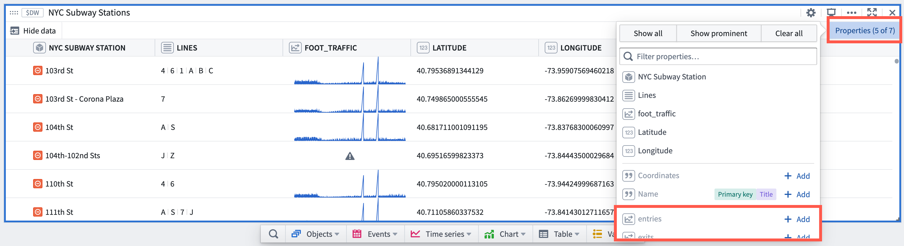
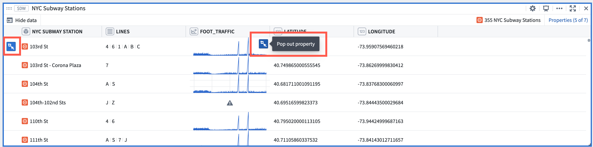

<!-- source: https://palantir.com/docs/foundry/quiver/cards-index-objects/ · mirrored 2026-08-18 from Palantir Foundry docs -->

# Objects cards

Back to: [Index of cards](/docs/foundry/quiver/cards-index/)

The following cards return object sets:

* [Code function object set](/docs/foundry/quiver/card-code-function-object-set/)
* [Cross filter](/docs/foundry/quiver/card-cross-filter/)
* [Defined by property](/docs/foundry/quiver/card-defined-by-property/)
* [Filter object set](/docs/foundry/quiver/card-filter-object-set/)
* [Import saved object set](/docs/foundry/quiver/card-import-saved-object-set/)
* [Set math](/docs/foundry/quiver/card-set-math/)
* [Status filter](/docs/foundry/quiver/card-status-filter/)
* [Switch to linked object set](/docs/foundry/quiver/card-switch-to-linked-object-set/)

The following cards return a single object:

* [Backing object from time series](/docs/foundry/quiver/card-backing-object-from-time-series/)
* [Object selector](/docs/foundry/quiver/card-object-selector/)
* [Object view](/docs/foundry/quiver/card-object-view/)

The following cards accept single objects as input and output object properties:

* [Object property](/docs/foundry/quiver/card-object-property/)
* [Time series property](/docs/foundry/quiver/card-time-series-property/)

Select the **Show data** and **Hide data** buttons to switch between the results view and the card configuration view.

Learn more about [adding data](/docs/foundry/quiver/getting-started/) to Quiver.

### Browsing object set properties and linked sensors

Object properties and available [linked sensors](/docs/foundry/quiver/timeseries-overview/#adding-a-time-series-property) can be added and removed directly from the card header by selecting **Properties** from the top right corner. This simplifies the discovery of time series data stored on the object as a time series property or on linked objects as sensors. Adding or removing properties will add or remove columns from the object set card table view.

Object set rows (individual objects in the object set) can be popped out as **object view** cards, and all properties values (cells in the table) can be popped out as either a time series plot or an [object property](/docs/foundry/quiver/card-object-property/) (metric) card. This pop out action shortens the process to drill down from an object set of many objects to a specific time series plot or property metric on a single object.

