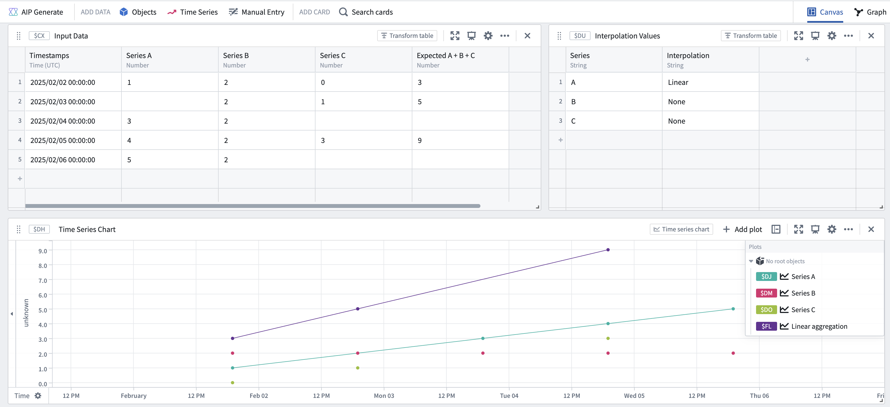
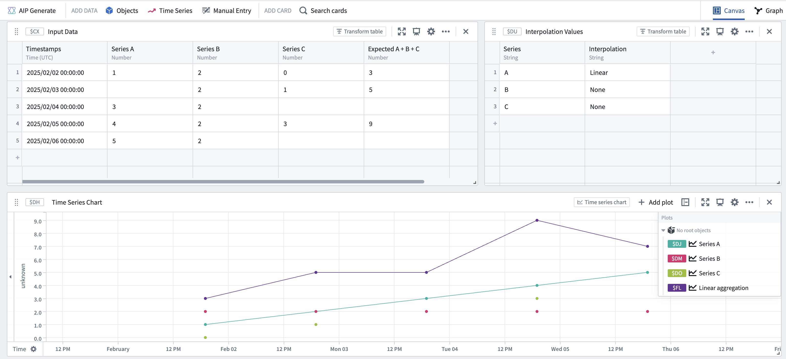
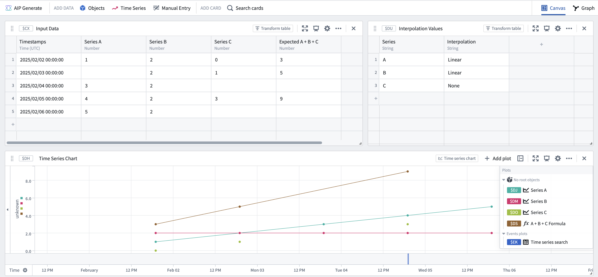
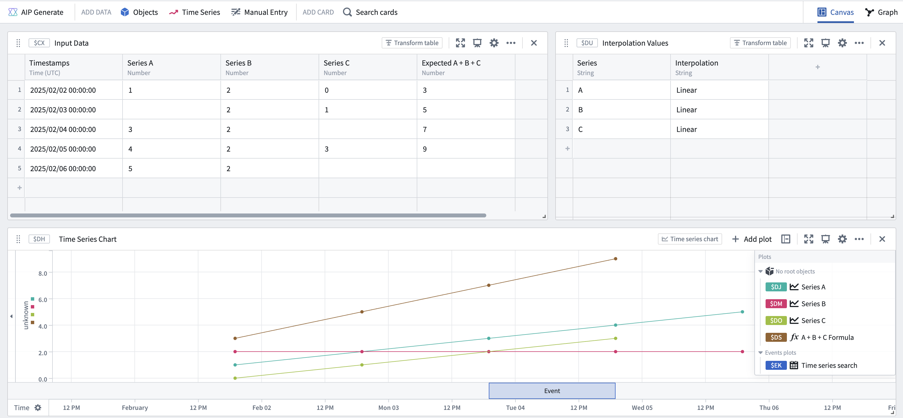

<!-- source: https://palantir.com/docs/foundry/quiver/cards-interpolation-usage/ · mirrored 2026-08-18 from Palantir Foundry docs -->

# Interpolation in Quiver

This guide explains how interpolation is used by time-series-related cards in Quiver. For general information on interpolation and its use in time series, see this [overview](/docs/foundry/time-series/interpolation-overview/).

## Interpolation in Quiver cards

In Quiver, interpolation settings can be applied on each time series card. Cards can either explicitly define an interpolation setting or "inherit from source", meaning that the card will derive an interpolation setting from its inputs. For time series properties loaded from the Ontology, cards that "inherit from source" will use an interpolation based on the [formatting settings](/docs/foundry/time-series/time-series-properties/#time-series-formatting). For other data transformations, cards that "inherit from source" will use the interpolation defined in their input plot.

The available interpolation strategies include:

**Before:** Choose the strategy that Quiver uses to interpolate (infer) the value of a series *before the first data point*.

* **Nearest:** Use the value of the nearest point. This option yields a stepped line.
* **None:** Do not interpolate this series. This option yields discrete points.

**Internal:** Choose the strategy that Quiver uses to interpolate (infer) the value of a series *between data points*.

* **Linear:** Fit a straight line between the two nearest points. This option yields an angled line and is available for numeric time series, but not categorical/enum time series.
* **Nearest:** Use the value of the nearest point. This option yields a stepped line.
* **Next:** Use the value of the next point. This option yields a stepped line.
* **Previous:** Use the value of the previous point. This option yields a stepped line.
* **None:** Do not interpolate this series. This option yields discrete points.

**After:** Choose the strategy that Quiver uses to interpolate (infer) the value of a series *after the last data point*.

* **Nearest:** Use the value of the nearest point. This option yields a stepped line.
* **None:** Do not interpolate this series. This option yields discrete points.

## How interpolation affects data transformations

When combining multiple series, the points that are used to build the output series are dependent on the respective interpolations of the input series. Refer to the interpolation [documentation](/docs/foundry/time-series/interpolation-overview/#the-role-of-interpolation-in-time-series-calculations) for more information on how the output series are computed.

## How interpolation affects data visualization

Quiver also uses interpolation as a visual tool for displaying time series data. The shape of the time series line between any two points can be changed by the [internal interpolation](/docs/foundry/time-series/interpolation-overview/#types-of-interpolation) setting. Additionally, the **Show interpolation line** setting in the [analysis settings](/docs/foundry/quiver/analysis-settings/#time-series-axes-and-legends) can be used to show a line before the first point or after the last point if the external interpolation (before or after setting) is not `NONE` for that series.

:::callout{theme="warning"}
The visual representation of interpolation may not be representative of the underlying data transformation. See the [time series search](#time-series-search) section below for an example.
:::

## Quiver cards that use interpolation for data transformation

The following Quiver cards use interpolation to compute the output of the card:

* [Value at time](#value-at-time)
* [Time series formula](#time-series-formula)
* [Filter time series](#filter-time-series)
* [Linear aggregation](#linear-aggregation)
* [Time series search](#time-series-search)
* [Sample](#sample)
* [Combine time series](#combine-time-series)

### Value at time

Both the **Value at time** and the **Enum value at time** cards use interpolation to retrieve the value of a series at a specified time. If the series does not have a data point at the queried timestamp, the card generates a value using the chosen interpolation method on the closest data points before and after the queried timestamp. You can also specify a specific interpolation strategy to use instead of using the source plot's interpolation.

### Time series formula

The **Time series formula** card only uses interpolation when joining multiple series together. For example, if you have a formula such as `$E + $F`, where `$E` and `$F` are two time series that may not share all of the same points, then interpolation settings will determine the set of points over which the output series is calculated. If any of the time series do not have interpolation defined, the output series will include all points at the intersection of all series with no interpolation. Otherwise, if all the series have interpolation defined, the output series will have values at any point which is present in any of the input series.

### Filter time series

Interpolation is only used in the **Filter time series** card when joining multiple series together (similar to the [time series formula](#time-series-formula) card). If you have a condition such as `$E + $F > 100`, the **Filter time series** card will first use interpolation to combine the two series before applying the `> 100` condition to the combined series.

If you have a condition such as `$E > 10 && $F > 100`, the **Filter time series** card will use the interpolation of each series to determine which timestamps to evaluate the condition over. For instance, if `E` has no interpolation set, but `F` has a defined interpolation, then the card would only evaluate the condition `$E > 10 && $F > 100` at timestamps where `E` contains a value and display the output accordingly.

To summarize, the output series depends on the interpolation settings of the input series.

### Linear aggregation

The **Linear aggregation** card uses interpolation when joining together multiple series to perform the specified aggregation. If one or more series do not have interpolation defined, then the linear aggregation may create partial aggregates. A partial aggregate is a timestamp in which some series do not contain a value, due to a lack of overlapping points and no defined interpolation.

You can configure whether you want to keep these partial aggregates in the output series using the **Include partial aggregates** in the card's editor.
For example, assume you have three time series `A`, `B`, and `C`, in which `B` and `C` have no interpolation and series `A` uses linear interpolation.

| Timestamps | Series A | Series B | Series C | Expected A + B + C |
|---|---|---|---|---|
| 2025/02/02 00:00:00 | 1 | 2 | 0 | 3 |
| 2025/02/03 00:00:00 |  | 2 | 1 | 5 |
| 2025/02/04 00:00:00 | 3 | 2 |  |  |
| 2025/02/05 00:00:00 | 4 | 2 | 3 | 9 |
| 2025/02/06 00:00:00 | 5 | 2 |   |   |

If you perform a linear aggregation sum of the three series when **Include partial aggregates** is off, you would see the following:

The resulting series in the screenshot above is equivalent to the time series formula of `A + B + C`, where points only exist at the intersection of the two series (`B` and `C`) which have no interpolation defined. If you perform a linear aggregation sum of the three series when "Include partial aggregates" is on, you would see the following:

Specifically, the screenshot above shows that the resulting series has points at every timestamp present in *any* of the input series. The value at each timestamp is computed using the value in each series at that point (if it exists) or the interpolated value at that timestamp (if interpolation is set for that series).

### Time series search

The **Time series search** card uses interpolation to combine multiple series together. For example, if your search formula contains `$E > 50 && $F > 50` then the **Time series search** card would use interpolation to compute what events satisfy the combined condition. This is similar to how the [time series formula](#time-series-formula) and [time series filter](#filter-time-series) cards behave.

Although the visualization of the combined series may suggest that the condition was met at an earlier timestamp, the start and end of events identified by the search are determined solely by timestamps that exist in the combined series.

For example, assume you have three time series `A`, `B`, and `C`, in which series `A` and `B` use linear interpolation and series `C` has no interpolation.

| Timestamps | Series A | Series B | Series C | Expected A + B + C |
|---|---|---|---|---|
| 2025/02/02 00:00:00 | 1 | 2 | 0 | 3 |
| 2025/02/03 00:00:00 |  | 2 | 1 | 5 |
| 2025/02/04 00:00:00 | 3 | 2 |  |  |
| 2025/02/05 00:00:00 | 4 | 2 | 3 | 9 |
| 2025/02/06 00:00:00 | 5 | 2 |   |   |

If you want to search for points when the sum of the three series is `>= 6`, your search would look as follows:

Although visually, the combined series "crosses" the threshold of 6 much earlier than the resulting event start, the event starts from the first actual point in the combined series that satisfies the condition. That point also happens to be the end of the event, because there are no more points after in the combined series. In contrast, if you have interpolation on series `C` as well, you would get the following result:

Again, the combined series seems to visually "cross" earlier, but the event actually starts at the first point which matches the condition.

### Sample

The **Sample** card transforms an input series into an output series by resampling it at a specified frequency. To achieve this, the operation uses the interpolation setting of the input series to fill any gaps and maintain the desired frequency.

For example:

| Timestamps | Input Series | Output series using `LINEAR` interpolation | Output series using `PREVIOUS` interpolation  |
|---|---|---|---|
| 2025/02/02 00:00:00 | 1 | 1 | 1 |
| 2025/02/02 01:00:00 |  | 2 | 1 |
| 2025/02/02 02:00:00 |  | 3 | 1 |
| 2025/02/02 03:00:00 | 4 | 4 | 4 |
| 2025/02/02 04:00:00 | 5 | 5 | 5 |

### Combine time series

The **Combine time series** card is the only card which does *not* use interpolation when joining series together. For each timestamp, the **Combine time series** card combines the data for any series which actually contain a data point at that timestamp. Additionally, the "inherit from source" interpolation option will apply the interpolation of the first time series in your union to the output of this card.
