<!-- source: https://palantir.com/docs/foundry/quiver/cards-transform-table/ · mirrored 2026-08-22 from Palantir Foundry docs -->

# Transform tables

**Transform tables** are a container to operate batch analysis of objects or of tabular data derived from objects. A transform table allows users to derive columns based on the properties of input objects (including time series) and provides joining and grouping functionality for object data.

Due to the computational intensity of these operations, **a maximum of 50,000 rows are allowed** in a transform table.

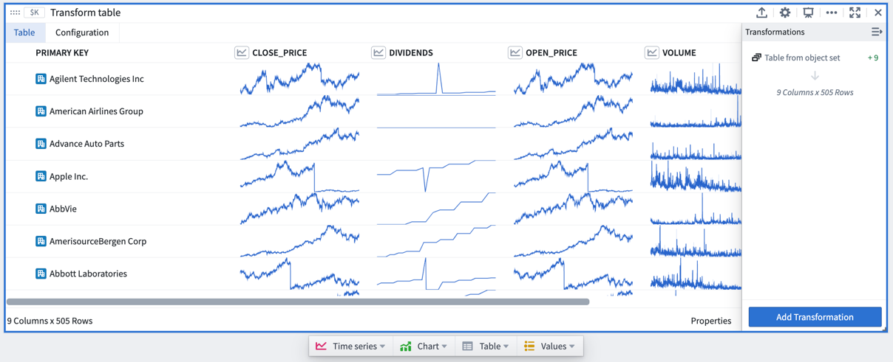

Transform tables allow you to:

* *Join and aggregate* objects;
* *Derive new columns* from object properties;
* *Enrich data* by creating or editing values;
* *Perform transformations on time series* columns in batch; and
* *Plot the outputs* of your operations in a variety of ways.

## Add a transformation

The transform table search window, accessible in a transform table through the **Add Transformation** button, shows all available transformations grouped by *transform action type*, such as edit columns, filter, time series operations, or null/error handling. While most transformations will add new columns of their respective type, some will change the shape of the table (for example, when joining other object types or grouping the table into categories to aggregate the rows).

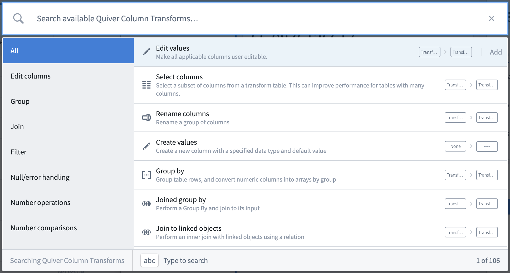

Transform tables transforms can also be added directly from the [next actions menu](/docs/foundry/quiver/analysis-toolbars/#next-actions-menu) by selecting the **Transform** category and a transform. This action will add a transform table card to the analysis with the selected transform applied to the table.

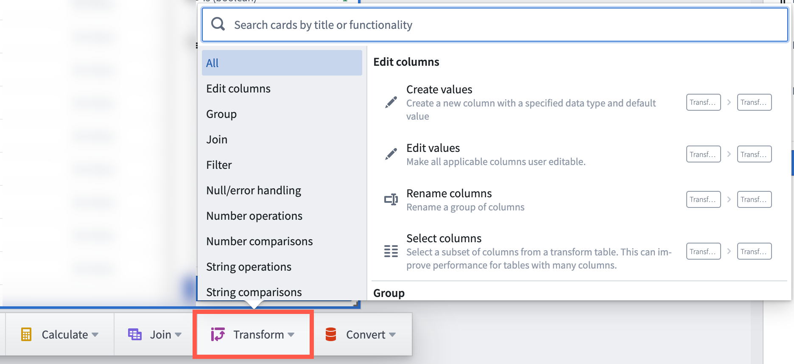

Transforms can also be applied on a single [supported input](/docs/foundry/quiver/analysis-data-model/) outside of a transform table, operating once on that value only rather than as a batch operation in a table.

To add a transform card to the analysis, simply search for it using the [search window](/docs/foundry/quiver/analysis-toolbars/#search-bar) available at the top menu bar.

## Transform table inputs

A transform table can take in various types of inputs, including object sets, categorical charts, time series charts, time series plots, materializations, pivot tables, and other transform tables. Users can also manually input data to construct a transform table.

To add a transform table to your analysis, select **Transform table** in the top **Tables** menu. This will open the editor panel, where you can select existing inputs that are eligible for your analysis.

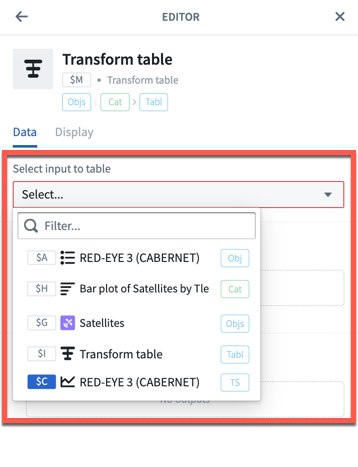

### Input: Object sets

Object sets are the most common input to a transform table.

You can create a transform table from any object set in your analysis from the **Next Actions** menu by selecting **Convert > Transform table**.

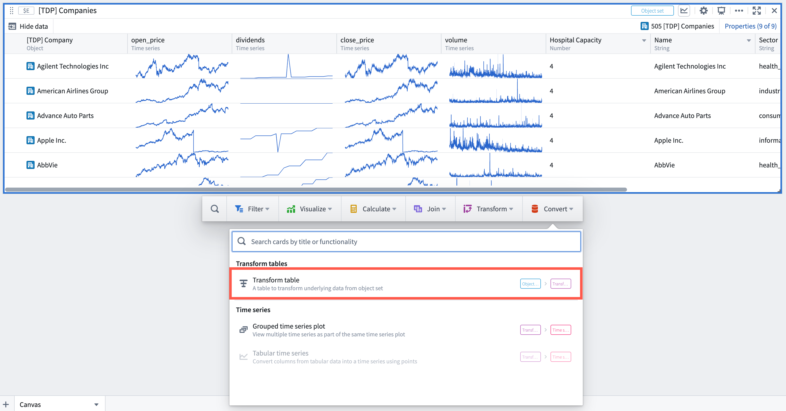

Note that there is a **limit of 50,000 rows per transform table** (whether from starting or from joining), so you will only be able to create transform tables with fewer than 50,000 objects.

When a transform table is created from an object set, it will have one row per object in the set, a Primary Key column representing each object’s unique ID, and columns for each of the *prominent* properties of the object (as defined in the Ontology), or, if there are no prominent properties, the first properties on the object (up to 20).

Add or remove property columns, as well as any linked sensor objects to the object set, by clicking the **Properties** button on the bottom right corner of the table. Drag the columns to reorder them in the table.

You can set different column configurations for each transformation step of the transform table. Learn more about [formatting a transform table](#formatting-a-transform-table) in the section below.

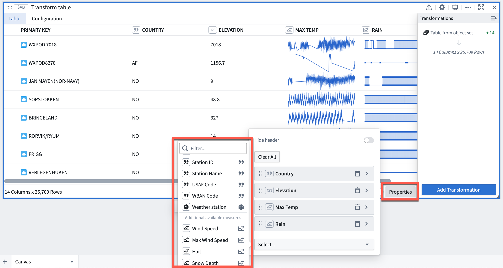

### Input: Categorical charts

Bar, line, and scatter plots can all be inputs to a transform table. Using these inputs will show the categories and values on your chart and will not pull in the underlying data. To pull in underlying data, you should use the object set from which you created the chart. You can create a transform table from a categorical chart by selecting the chart, clicking the **Next Actions** menu, then selecting  **Table > Transform table**.

### Input: Time series plots

Time series plots can be an input to the table, converting the time series data into tabular format where it can be manipulated, edited, or enriched.

To create a transform table from a time series plot, select a specific time series plot from the chart. Then, select **Table** > **Transform table** in the **Next Actions** menu at the bottom of the time series chart.

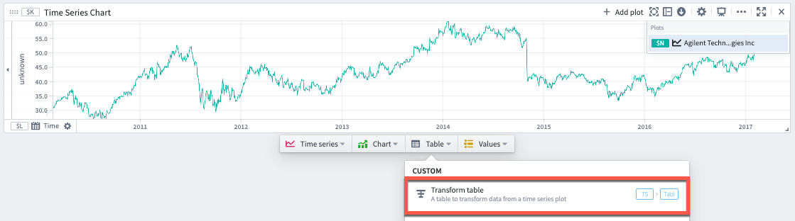

Then, select from the available **Range Options** in the transform editor panel:

* Use the full time range of the input time series (default).
* Specify a time range to import, which could be done by either manually entering the start and end timestamps or by referencing a range parameter.

Transform tables are limited to 50,000 rows for performance reasons; the transform table pulls data into the frontend for operation, rather than pushing data to a backend service. Therefore, the time series data may need to be sampled (bucketed) to fit.

You can select how to convert the time series data into tabular format in the **Data Options**:

* In the 'Sampled' setting, the table will show for each bucket the boundary timestamps and values (earliest and latest, and smallest and largest), the mean value, and point count. You can adjust the number of sampling buckets.
* In the 'Unsampled' setting, the table will show the raw unsampled data ('tick data') and have three columns: primary key, timestamp, and value.

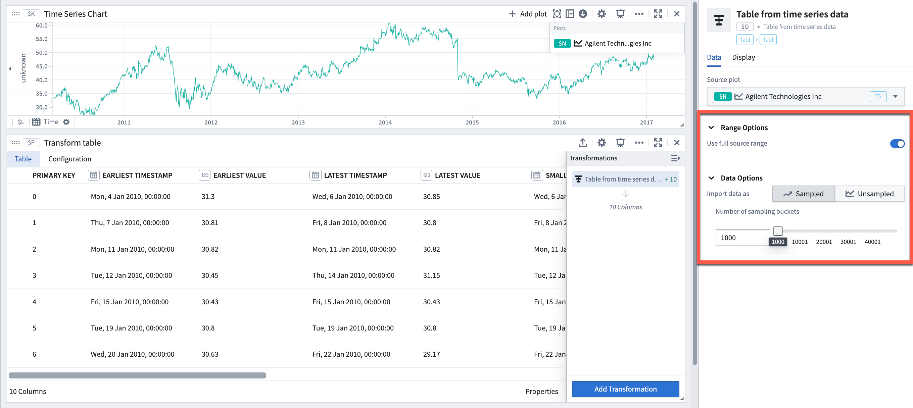

The timestamp series data will show in UTC by default. The timestamp timezone can be changed to the user's timezone or a different static timezone in the column setting of the transform table editor.

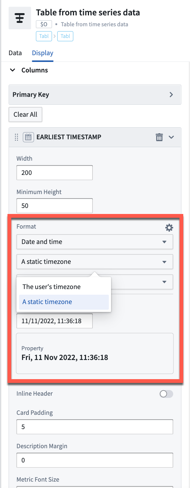

### Input: Time series charts

Time series charts can be an input to the table, opening each time series plot in the chart as one row in the table.

To create a transform table from a time series chart, select the time series chart (rather than a specific time series plot). Then, select **Table** > **Table from chart's time series** in the **Next Actions** menu at the bottom of the time series chart.

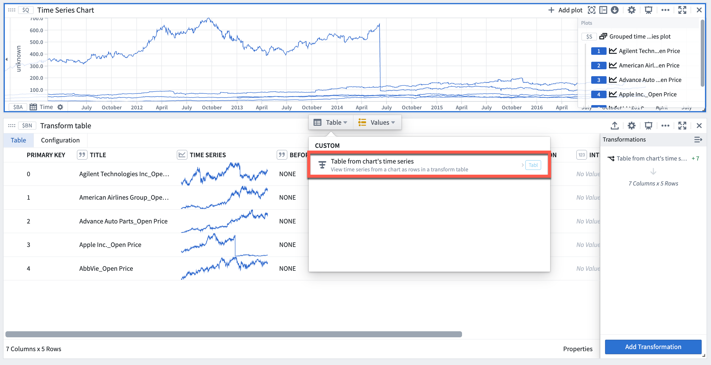

### Input: Pivot Tables and other transform tables

Pivoted data can be an input to the transform table, enabling you to use formulas to operate on pivot table columns. As with charts, creating a transform table from a pivot table will not bring in its input data, but rather the pivoted data itself.
A transform table can also be an input for a transform table. This is useful in cases where you want to split transformation logic into "blocks" of logic steps, or to separate data transformation and data formatting.
You can create a transform table from another table by selecting **Table** in the **Next Actions** menu at the bottom of the table card.

### Input: Manual entry transform tables

Users can manually enter up to 5,000 rows of data to create a new transform table. The manual entry transform table card has a spreadsheet-like user interface and supports five data types: string, number, boolean, time, and [time series](/docs/foundry/quiver/timeseries-overview/). Users can interact with and apply operations on manual entry transform tables the same way as other transform tables.

To add a new manual entry transform table to a Quiver canvas, select **Manual Entry** in the analysis header or search for the table in the **Search cards** dialog.

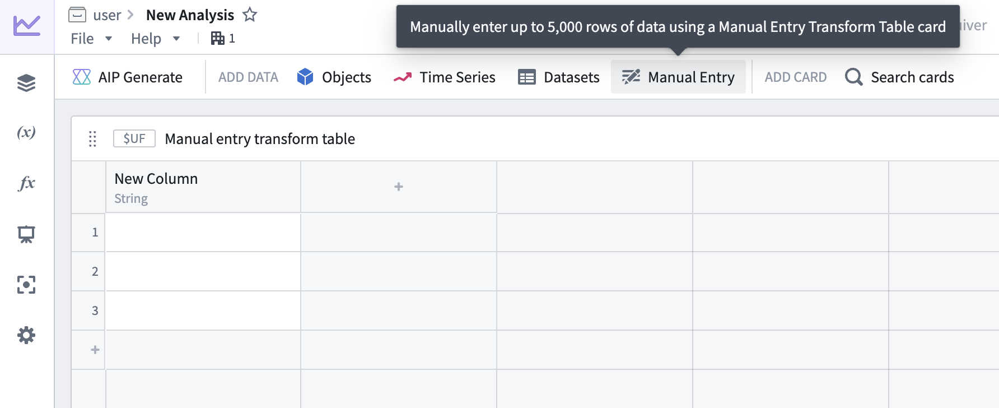

#### Example manual entry table workflows

* **Use table values to parameterize an analysis:** Use a manual entry transform table in conjunction with row and column selectors to switch between rows. The values in the table's selected rows can be used as dynamic parameters in downstream analyses.

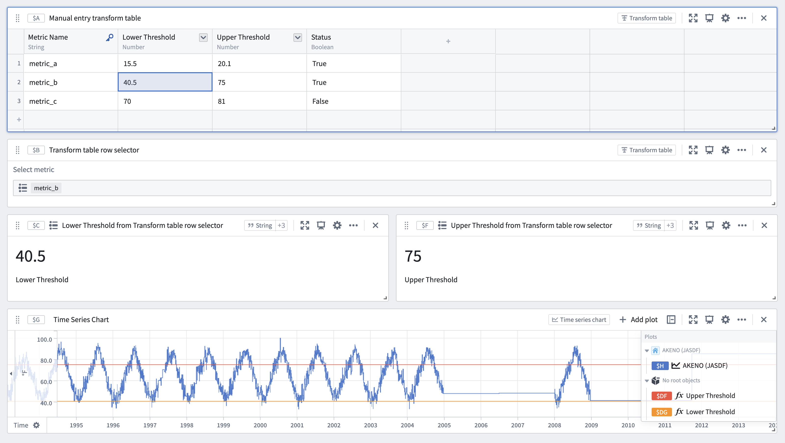

* **Ingest small sets of data from external sources to supplement an analysis and the Ontology:** Users can copy and paste metadata from spreadsheets into a new table to join to an existing object set by searching for **Join to transform table** in the [next actions menu](/docs/foundry/quiver/analysis-toolbars/#next-actions-menu) beneath the object set.

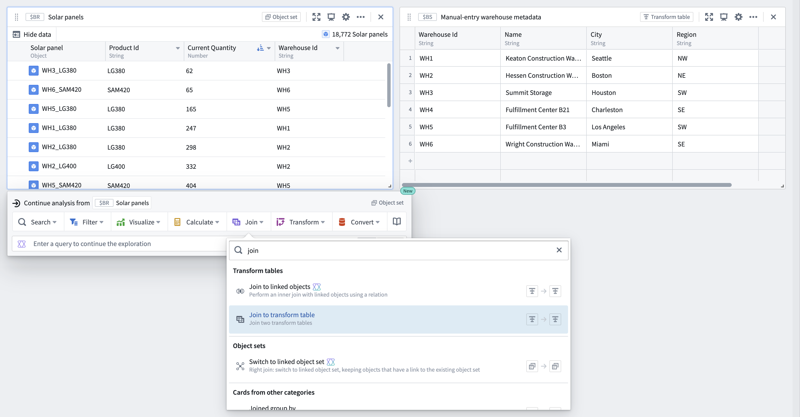

From the joined object set and manual entry transform table, configure the **Join to transform table** transform to specify the [join conditions](#join).

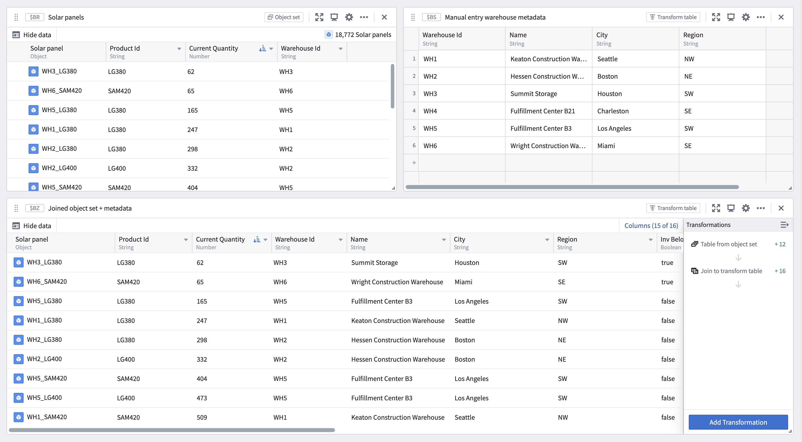

* **Analyze small sets of time series data without setting up a time series sync:** Copy and paste tabular time series data and convert the table into a time series plot using a **Tabular time series** card to continue analysis with the full range of Quiver's [time series operations](/docs/foundry/quiver/timeseries-transform/).

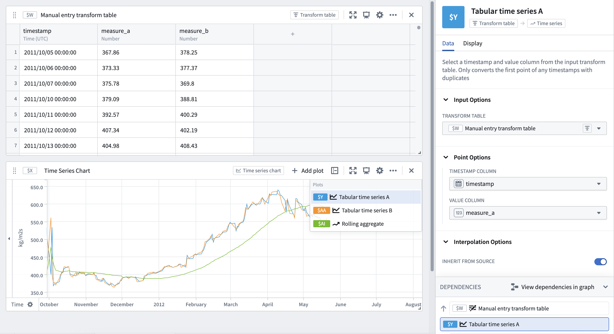

By default, manual entry transform tables generate a random unique primary key for each row, but users can choose to set a column as the table's primary key. Primary keys propagate downstream and are made available as unique identifiers in other cards, such as transform table row selectors.

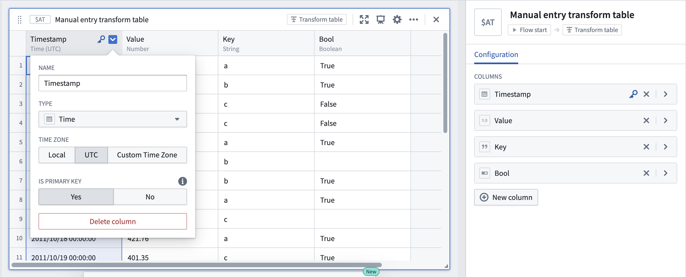

:::callout{theme="neutral"}
For time series data larger than 5,000 rows, or to reuse time series data across Foundry, set up a [time series sync](/docs/foundry/time-series/time-series-syncs/) for improved performance and reusability.
:::

### Input: Ontology SQL

[Ontology SQL](/docs/foundry/quiver/card-ontology-sql/) results can be used as an input to a transform table, converting the SQL query results into a tabular format where they can be further manipulated, enriched, or visualized.

To create a transform table from an Ontology SQL card, select the Ontology SQL card, then select **Convert > Transform tables** in the **Next Actions** menu at the bottom of the card.

When an Ontology SQL card is converted to a transform table, the columns correspond to the columns returned by the SQL query. You can then apply any transform table operations such as filtering, grouping, deriving new columns, or charting on the resulting data.

## Transform table outputs

There are four primary categories of outputs from a transform table: time series, charts, tables, and values.
Transform table outputs can be added via the **Next Actions** menu at the bottom of the table.

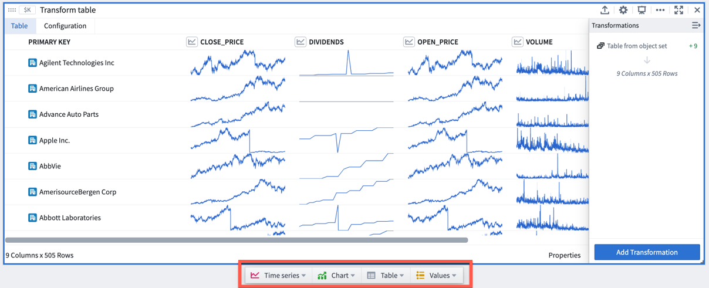

### Output: Time series

There are several ways to output time series data from a transform table:

* When hovering over a **time series table cell**, a 'pop out' button will appear. Click on it to plot the time series in a new time series chart.

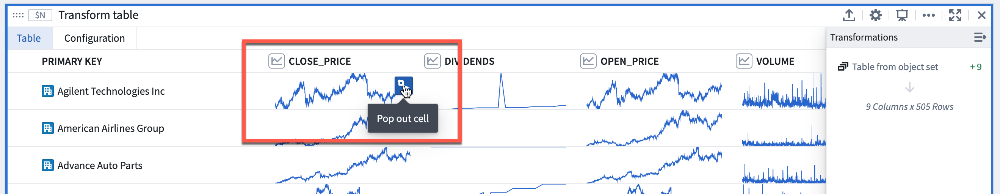

* Plot a time series column on a single time series chart by selecting **Time series** > **Grouped time series plot** in the **Next Actions** menu at the bottom of the table. Select the input column from the table and the page size to configure how many time series to overlay.

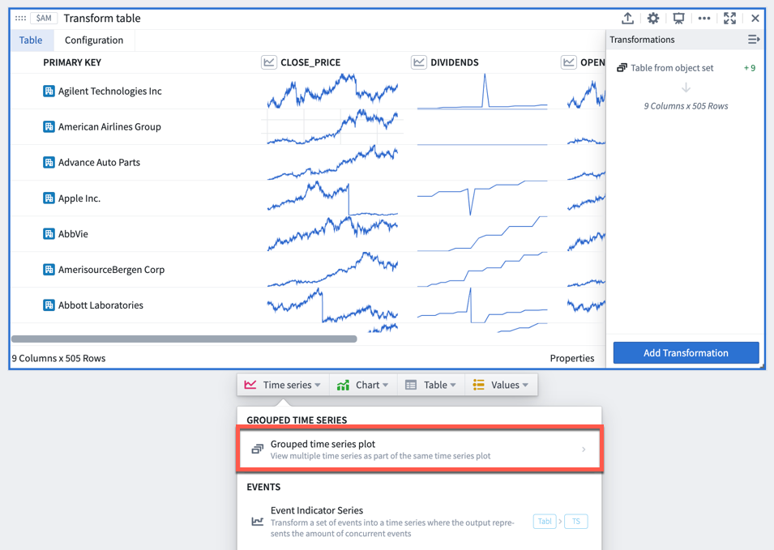

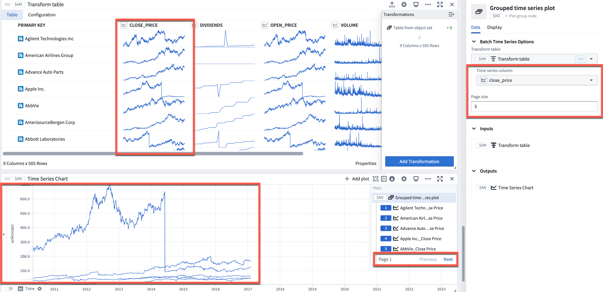

* Convert time series data in tabular format (timestamp and value) to a time series plot to use the entire range of time series visualizations and transformations available in Quiver. Select **Time series** > **Tabular times series** in the **Next Actions** menu at the bottom of the table. Select the timestamp (date/time) and value (number) columns from the transform table and optionally set the units. Note that if the tabular data contains more than one value point per timestamp, only the first point for that timestamp will be plotted.

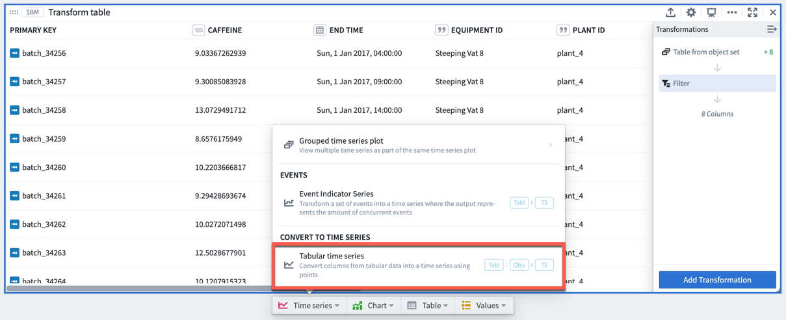

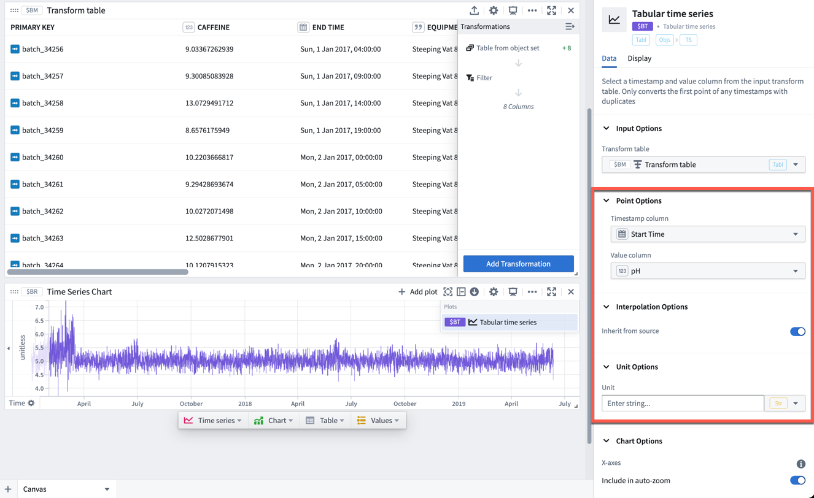

### Output: Charts

You can create line charts, categorical scatter plots, bar charts, or Vega plots from transform table data. These charts can be used in Quiver for any functionality that takes a chart as input, such as a categorical formula plot or an overlay chart.

### Output: Table

You can start a **New transform table** off of an existing transform table to provide a view that can be formatted and organized separately from the underlying data.

### Output: Pivot Transform Table

You can create a [pivot transform table](/docs/foundry/quiver/card-pivot-transform-table/) from a transform table to display aggregated data.

### Output: Values

You can aggregate columns of the transform table and output these as numbers or arrays on metric cards. These metrics can be used in Quiver for any functionality that takes numbers or arrays as inputs.

## Compute new columns

To add a computed column, select **Add Transformation**, then select the tab that corresponds to the type of data you want to create: numeric, date/time, string, Boolean, array, or time series.

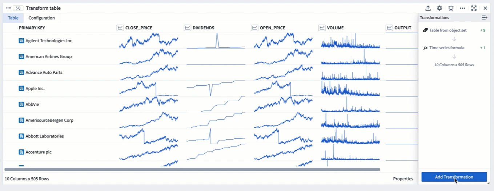

For the full list of transformations available to create columns, refer to the [index of transform table transformations](/docs/foundry/quiver/cards-transform-table-index/).

## Joining

### Join to Linked Objects

When a transform table has an object set as its input, you can use the [Ontology](/docs/foundry/quiver/objects-overview/) to join linked objects into the table. This transformation is called **Join to Linked Objects** and can be found under the **Tables** tab in the transformations menu.

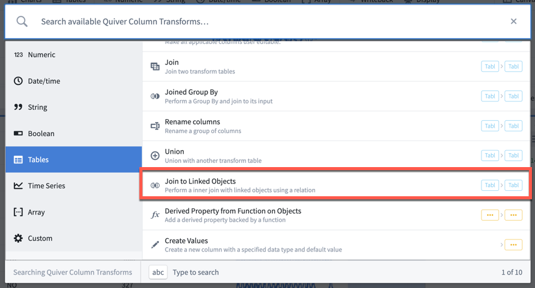

When you join an object set to other linked objects, you will be prompted to select the *link type*, which is the connection between your starting objects and the incoming objects. The resulting table will have a new joined primary key; this is a combination of the primary key of your starting set and the primary key of the incoming set. The new joined primary key will add the properties of your incoming objects onto each existing row, increasing the number of columns.

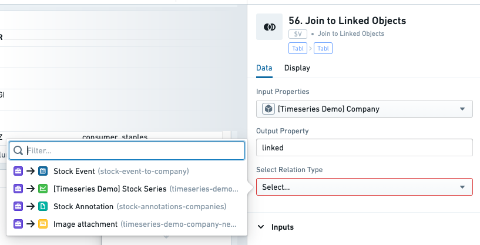

If your starting objects only connect to one incoming object (that is, either a “one-to-one" or "many-to-one" [link type](/docs/foundry/object-link-types/link-types-overview/)), the number of rows will not increase. If there are many incoming objects for each starting object (in other words, a "one-to-many” [link type](/docs/foundry/object-link-types/link-types-overview/)), the number of rows in your table will increase.

In the example below, we start a transform table from an object set of Companies. Initially this table has 505 rows (1 per object). We then add a Join to Linked Objects transform, to add linked Stock Event objects. Now, the table has 11,149 rows, the primary key is the combination of both objects’ primary keys, and columns from the Stock Event objects have been added.

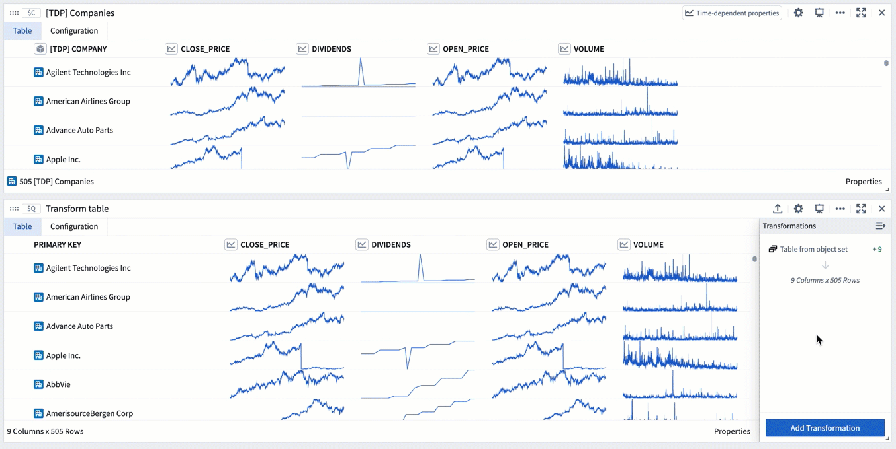

### Join

The **Join** transform can be found under the **Tables** tab in the transformations menu. Similar to a SQL join operation, it allows you to combine two transform tables while specifying the match condition (indicated by the green box in the image below).

To perform a join:

1. Select which table to join to.
2. Set the join type (left, inner, or full).
3. Configure the match conditions: matching style (all, any) and one or more pairs of columns from the input and joined table for comparison.
4. Select which columns from the input table to retain.
5. Select which columns from the joined table to add to the input table. If the input table already contains a column with the same name as one of the columns being added, then the **Prefix for joined columns** will be added.

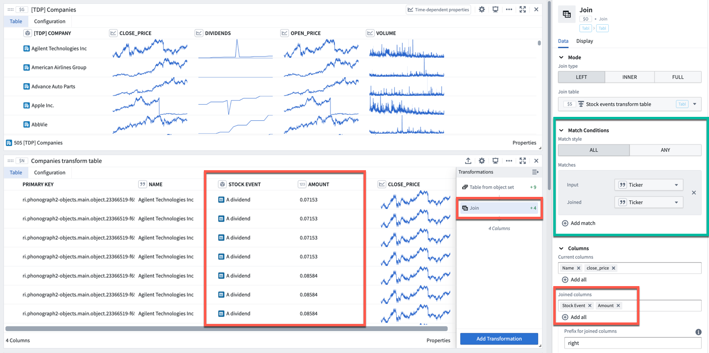

### Cross join

The **Cross Join** transform allows you to combine two transform tables by performing a [Cartesian ↗](https://en.wikipedia.org/wiki/Cartesian_product) join. A cross join generates a row for every paired combination of a row from the first table and a row from the second table. It does *not* join based on a specific column.

## Grouping

Grouping is the action of aggregating a collection of values over some pre-defined window or bucket. There are two ways you can do this in the Transform Table:

* [Group By](#group-by)
* [Group By followed by a Join (also known as Joined Group By)](#joined-group-by)

### Group By

In a ***Group By***, you create one *category* for each property in your Group By column. For each category, all of the associated time-based, numeric, and time series columns become arrays of values (also called groups). Array transformations and aggregations can be performed over these arrays (groups).

For example, the transform table below shows a set of worldwide weather stations with different elevation values. We can group these stations by the country they are located in to create arrays of the elevation values per country.

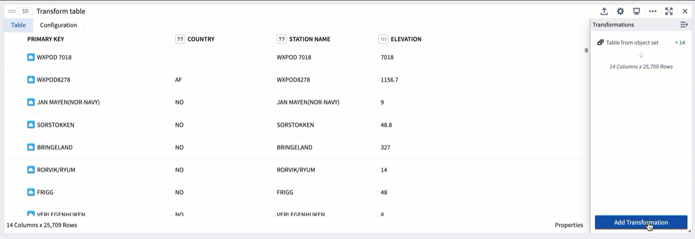

If we want to do an *aggregate* over these elevation values, for example calculating the average elevation for each country, we can use the **Numeric Group Aggregation** transformation, which will add a column to the table returning the average of the input column we select (here, `elevation_array`).

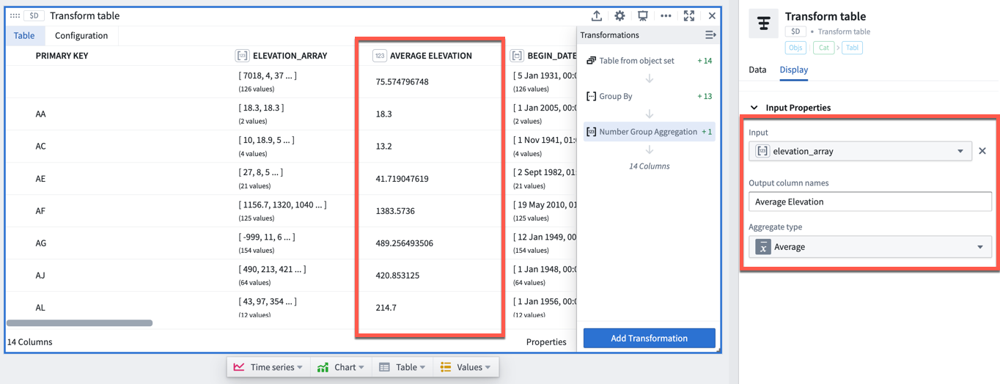

### Joined Group By

**Joined Group By** is useful when you want to calculate some windowed and aggregated quantity (e.g. the average roof height per category, above), but want to keep the same number of rows in your table (one per building) while adding a new column for the aggregate metric.

Performing a **Joined Group By** transform will add an array of values column for each property that is not part of the group by category the object belongs to (indicated by the green boxes in the image below). You will then need to add an aggregation transformation to compute values on these arrays (indicated by the red boxes in the image below).

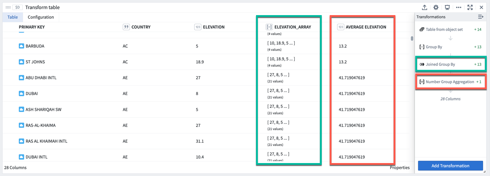

## Time series

The transform table is designed to enable batch analysis of time series. This means that transformations such as filters, derivatives, or cumulative aggregates can now be applied to more than one time series at a time. For a comprehensive guide on batch time series analysis, see [batch analyze time series](/docs/foundry/quiver/timeseries-batch-analyze/).

For more information on the individual time series transformations included, refer to the [index of transform table transforms](/docs/foundry/quiver/cards-transform-table-index/).

There are three methods for adding time series column to a transform table, depending on the category of data to be transformed; these methods are:

* [Showing a time series line plot (sparkline) from an object set of time series objects](#showing-a-time-series-line-plot-sparkline-from-an-object-set-of-time-series-objects)
* [Adding a sensor object from a root object](#adding-a-sensor-object-from-a-root-object)
* [Creating a time series from a group of timestamps and values](#creating-a-time-series-from-a-group-of-timestamps-and-values)

### Showing a time series line plot (sparkline) from an object set of time series objects

By default (and for performance reasons), sparklines of time series data are not shown unless you explicitly add them. If you have created a transform table that includes time series or sensor objects, you can include them by adding a Time Series Object transform, and selecting the primary key of the time series object.

### Adding a sensor object from a root object

Objects that have been marked as root objects and have time series objects connected to them in the [Ontology](/docs/foundry/time-series/time-series-overview/#store-time-series-in-the-ontology) can have their linked series displayed purely by adding a *Linked Sensor* column. To do this, select **Linked Time Series Sensor** and select the primary key of the parent object.

### Creating a time series from a group of timestamps and values

The transform table enables a group of dates or times to be turned into a time series, just as a bar or line chart of objects can be turned into a time series outside of the transform table. To do this, first select **Group by** to create groups of dates and groups of numeric values. Then, select **Group to Time Series** and select the date/time group as the *date group property* and the number/value group as the *numeric group property*.

For example, the transform table below shows a set of stock dividend events with different dividend values. If we want to create a time series using these dividend values, we can do the following:

1. First, group these events by the ticker to which they correspond to create arrays of the dividend value per event and arrays of the date each event occurred.
2. Then, use the **Group to Time Series** transformation to add a column to the table showing a time series plot with the numeric group property (`amount_array` in this case), plotted over the date group property (`start_ts_array`).

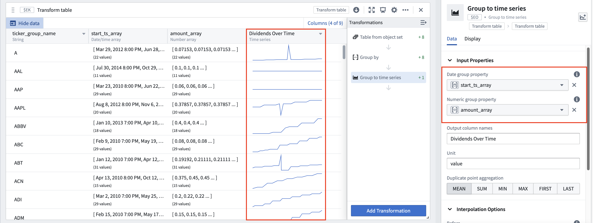

## Formatting a transform table

The columns of a transform table can be formatted with customizable widths and heights, as can the individual values themselves. All formatting occurs in the *Display* tab of a Transform Table.

### Column formatting

All columns, numeric or otherwise, contain formatting options for statically setting column widths and minimum heights.

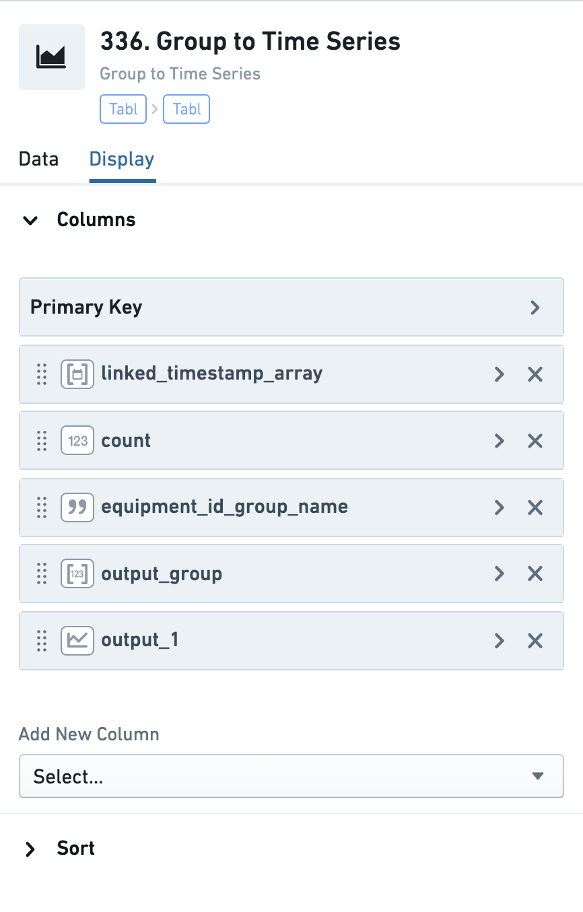 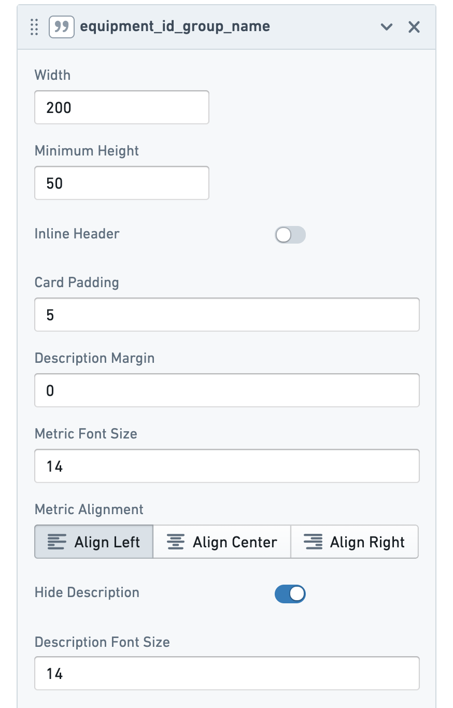

Columns can be renamed by adding a **Rename columns** transformation from the transformations menu.

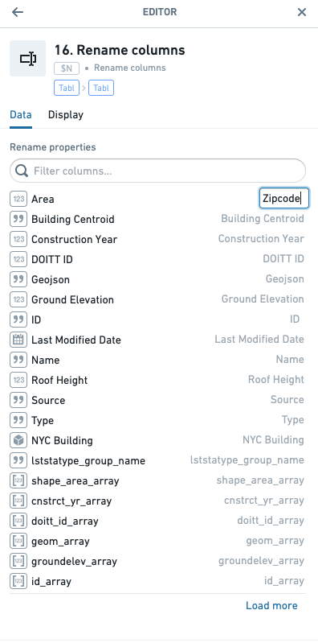

### Conditional formatting of values

In addition, numeric columns have value and conditional formatting options, with the following controls:

1. **D3/visual format:** These number formatting options are similar to those used to format metric cards or other numeric data in Quiver. [Learn more about D3 formatting. ↗](https://github.com/d3/d3-format#locale_format)
2. **Alignment:** These options control the placement of the numbers within a cell; left, central, and right alignment settings are available.
3. **Conditional coloring:** These options enable conditional coloring of values based on thresholds. The thresholds can either be set statically or can be configured to pull in any other numeric value on your Quiver analysis. You can choose to color either the text or the background of the cell.

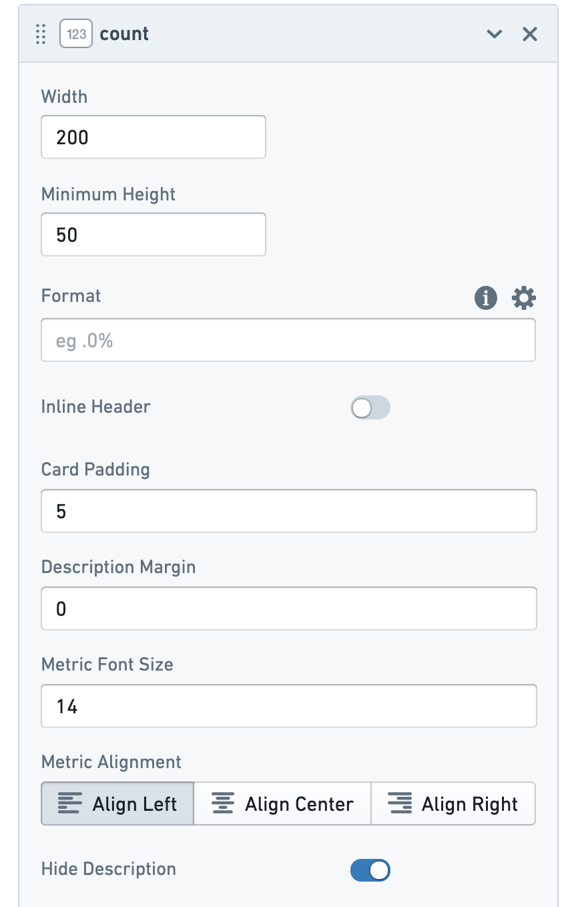
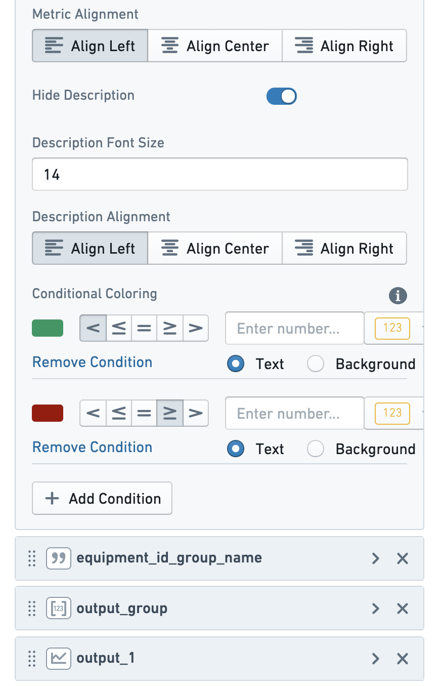

### Formatting time series columns

Time series columns in transform tables render sparklines of the associated time series property. By default, sparklines show the full extent of data in the series. This can be changed from the **Display** tab of the editor:

1. Select the down caret icon in the column header for the time series column of interest. This will open a menu of column actions.
2. Select the **Configure display settings** option. This is a quick action that will open the transform table editor to the relevant configuration section in the **Display** tab.
3. Change the **View range** of the sparkline by selecting an option from the menu.

You can follow the same steps to configure the view range for sparklines in object set tables.

#### View range options

There are four ways to set the view range for sparklines:

* **Full data range:** The default option. Shows all data in the time series. This may negatively impact performance for large time series.
* **Fixed range:** Sets the view range to a static start and end date, for example, `2025-5-21` to `2025-06-04`.
* **Relative range:** Sets the view range to a range relative to today. For example, from `2 weeks ago` to `Now`. By default, the range's  end date is set to `Now`, but a specific time can be input by selecting the **Set to relative time** toggle on the top right.
* **Initial default time axis range:** set the view range to the range used to initialize the default time axis. This value is controlled by the [**Global settings**](/docs/foundry/quiver/analysis-settings/) menu.

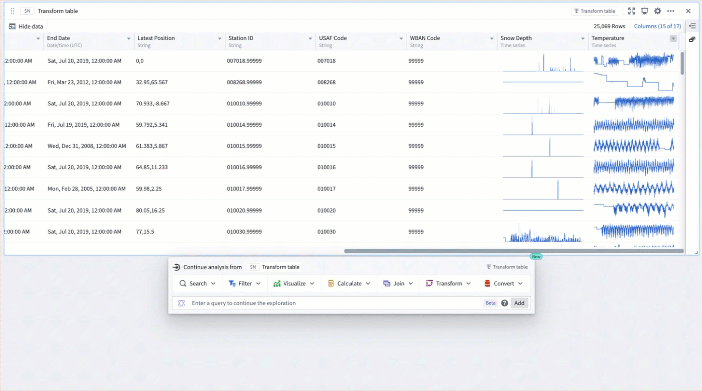

## FAQ

### Can I use a transform table to create group-by time series?

Yes. Group-by time series (the ability to create a time series from a bar plot, and then segment it into several time series) are available with a transform Table. You can create a group-by time series using the Group to Time Series function with a group of dates or times, and a group of values.

See [time series in transform tables](#time-series) for more information.

### Can I format a transform table?

Yes, you can use parameters or manually input values in order to format the cells of the Table according to user-defined logic rules.

See the documentation on [formatting a transform table](#formatting-a-transform-table) for more information.

### What are the scale limits of the transform table?

The transform table has a limit of 50,000 rows for performance reasons, since the transform table pulls data into the frontend for operation, rather than pushing data to a backend service.

### Can I plot the values in a transform table?

Yes. There are four outputs from the transform table: time series, tables, charts, and values (metric cards).
See the documentation on [transform table outputs](#transform-table-outputs) for more information.

### Are object sets the only allowed inputs to a transform table?

No. Though it is common to use objects in a transform table, you can also use a transform table to operate on time series data, chart data, or tables such as pivot tables or other transform tables.
Note that when working with chart data or pivot tables, the rows will lose their connection to the underlying objects and you will be able to operate on the aggregates, but not link back to the underlying data. This opens up the ability to perform column-wise operations on a pivot table, as well as the ability to create and operate on plot data in tabular form.

See the documentation on [transform table inputs](#transform-table-inputs) for more information.
