<!-- source: https://palantir.com/docs/foundry/quiver/cards-vega-plot/ · mirrored 2026-08-22 from Palantir Foundry docs -->

# Vega Plots

Quiver allows users to create fully customizable and interactive visualizations using the Vega or Vega-Lite libraries. Review [Vega ↗](https://vega.github.io/vega/) and [Vega-Lite ↗](https://vega.github.io/vega-lite/) documentation for inspiration and examples.

## What is Vega?

Vega and Vega-Lite allow you to create, save, and share interactive visualization designs in the form of a concise JSON spec that describes the appearance and behavior of a visualization. Vega supports a variety of visualization designs, such as:

* [Data loading ↗](https://vega.github.io/vega/docs/data) and [transformation ↗](https://vega.github.io/vega/docs/transforms)
* [Scales ↗](https://vega.github.io/vega/docs/scales)
* [Map projections ↗](https://vega.github.io/vega/docs/projections)
* [Axes ↗](https://vega.github.io/vega/docs/axes)
* [Legends ↗](https://vega.github.io/vega/docs/legends)
* [Graphical marks ↗](https://vega.github.io/vega/docs/marks) such as rectangles, lines, plotting symbols, etc.

Vega-Lite is a higher-level language built on top of Vega that provides a more concise and convenient way to author common visualizations. We suggest starting with Vega-Lite, since Vega-Lite syntax is easier to read, write, and debug than Vega. If Vega-Lite's options are insufficient, consider using Vega instead.

Several examples built with Vega and Vega-Lite can be seen in the image below:

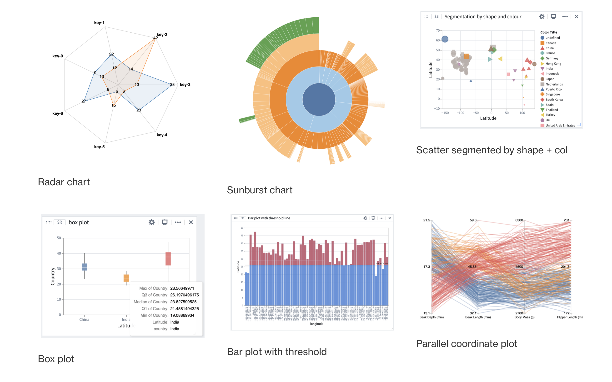

## Configure a Vega plot

To configure a Vega plot, hover over the desired card, select **Visualize** and navigate to (or search for) **Vega plot** in the dropdown menu. Select **Vega plot** to open the configuration menu.

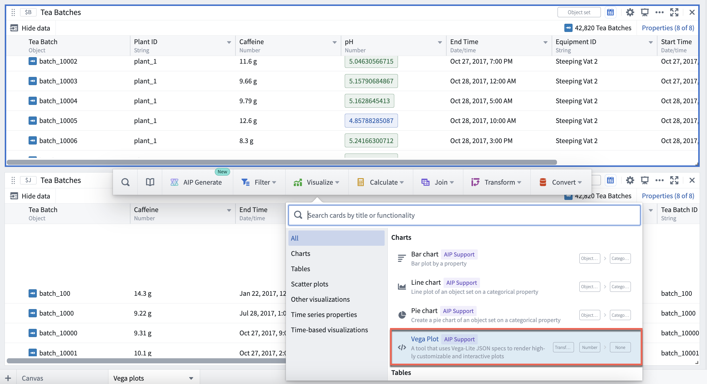

Within the editor menu, choose to configure either a Vega plot or a Vega-Lite plot. Templates for common visualizations, including bubble plots, box plots, sunburst plots and more, are provided in the **Choose a template** dropdown menu, as pictured below.

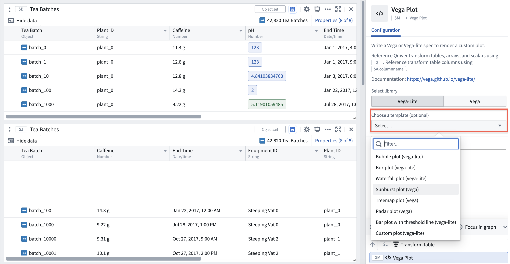

Once you have selected your Vega plot template, you will be prompted to fill in parameters relevant to the plot you have selected by mapping them to columns of the transform table data source.

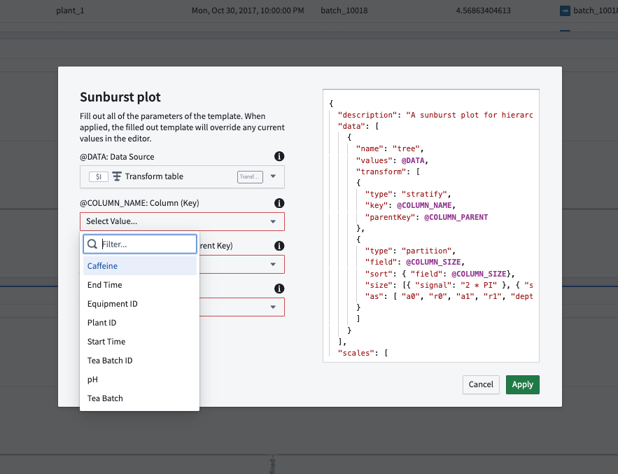

After filling in the template parameters, select **Apply** to generate your Vega plot. Note that:

* Wherever fields are left blank, the parameter name is used as default.
* A filled-in template overrides any current values in the editor.

### Configure data inputs

Vega plots accept the following data inputs:

* **Transform tables:** Any transform table can be used as an input to a Vega plot. When adding a Vega plot from an object set, a backing transform table is also automatically added to the **Analysis Contents** panel (but not the Canvas).
* **Arrays:** Arrays are parsed as a transform table with a single column named `ARRAY_VALUES`.

In the data section, you can reference tabular data in the form of a transform table or array by its global ID (such as `$A`) in the following format:

```json
{
    "data": { "values": $A }
    ...
}
```

For instance, if table `$A` is a table with two columns, `name` and `id`, the data will resolve into a spec that looks like this:

```json
{
    "data": {
        "values": {
            { "name": "a", "id": 1},
            { "name": "b", "id": 2},
            { "name": "c", "id": 3}
        }
    }
}
```

To reference specific columns in a transform table, use the syntax `$A.column_name`. This expression gets resolved into the column's ID as a string.

```json
{
    "encoding": {
        "x": {
            "field": $A.column_x,
            "type": "quantitative",
        }
    }
    ...
}
```

### Use variables from the analysis

You can also reference [value types](/docs/foundry/quiver/analysis-data-model/#list-of-input-and-output-types) (such as numeric metric cards) in a Vega plot. For instance, to set a threshold line at a certain value using a numeric metric card, reference that value using the metric card's global ID.

```
"encoding": {
    "y": { "datum": $C }
}
...
```

### Preview resolved Vega specification

You can debug issues with Vega plot configurations by looking at the resolved Vega specification. Select **Preview** to view the resolved Vega.

:::callout{theme="neutral"}
Note that resolved Vega specifications may be slow to load as they will contain all the data points from data inputs referenced within.
:::

### Embed a Vega plot in other applications

The Vega editor contains two useful settings for embedding a Vega plot in Workshop using Quiver dashboards:

* **Autoscale plot:** When Autoscale plot is enabled, your Vega plot will automatically adjust to the card dimensions, based on the data provided.
* **Default styling:** Inject some auto sizing and styling configurations to the Vega specification to make the plot appearance match the Quiver cards style. When disabled, the Vega visualization will match that on the public Vega website.

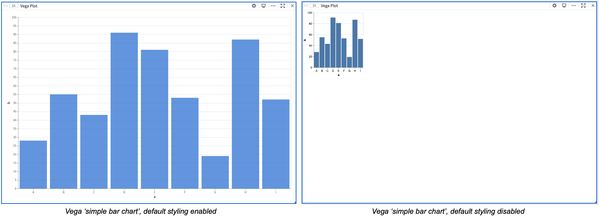

## Using AIP to configure Vega plots

AIP can help generate Vega plot configurations using only the description of your desired plot, or plot modification, in natural language. Users can simply describe the plot they wish to create or modify and AIP will make suggestions based on the prompt, helping to simplify Vega plot configuration in JSON, which can be prone to error.

### Describe the desired Vega plot

To use AIP, select **AIP Configure** in the upper right of the Vega plot card. Then, provide a prompt, select **Configure**, and review the suggestion generated by AIP. To accept a suggestion, select **Apply**. If you would like AIP to make an alternative suggestion, edit your prompt and then select **Reconfigure.**

In the example below, the user prompts AIP with: “Show ph vs caffeine on a scatter plot and draw a red line at 13 on the x axis and at 6 on the y axis”. AIP uses the prompt to suggest the configuration of a plot which contains the two numerical properties of interest (caffeine and pH levels).

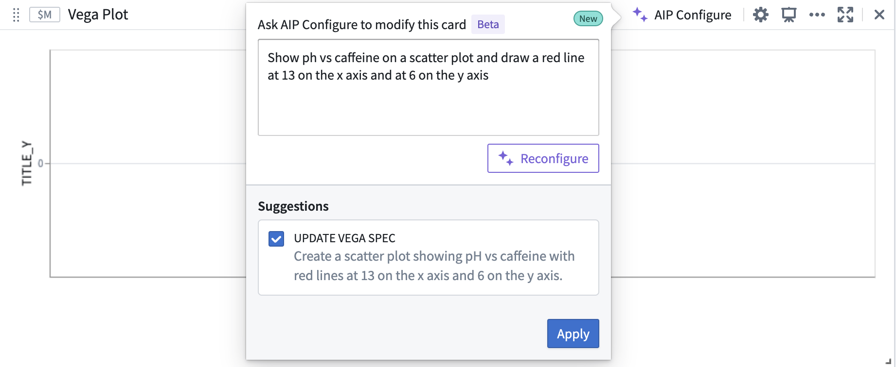

To accept AIP’s proposed update, select **Apply**. The Vega plot will render a visualization based on the updated Vega specification.

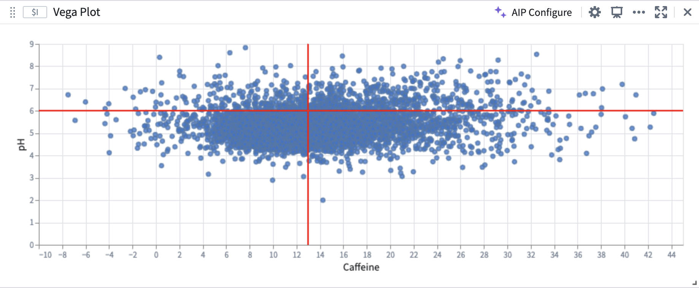

### Build on top of existing plots

AIP can recognize and differentiate abstract ideas contained within your prompt and use this information to help generate or modify Vega plots. For example, AIP can use references to the characteristics of previously generated plots, allowing you to “build on top of" your existing plots.

In the image below, the user provides the prompt: “The two lines on the plot split the points into 4 quadrants. Color each quadrant a different color.” AIP recognizes that the areas defined by the vertical and horizontal lines are quadrants, even though the current plot configuration does not contain any definition or configuration of quadrants.

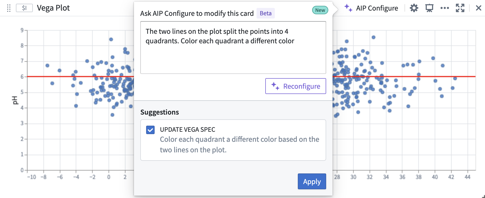

AIP accurately generates the desired plot, aligned to the user prompt, which builds off of the initial plot.

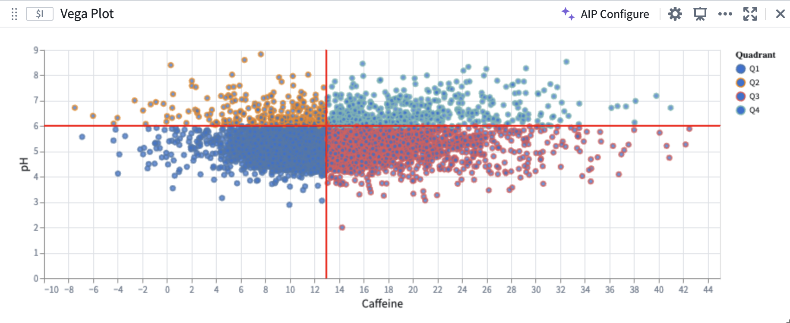

### Create Vega plots using AIP Generate

Quiver analysis graphs produced using AIP can include Vega plots. To instruct AIP to produce a Vega plot rather than native Quiver visualizations, such as line or scatter plots, make explicit in your prompt that AIP should return a “Vega plot.” For example, an accurate prompt could be: “Show caffeine vs ph on a scatter plot using a vega plot.”

Note: AIP feature availability is subject to change and may differ between customers.

## Vega-Lite selection

### Configure selection for Vega-Lite plots

Vega-Lite selection is a powerful and highly customizable feature for building interactive visualizations. The Vega-Lite library has built-in support for [selection ↗](https://vega.github.io/vega-lite/docs/selection.html), and Vega-Lite plots in Quiver can be configured to output selections as a transform table. Users can leverage selection data to parameterize downstream cards, construct drill-down workflows, and continue analysis. The behavior of Vega-Lite selections differ from object set plot selections and require additional steps for setup.

Vega-Lite enables users to interact with charts through [two types of selection ↗](https://vega.github.io/vega-lite/docs/selection.html#type):

* **Point** selection: Select a single point, or hold shift to select multiple points on the canvas.
* **Interval** selection: Drag to select a bounded rectangular region on the canvas.

:::callout{theme="neutral"}
Not all Vega-Lite plot types support selection. See the [FAQ section](#faq-and-limitations) below for more details.
:::

To output the plot selection data as a transform table, perform the following steps:

1. Open the Vega plot card’s configuration panel, and scroll to **Selection Options**. Then, toggle on **Enable output point selections as transform table** and/or **Enable output interval selections as transform table**.

2. In the Vega plot’s JSON editor, add a selection parameter to the `params` field. Review the [Vega plot documentation](/docs/foundry/quiver/cards-vega-plot/) for more on selection parameters.
   1. The parameter must be named `quiverDefaultClick` for point selections, or `quiverDefaultBrush` for interval selections.
   2. Set the `type` property to `point` for `quiverDefaultClick`, or `interval` for `quiverDefaultBrush`.
   3. Specify one or more [encodings ↗](https://vega.github.io/vega-lite/docs/encoding.html) in the `encodings` property. These are the fields that you wish to select over, such as `x`, `y`, or `color`. Encodings determine how values are selected and what information is output.

       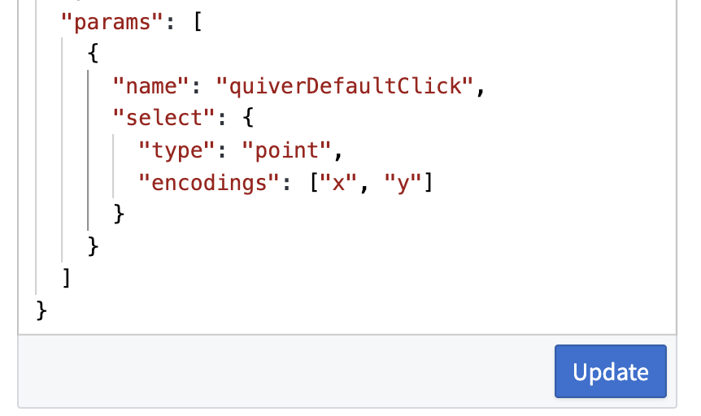

3. Once a selection is made, a card footer with selection data will appear. Select **Output Selection** to output the selection data as a transform table. Alternatively, use the Vega plot’s next actions menu and select **Convert** > **New Transform Table**.

   * Point selections are output as a table of encoding fields and values, where each column corresponds to a field, and each row represents a selected point. <br><br>
     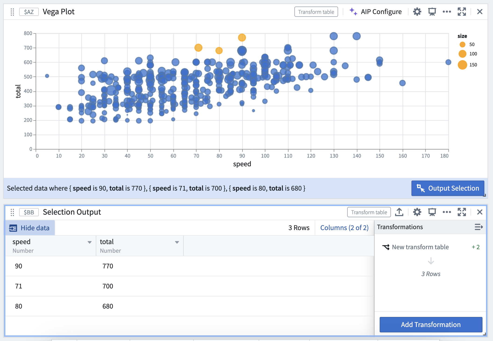 <br><br>

   2. Interval selections are output as a range (minimum, maximum) of the interval’s bounds if the field is continuous, or as an array of values if the field is discrete. <br><br>
      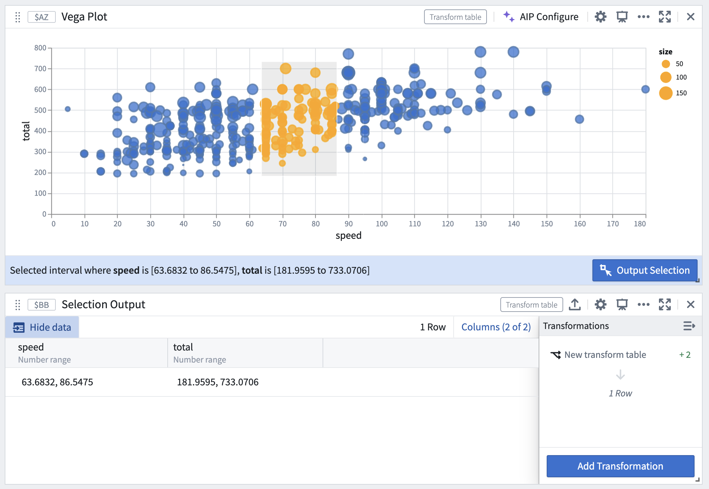 <br><br>

:::callout{theme="neutral"}
Unlike object set plots, where selection is a drill-down operation that outputs a filtered object set, Vega plots cannot automatically filter the input data based on the current selection. Instead, Vega plots will output the selected values of the given encodings, and these outputs can be used to manually construct a filter on the input table. For more information, review the section on [constructing a drill-down workflow](#construct-a-drill-down-workflow).
:::

### Examples of customized selection parameters

Refer to the provided Vega plot templates for additional examples of selection setups in common visualizations, such as bubble plots and heat grids. These templates can be found under the **Choose a template** dropdown menu in the configuration editor.

#### Examples of point selection parameters

```
...
"params": [
  {
    "name": "quiverDefaultClick", // Define point selection parameter
    "select": {
      "type": "point",
      "encodings": ["x"] // Select all points with the same "x" value
    }
  }
],
"encodings": [
  "x": ...
  "y": ...
  "color": {
    "condition": [
      {
        "param": "quiverDefaultClick",
        "empty": false,
        "value": "orange" // Conditionally color selected points
      }
    ]
  },
]
```

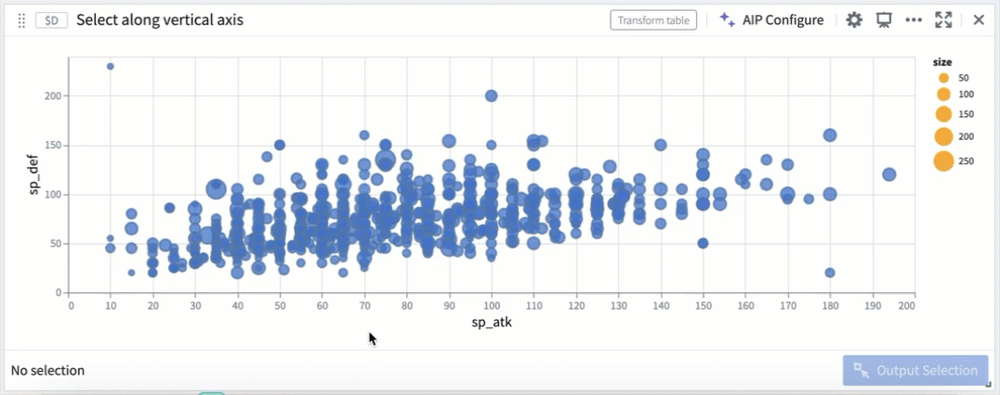

```
...
"params": [
  {
    "name": "quiverDefaultClick",
    "select": {
      "type": "point",
      "encodings": ["color"] // Select all data with the same "color" encoding
    }
  }
]
```

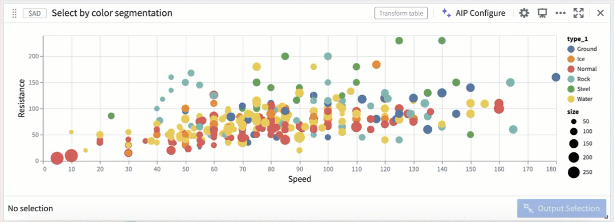

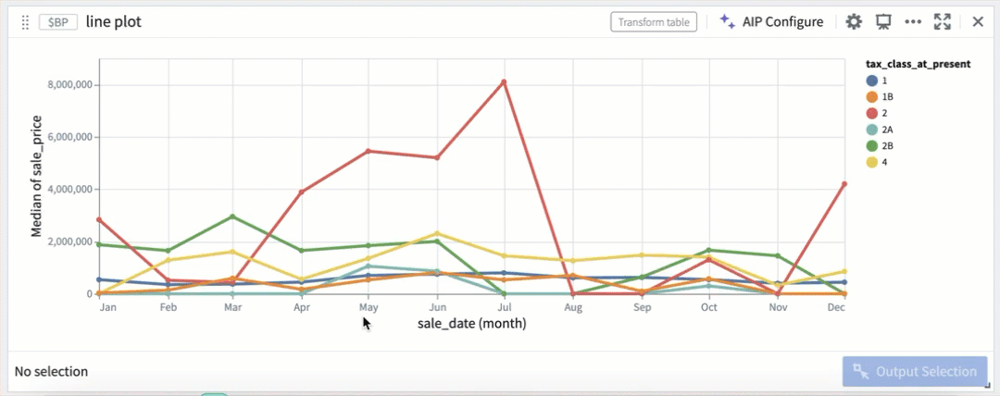

#### Examples of interval selection parameters

```
...
"params": [
  {
    "name": "quiverDefaultBrush",
    "select": {
      "type": "interval",
      "encodings": ["y"] // Restrict interval selection to the y-axis
    }
  }
]
```

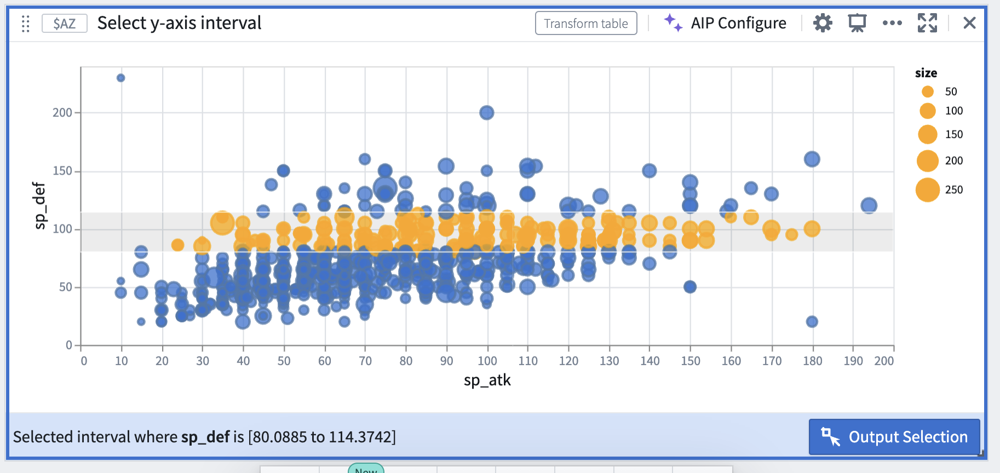

### Construct a drill-down workflow

Selection data from Vega-Lite plots can be used to construct drill-down workflows, where chart selections act as a filter and users can continue analysis on a subset of data based on the upstream selection. The following steps describe how to construct drill-down workflows.

1. Set up selection parameters following the steps above, and output the current selection as a transform table. <br><br>
   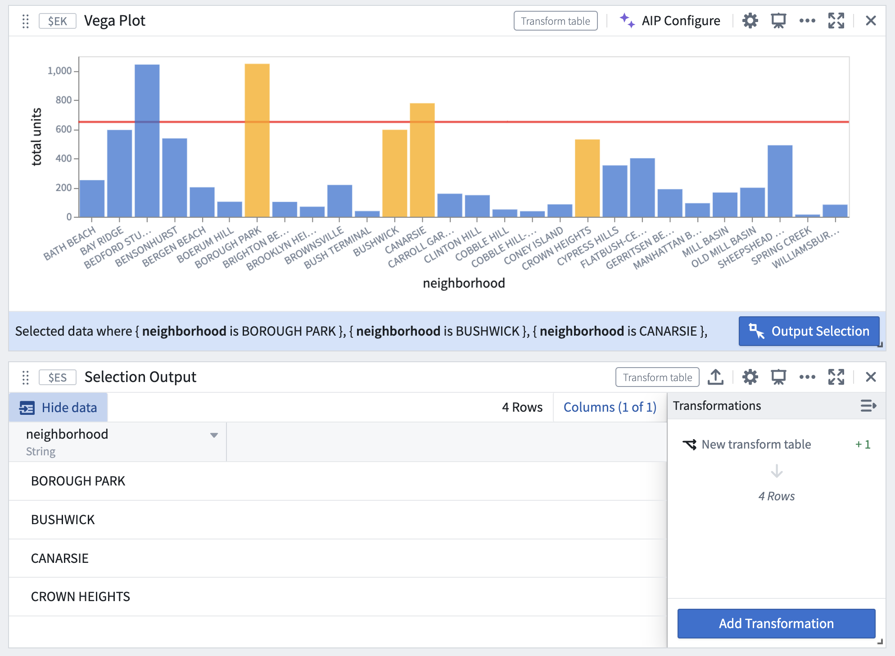 <br><br>

2. Select **Pop out column as array** to convert the property into an array. <br><br>
   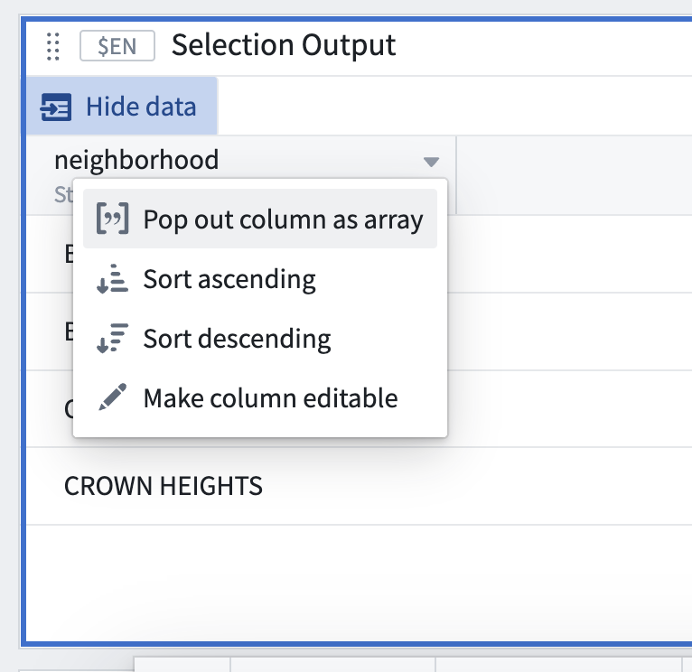

<br><br> 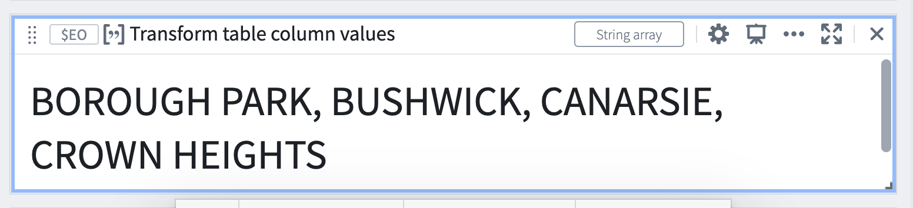 <br><br>

3. Filter a copy of the original transform table (or a copy of the root object set from which the transform table was derived), using the selected values as the filter parameter. <br><br>
   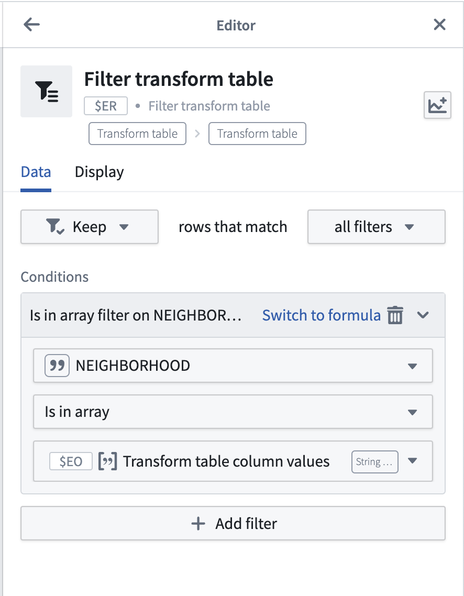

<br><br>

4. The filtered table will now dynamically update based on the upstream chart selection. <br><br>
   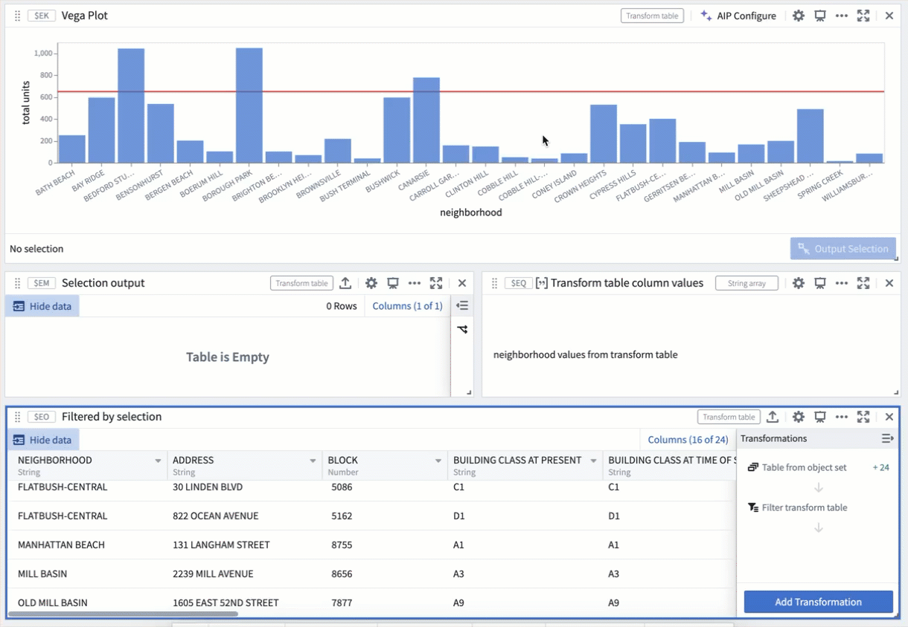

<br><br>

### FAQ and limitations

#### Can any type of Vega-Lite plot be configured for selection?

Not all Vega-Lite plot types support selection. Although Vega documentation does not provide an exhaustive list of supported plot types, the following is a non-comprehensive list:

* **Supported:** Bar plot, scatter plot, heat grid, line plot, pie chart (point selection only), waterfall plot (point selection only), geographic coordinate projection, GeoJSON map (point selection only)
* **Not supported:** Box plot, confidence interval plot

#### Can I define multiple selection parameters within a single chart specification?

Each plot is limited to one point selection parameter and one interval selection parameter that outputs data into Quiver. This is a limitation set by Quiver; while Vega permits the definition of multiple parameters as long as they have unique names, only those named `quiverDefaultClick` and `quiverDefaultBrush` will be output as a Quiver transform table.

#### I am unable to select a subset of an axis, even though added it to the list of encodings in the selection parameter. What is causing this?

Check whether the values on that axis are being aggregated within the Vega specification. Vega does not support selection over fields aggregated by Vega. For example, if the `y` encoding field includes an inline aggregation like the snippet below, users will not be able to select a subset of the y-axis.

```
"encodings": {
  "y": {
    "field": $C.field_y,
    "aggregate": "avg"
  },
  ...
}
```

To enable selection over the y-axis, aggregate the data in Quiver first (using pivot tables, for example) before passing it into Vega.

#### Why am I receiving an `Invalid data selection` error when I attempt to make a selection, even though the spec compiles?

Check the following:

* Ensure that all selection parameters have a non-empty `encodings` field. Each parameter must specify one or more encodings to output selection information.
* If it is an interval selection, check whether any of the encodings defined in the selection parameter are non-axis fields. Vega does not support interval selection over non-axis encoding fields like `color`, `shape`, and so on. Removing these from the encodings array should resolve the error.

#### Vega plot object limit

Vega plots in Quiver have a limit of 50,000 objects. If you need to visualize datasets exceeding this limit, consider using [object set charts](/docs/foundry/quiver/objects-chart-drilldown/) or [materialization charts](/docs/foundry/quiver/card-categorical-plot-materialization/), which are not scale-limited.

:::callout{theme="warning"}
[Vega-Lite ↗](https://vega.github.io/vega-lite/docs/encoding.html) documentation and the [Vega editor ↗](https://vega.github.io/editor/#/) can be helpful tools to test and debug Vega specs. However, you **should not** enter any sensitive information in the editor tool as we cannot guarantee data security outside of the Palantir platform.
:::
