<!-- source: https://palantir.com/docs/foundry/quiver/dashboards-create/ · mirrored 2026-08-18 from Palantir Foundry docs -->

# Create a dashboard

## Getting started

To create a dashboard, select the dashboard icon on the left side toolbar (as shown below). This will open the **Dashboards** panel.

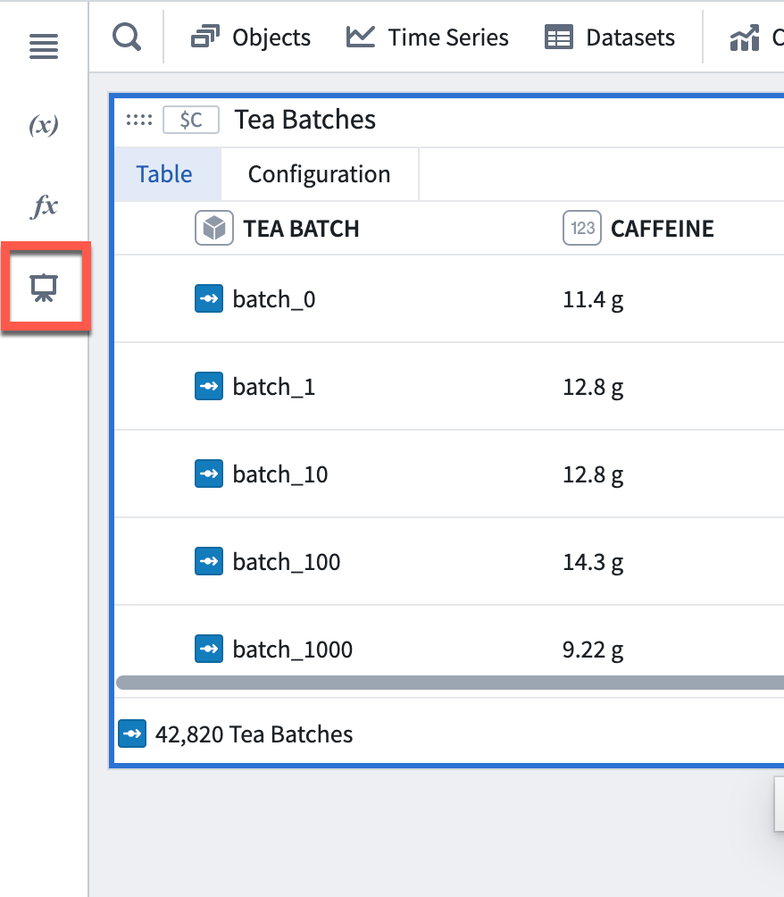

If you do not have a dashboard in this analysis yet, select **Create new dashboard**. This will create a new, unpublished dashboard.

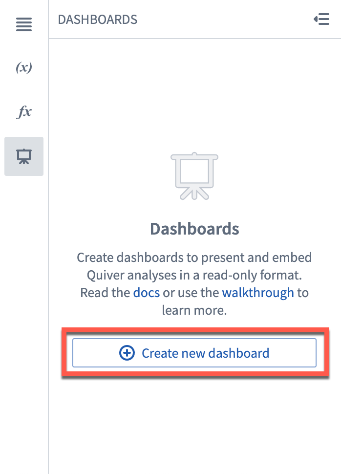

## Rename your dashboard

To rename your dashboard, click on its name in the top toolbar, and type the new name. The new name will be saved once you leave the name input box. You will see the new name reflected on the left side panel.

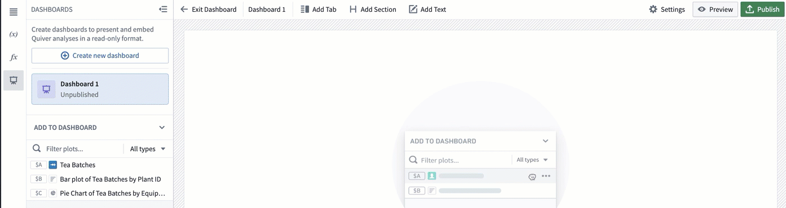

You can also rename the dashboard form the editor panel by clicking on the name at the top.

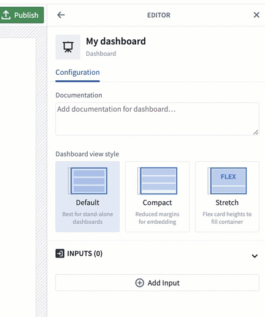

To open and close the editor panel, select the **Settings** button in the top toolbar.

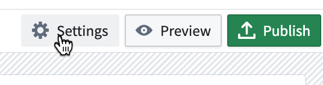

## Add documentation

To provide more context to your dashboard, you can add a description in the editor panel's **Documentation** text box.

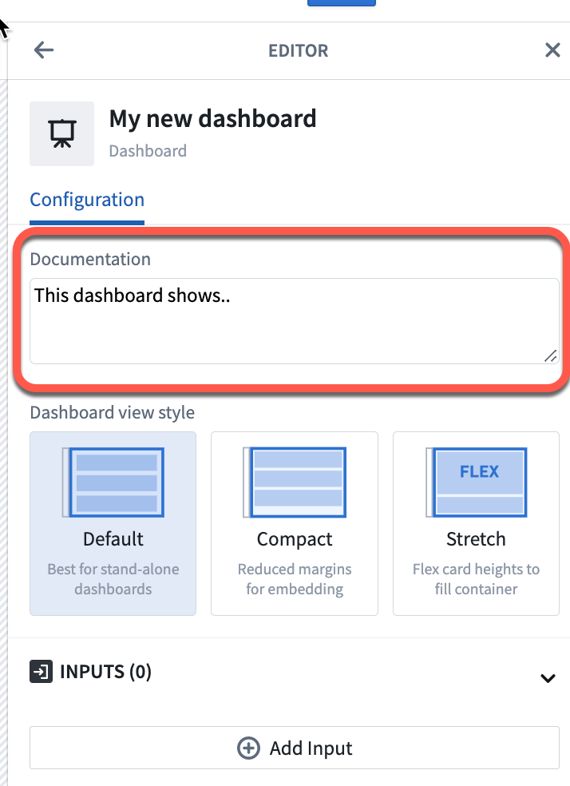

## Add content to your dashboard

### Add cards to dashboard with drag-and-drop

To add content to your dashboard, click on a card in the **Add to dashboard** section in the left panel, and drag it into the dashboard.

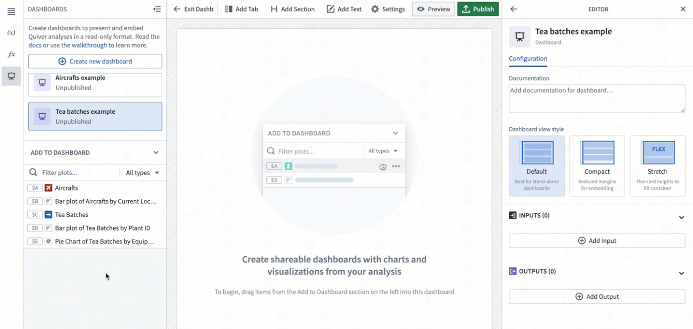

As you drag the card into the dashboard, you will see several drop zones highlighted, indicating where you can drop the card.

If there are already cards in your analysis, you will have the option to drag your selected card next to it on the same row. The cards will automatically align and resize to be the same width and height. You can then adjust the row height using the sizing handle. You can add up to three cards side-by-side on the same row.

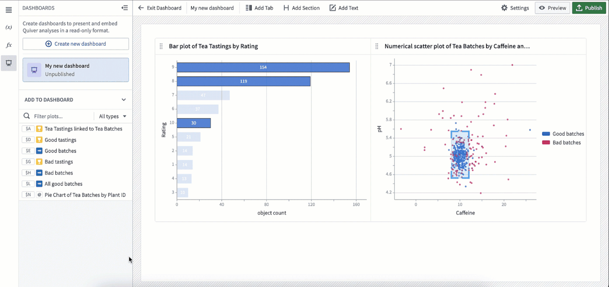

You can use the drag handle in the top left corner of a card or cell to change its position on the dashboard.

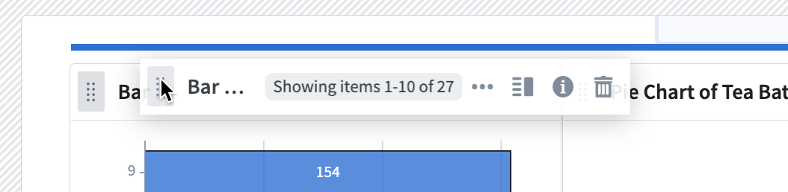

To remove a card, use the "trash" icon in the top right corner of a card as shown below. Once removed from the dashboard, the card will become available in the **Add to dashboard** panel and can be added again. Note that removing a card from a dashboard does not delete the card from the analysis.

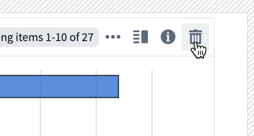

### Filtering cards by name or output type

In large analyses, you can quickly end up with a lot of cards to search through. To make it easier to find the content you need in your dashboard, you can filter content by name or card output type. You will also see a preview of the card when hovering over it.

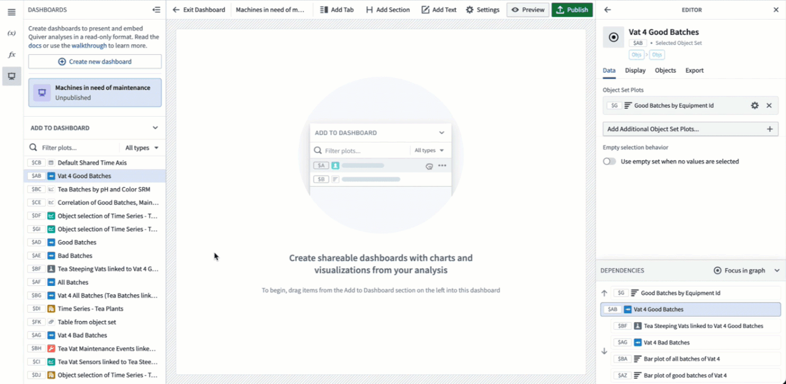

### Add content to dashboard from analysis mode

While building your analysis, you can add cards to a dashboard directly without opening the dashboard. To do this, click the dashboard icon in the top right corner of the card. You can either add to an existing dashboard or to a new dashboard. The card will be added at the bottom of the chosen dashboard in a new row.

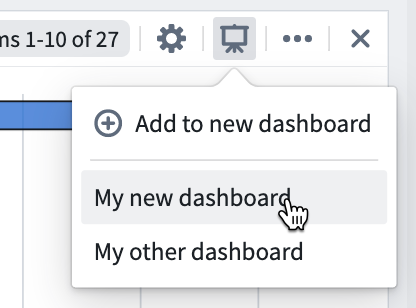

## Edit layout and annotate your dashboard

### Create parameters and metrics cells

Once you’ve added a parameter or metric card to the dashboard, you can add more cards of the same type to the same cell. You can then reposition them on your dashboard at the same time. To do this, drop the cards on the blue drop zone inside the cell.
One benefit of adding multiple parameters or metrics to the same cell is that there is no limit on how many you can add side-by-side. On regular cards, you would be limited to three in the same row.

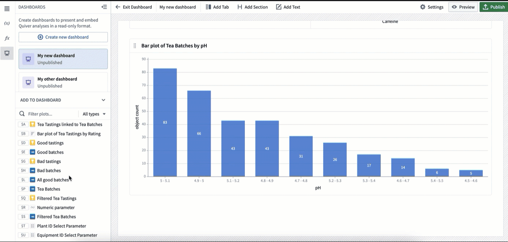

### Attach sidebars

A common pattern for using parameters (or metrics) cells is to attach them to one side of the dashboard so they are always visible when scrolling. This can be useful to highlight key metrics (such as KPIs) or to create a parameters sidebar that the user can easily access. Though these use cases are the most common, you can attach any type of card to the sides of the dashboard.

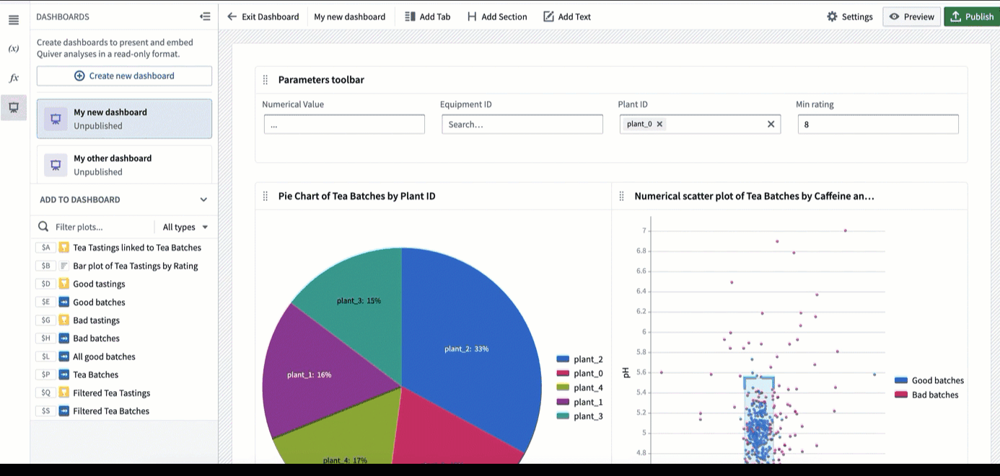

### Add tabs

There are two level of tabs you can create in your dashboard: top-level tabs and card-level tabs.

#### Top-level tabs

Top-level tabs are added to the very top of your dashboard and allow you to create multiple “pages”. To add a top-level tab, select **Add Tab** in the top toolbar as shown below.

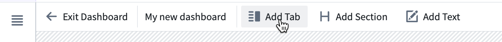

Select the down arrow next to a tab to access a dropdown menu of actions to rename, move right or left, or delete the tab. You can also rename a tab by double-clicking on the tab name.

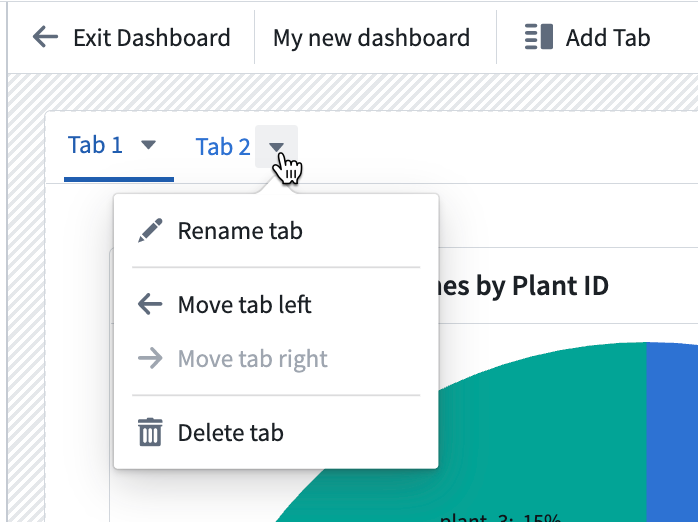

#### Card-level tabs

Card-level tabs allow users to toggle between different charts. Note that you cannot add sections or text within card-level tabs.

To add a tab on a card, select the **Add tab** icon in the top right corner as shown below.

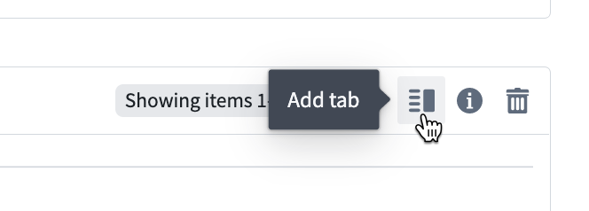

Select the down arrow next to a tab to access a dropdown menu of actions to rename, move right or left, or delete the tab. You can also rename a tab by double-clicking on the tab name.

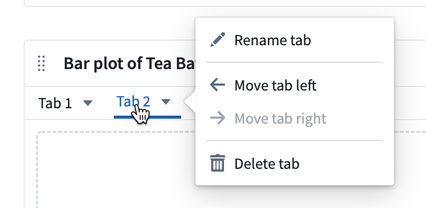

### Add sections

A section is defined from the header to the following header, or to the bottom of the dashboard if there are no other headers. To create a section, select **Add Section** in the top toolbar.

Sections can be repositioned using the drag handle on the left.

Sections are automatically collapsible. To collapse a section, click on the arrow on the left side of the section as shown below.

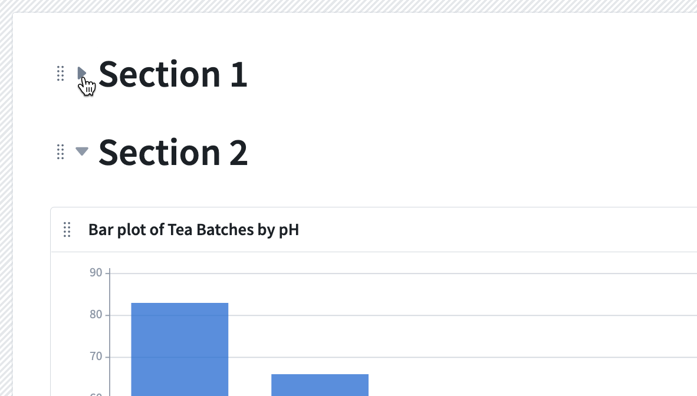

### Add text

You can add text in your dashboard using the rich text editor provided.

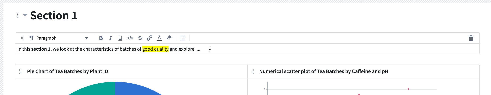

To add a text component, select **Add Text** in the top toolbar. The text component will be added at the very bottom of the dashboard.

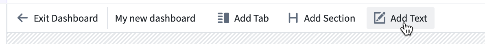

You can add text to a specific place in the dashboard by clicking the **⁠— + ⁠—** line in-between rows, as shown below.

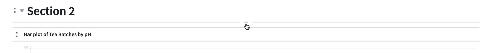

### Add tooltips

On each cell in the dashboard, you can add a tooltip that will be visible to end users. Click on the **(i)** (information) icon in the top right corner to add a tooltip.

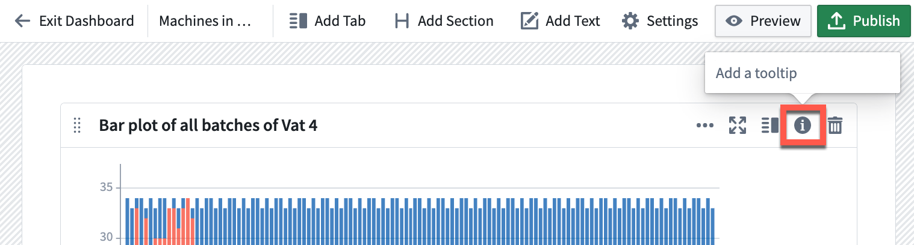

### (Advanced) Add containers

Containers are not recommended for standard dashboard designs. However, some cases may require more complex or customized layouts for which containers can be helpful. Containers allow you to add multiple cards to a single cell within a specific configuration, such as tabs or a list. Once created in analysis mode, containers can be added as a single cell to your dashboard.

Containers can be added from the **Display** menu in your analysis.

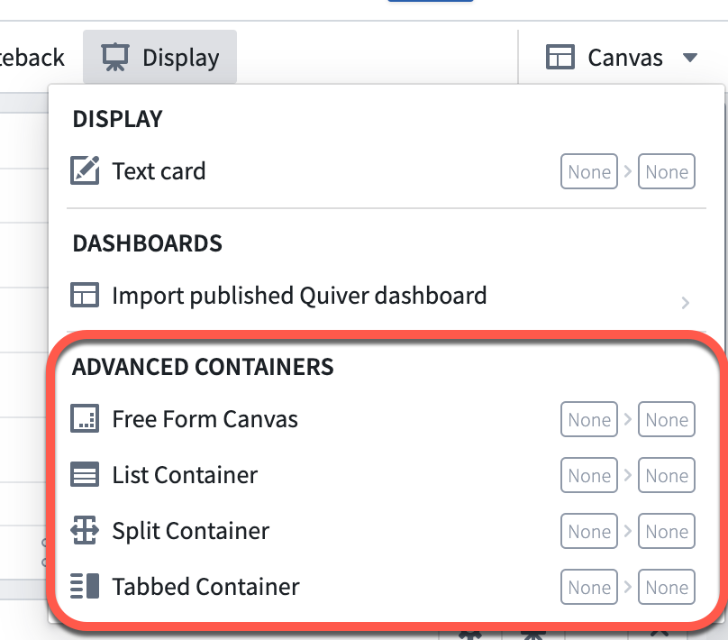

Add the container to your analysis, then drag cards from the **Analysis contents** panel into the container. You can configure containers using the card editor on the right side.

Once the container has been configured in analysis mode, you can add it to your dashboard like a regular card. To add the container, select the **Add to dashboard** button in the top right corner of the card, or drag it into the dashboard from the **Add to dashboard** section.

## Choose your dashboard view style

To choose your dashboard view style, open the dashboard editor with the **Settings** button in the top toolbar.

You will have the option to choose between three view styles: default, compact, and stretch.

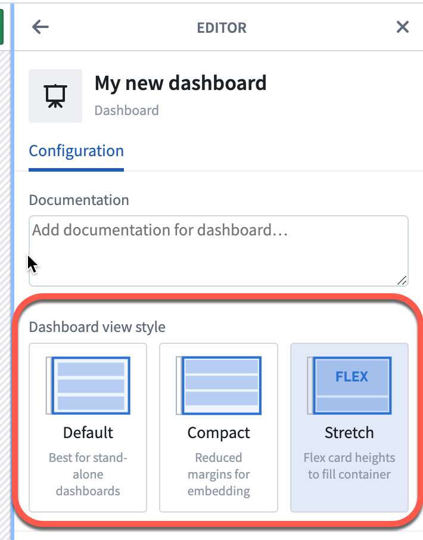

### Default

The default dashboard view is a report-style view. This view is designed with more whitespace for ease of reading, including large margins on the sides and between rows. This style is best for standalone dashboard consumption.

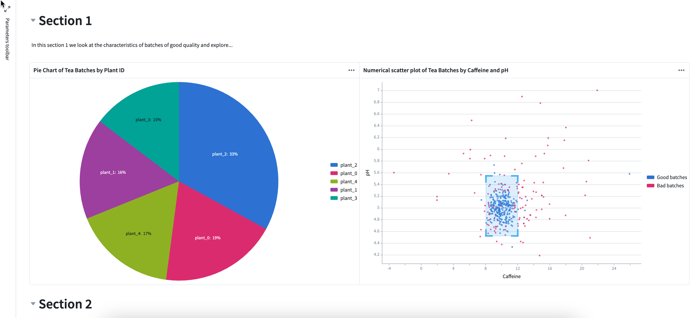

### Compact

In the compact dashboard view, rows are stretched horizontally, margins to the sides and between rows are removed, and row heights are unchanged. The compact view is a good option when embedding a dashboard in another application, as the dashboard may fit better without added margins. In the example below, the title whitespace in cards (marked in red) is compacted pushing section 2 up into view.

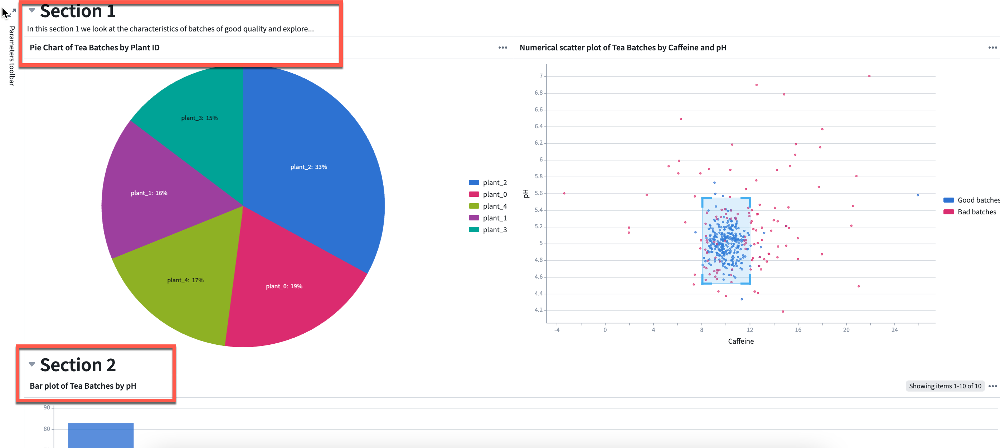

### Stretch

In the stretch dashboard view, rows are stretched both horizontally and vertically so all contents of the dashboard fit in the size of the window. This prevents the user from having to scroll when embedding the dashboard in another application. In the example below, both sections are compacted to remove whitespace and chart sizes are adjusted to fit in one window.

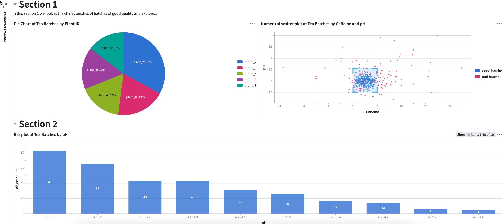

## Define your dashboard inputs and outputs

The main purpose of inputs and outputs is to pass data to and from an application where the dashboard is embedded. For example, charts in the embedded dashboard can update based on an object set selection in the application, or a Workshop metric card can highlight a value computed in the [embedded dashboard](/docs/foundry/quiver/dashboards-workshop/).

You can define multiple inputs and outputs to your dashboard.
Follow the steps below to add inputs or outputs to your dashboard:

1. Open the dashboard editor with the **Settings** button.

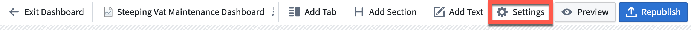

2. Select **Add input** or **Add output**.

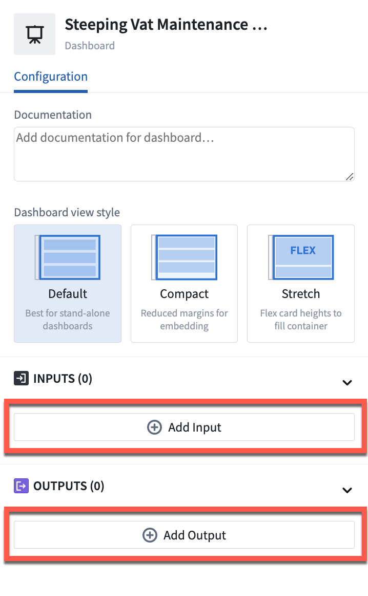

3. Choose the data (e.g object set, object, time series, variable, etc.) from the dropdown list to be used as an input or output.

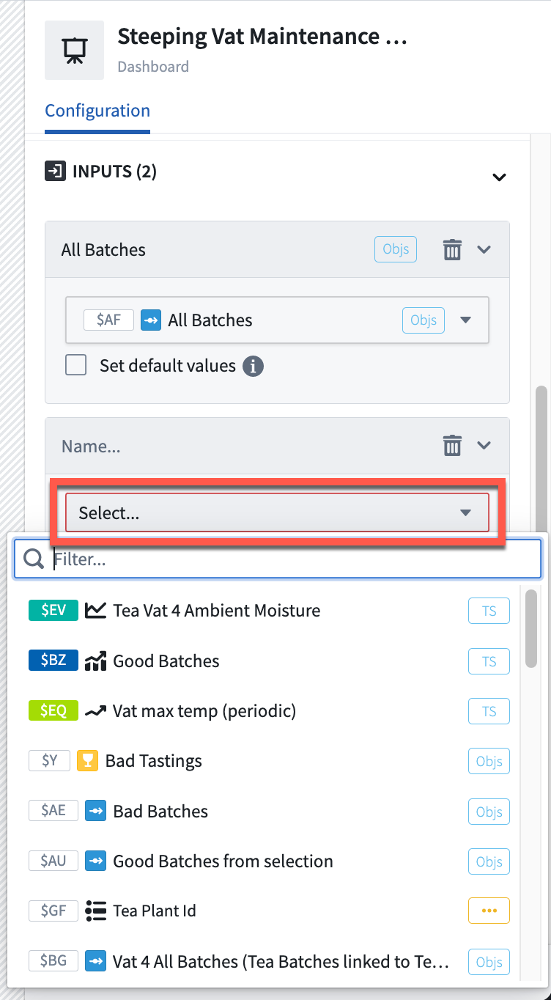

4. Optionally, set the current data value as the default value for the input, which is the value the parameter will have if no input is passed in.

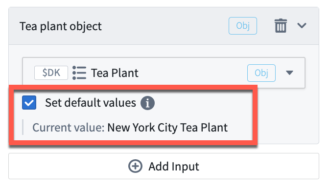

5. Optionally, give a meaningful title to the input or output by selecting the default title and typing in a new one. This title will be visible in the application where the dashboard is embedded when mapping inputs and outputs.

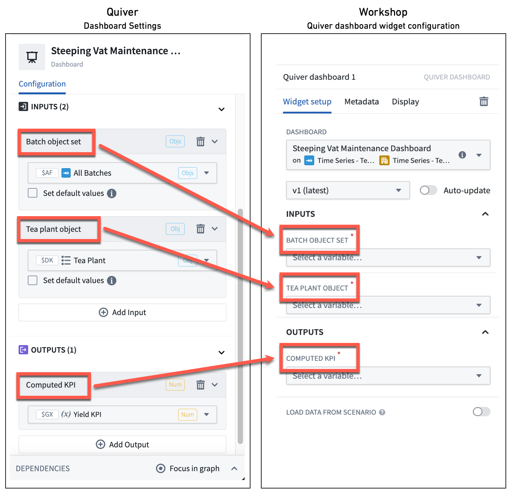
