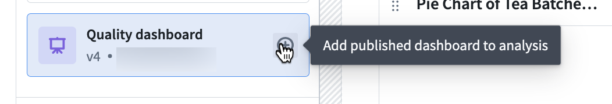
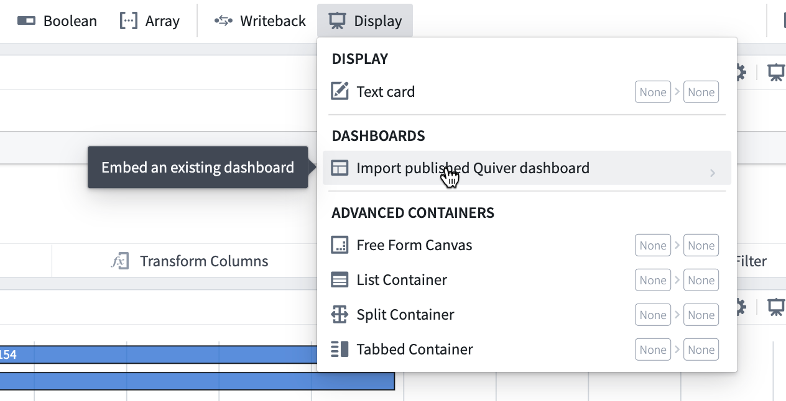
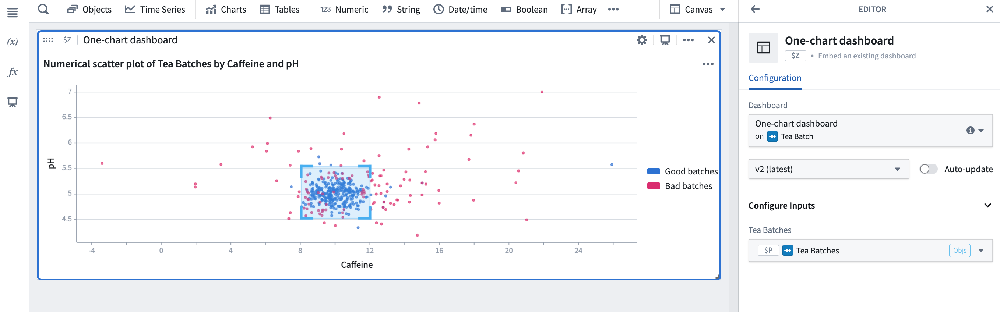

<!-- source: https://palantir.com/docs/foundry/quiver/dashboards-in-analysis/ · mirrored 2026-08-22 from Palantir Foundry docs -->

# Use a dashboard within an analysis

To reuse a visualization with the same configuration and different inputs, create a dashboard that contains only the visualization and define its inputs. **Publish** the dashboard before adding it to an analysis. You can add a published dashboard in the following ways:

1. From the dashboard side panel, use the **+** button next to the dashboard to add it to the analysis.

2. From the analysis mode, select **Display** in the top menu and then **Import published Quiver dashboard**.

3. From **More actions** on a dashboard list item, select **Add Published**. This menu also provides actions such as **Manually Link** and the option to duplicate a dashboard.

When imported into the analysis, the dashboard will be displayed in a card. In the card editor, you can choose which dashboard to display, select the dashboard version (if **Auto-update** is enabled, the editor will always show the latest version), and configure any dashboard inputs.

