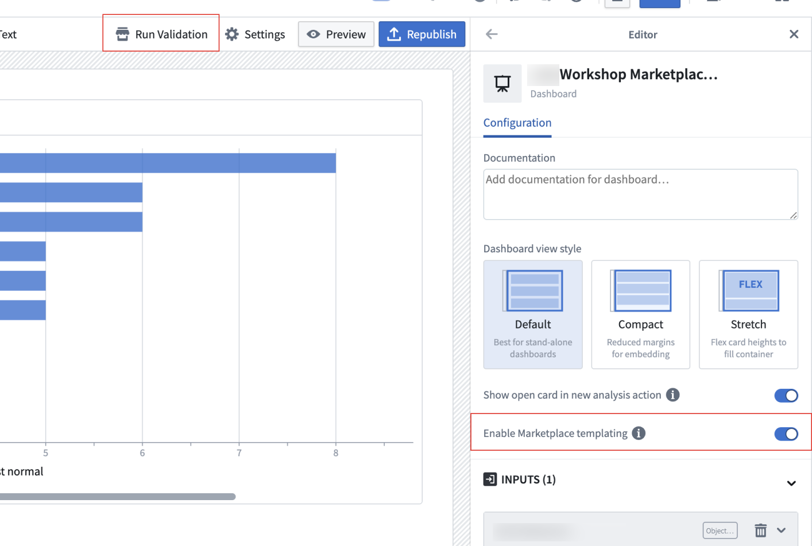
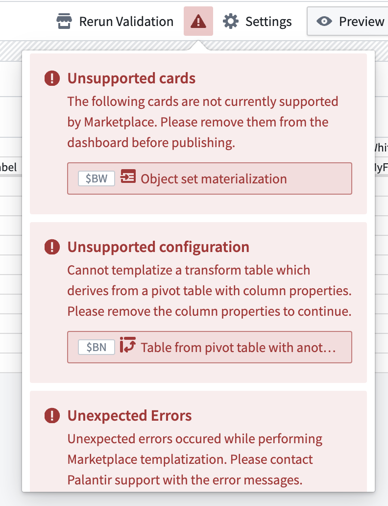
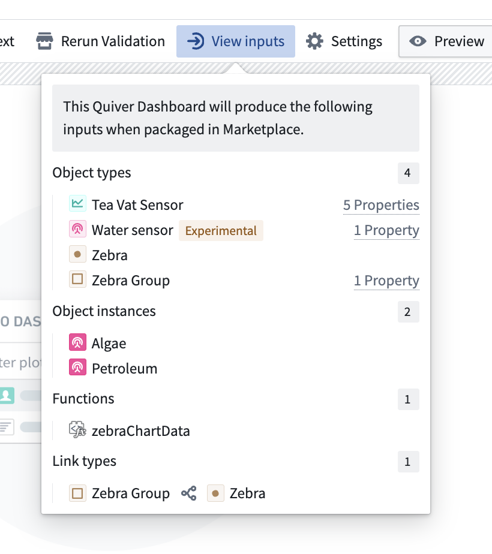
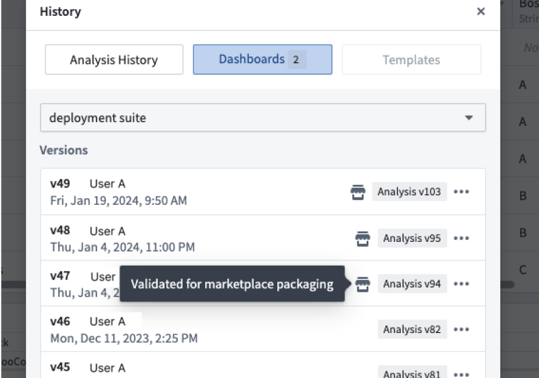
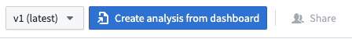

<!-- source: https://palantir.com/docs/foundry/quiver/dashboards-marketplace/ · mirrored 2026-08-22 from Palantir Foundry docs -->

# Add Quiver dashboard to a Marketplace product

Use [Foundry DevOps](/docs/foundry/devops/overview/) to include your Quiver dashboard in [Marketplace products](/docs/foundry/devops/core-concepts/#product) for other users to install and reuse. [Learn how to create a Marketplace product.](/docs/foundry/foundry-devops/create-products/)

## Supported features

Quiver dashboards with the following features are supported:

* Object analytics cards, such as filter object set, set math, and linked object sets.
* Object-based visualizations (charts) such as bar chart, line chart, and heat grid. Vega plots can also be packaged as long as the underlying transform table is supported.
* Time series charts and plots, including events and grouped plots.
* Tables including most pivot tables, and transform tables with transforms such as group by, join, and filter.
* Basic visualizations including numeric cards, string cards, text cards, and date/time cards are supported.

## How to package dashboards

1. From the right side of the dashboard settings pane, select the **Enable Marketplace templating** option.
2. Select the **Run validation** button in the header to identify potential Marketplace templatization issues, if any.
3. If the validator does not display any errors, the dashboard **Publish** or **Republish** button will also save a Marketplace-ready version of the dashboard.
4. Use that dashboard version in a new or existing [Marketplace product](/docs/foundry/foundry-devops/create-products/).

### Linter errors

The linter may indicate up to three main classes of errors:

* Unsupported cards: The card is not currently supported for Marketplace templatization.
* Unsupported configuration: The card is supported, but its configuration is not supported (such as seen in the pivot table examples below). Review the error message provided to learn more.
* Unexpected errors: In most cases, resolving the above two items will remove any unexpected errors. If unexpected errors remain, contact Palantir Support.

:::callout{theme="neutral"}
The validation process considers the underlying logic and dependencies of all cards and transforms in your analysis, not just those directly visible on the dashboard. If a card that is not compatible with Marketplace has a dependency that is used on the dashboard, validation will fail. Review the full dependency chain of any flagged cards to identify and resolve compatibility issues.
:::

:::callout{theme="neutral"}
Instead of linting each dashboard individually, you can enable Marketplace linting for an entire analysis to run validation automatically as you work. When analysis-wide linting is enabled, a Marketplace validation indicator appears next to the **Save** button, displaying the current validation status and the number of errors and warnings found. Select the indicator to review validation details.   
In the [Global settings](/docs/foundry/quiver/analysis-settings/#global-settings) panel, select the **Enable marketplace linting** option to turn on Marketplace templating for all dashboards in the analysis and enable the analysis-wide linter. You can still disable templating for an individual dashboard from its dashboard settings.
:::

### Inputs required for Marketplace installation

If validation is successful, a **View inputs** option will appear in the header. Selecting it will display a list of object types, object instances, functions, and link types that the dashboard will require when packaged in Marketplace. For object type inputs, hover over the **Properties** text to the right of each input to see a list of property types that will need to be mapped.

The **Dashboards** section of the **Analysis History** dialog displays which dashboard versions have been validated for packaging:

## Create an analysis from an installed dashboard

While the underlying Quiver analysis is not packaged alongside the dashboard, you can create a new Quiver analysis from the installed dashboard by selecting **Create analysis from dashboard**.

The created analysis will contain a copy of this dashboard, all cards visible in the dashboard, and their upstream dependencies.

:::callout{theme="neutral"}
The created analysis and its dashboards will be disconnected from the installed dashboard. Modifications to the analysis will not update the installed dashboard, and changes made to the installed dashboard will not be automatically incorporated into the analysis.
:::

## Feature usage considerations

The feature's capabilities are still being actively developed. Do take note of the following important usage considerations.

### Unsupported cards and configurations

Certain cards which derive their configuration from underlying data have limited support when packaging for Marketplace. See the pivot table and materialization sections below for more details.

### Time series

Most Foundry time series features are supported in Marketplace products. However, [time series measures](/docs/foundry/quiver/timeseries-overview/) are not currently supported in Marketplace.

To ensure compatibility with Marketplace, your dashboard must:

* Not use measures capabilities in time series features and transforms.
* Not have measure columns added to the transform table or object set views. These can be removed from the transform table display settings.

If the linter detects any measures are used, the linter will throw an unsupported configuration error, detailing the offending card and/or measure(s).

As an alternative to using measures capabilities, you can directly import a series from its [sensor object](/docs/foundry/time-series/time-series-concepts-glossary/#sensor-object-type), which is a supported method.

### Pivot tables

The [pivot table card](/docs/foundry/quiver/card-pivot-table/) is available but has limitations when a transform table is downstream, affecting column renaming and row operations. Ensure your card:

* Contains no column properties, as the columns would have been based on underlying data.
* Have labels configured the input pivot table card for any aggregations to ensure a stable and unique column name.

Additionally, if there is a Selected Object Set card downstream from a pivot table, its selected data will be cleared before packaging.

### Materializations

Cards that use [Materialization](/docs/foundry/quiver/cards-index-materializations/) data types can be packaged, but with limitations. Column names remain unchanged during packaging and installation, so they will not be updated to reflect the installed object type. If the dashboard is installed with a different object type than it was packaged with, Materialization cards (and their downstream cards) within the dashboard may fail to load. Specifically, the property type API names or backing dataset column names must match those in the original object type, depending on whether `Rename column names to API names` is enabled.
