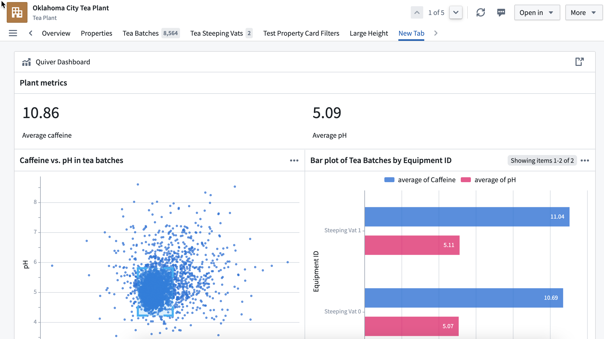
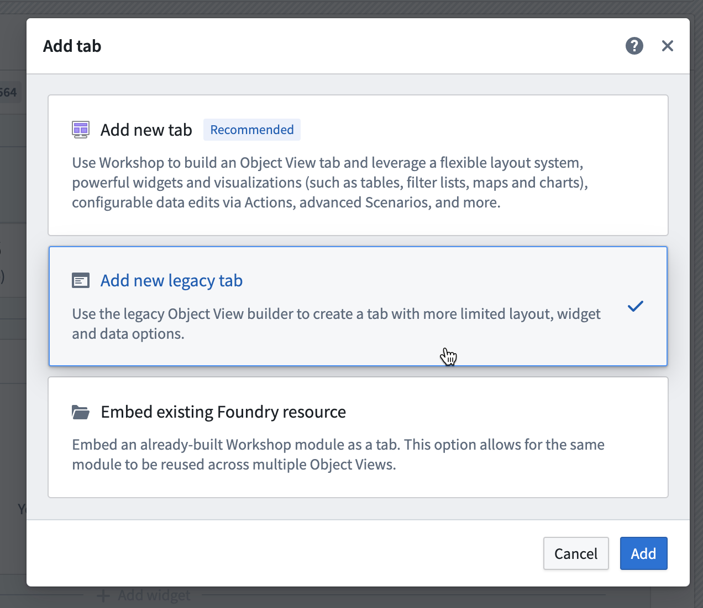
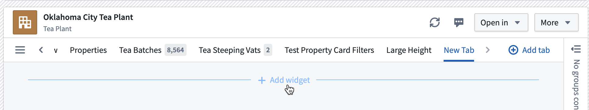
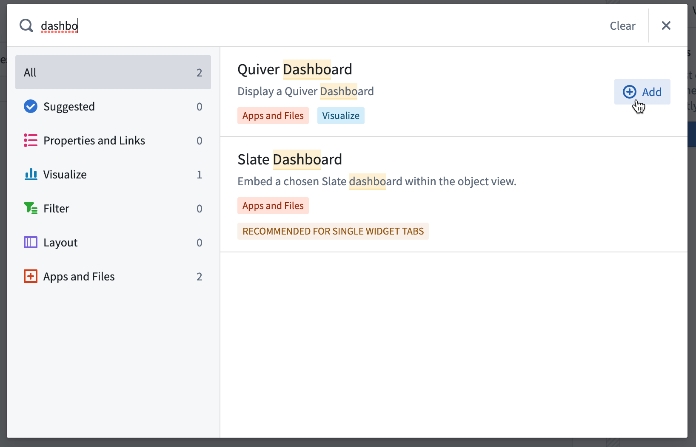
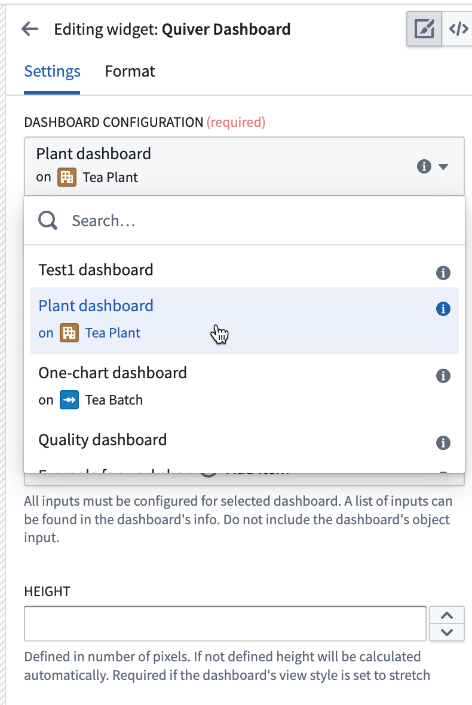
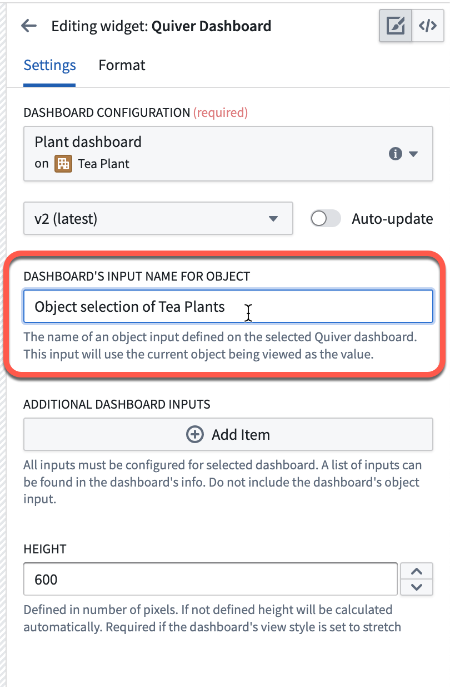

<!-- source: https://palantir.com/docs/foundry/quiver/dashboards-object-view/ · mirrored 2026-08-22 from Palantir Foundry docs -->

# Embed in an object view

Published Quiver dashboards can be embedded in [object views](/docs/foundry/object-views/overview/) in Object Explorer.

## Add Quiver dashboard widget

A Quiver dashboard can be added directly from a [“legacy” Object View builder tab](/docs/foundry/object-views/config-tabs/).

From there, open the **Add widget** menu and select **Quiver dashboard** from the list.

## Configure Quiver dashboard widget

From the dropdown list, select the published dashboard you want to embed.

To use the object from the object view as an input to the Quiver dashboard, copy the name of the object input defined in the Quiver dashboard in the **Dashboard’s input name for object** field.

If there are additional inputs configured for this dashboard, you can map to the data inputs from the object view by selecting **Add Item** in the **Additional dashboard inputs** section.

| Quiver input type | Object view filter type |
| --- | --- |
| Boolean | String, or first in string list |
| Number | String, or first in string list |
| String | String, or first in string list |
| Time | String, or first in string list |
| Time Range | Time range or relative time range filter |
| Time Series | *Not supported* |
| Object | *Not supported* |
| Object Set | *Not supported* |
| String List | String list |

Finally, define the height of your widget. **This is required when the dashboard’s view style is set to stretch**, otherwise the widget will have a default height of 0 pixels.
