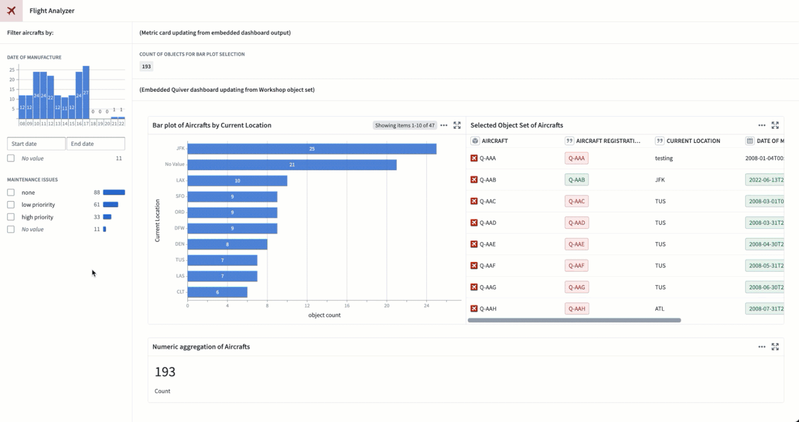
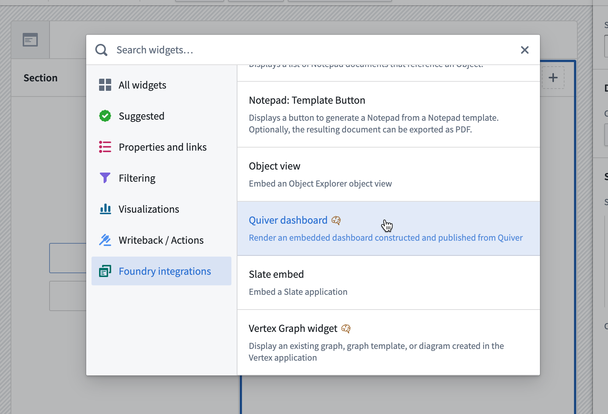
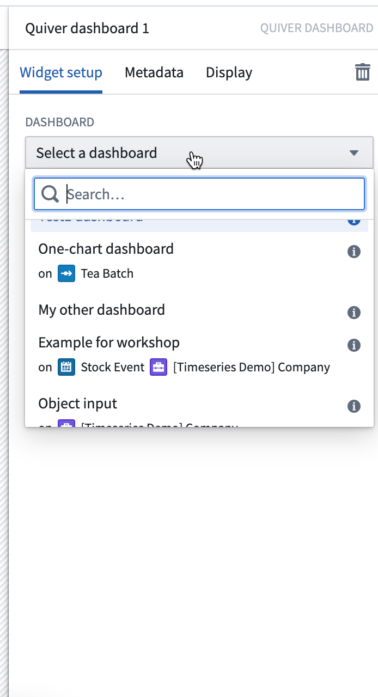
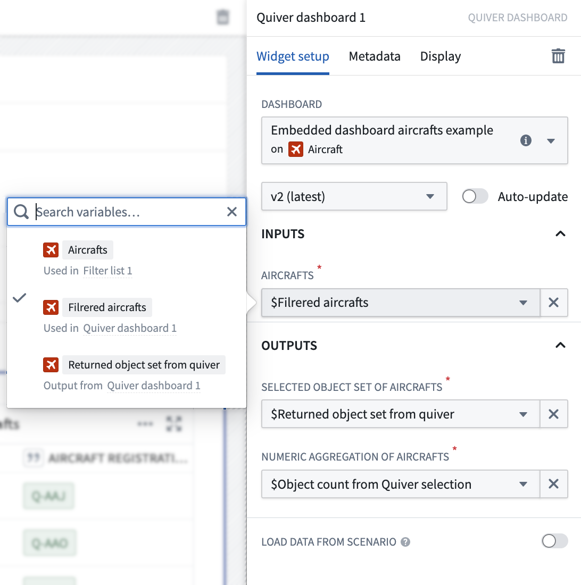

<!-- source: https://palantir.com/docs/foundry/quiver/dashboards-workshop/ · mirrored 2026-08-18 from Palantir Foundry docs -->

# Embed in a Workshop module

You can embed published Quiver dashboards in [Workshop modules](/docs/foundry/workshop/overview/).

The main purpose of inputs and outputs is to pass data to and from an application where the dashboard is embedded. For example, charts in the embedded dashboard can update based on an object set selection in the application, or a Workshop metric card can highlight a value computed in the embedded dashboard.

In the example below, we filter the Workshop `Aircraft` object set for aircrafts with `high priority` maintenance issues.
The embedded Quiver dashboard automatically updates to show a bar plot of aircrafts by current location and a list of objects next to it. As we select only the aircrafts located  in `DFW` and `DEN` from the bar plot, the Workshop metric card at the top updates accordingly to show the object count in the Quiver bar plot selection.

## Embedding a dashboard

In Workshop, select **Add widget**, then choose **Quiver dashboard** from the menu.

In the widget editor, select the dashboard you want to embed. The list shows all the published dashboards to which you have access. Hover over the information tooltip next to each dashboard to get more information, or open it in a new tab.

## Configuring inputs and outputs

You can define multiple inputs and outputs to your dashboard.

If the selected dashboard has inputs or outputs configured, Workshop will prompt you to map them to Workshop variables.
Quiver dashboard inputs and outputs can be mapped to Workshop variables according to the following mapping table:

| [Quiver data type](/docs/foundry/quiver/analysis-data-model/) | Workshop variable type |
| --- | --- |
| Boolean | Boolean |
| Number | Numeric |
| String | String |
| Time | Timestamp, Date |
| Time Range | String (because Workshop does not have a range variable type, pass the [range start](/docs/foundry/quiver/card-range-start/) and [range end](/docs/foundry/quiver/card-range-end/) as strings instead) |
| Time Series | Object (because Workshop does not have a time series variable type, pass the time series object instead) |
| Object | Object |
| Object Set | Object Set |

Finally, make sure you have the correct dashboard version selected. If you want the dashboard to automatically show the latest version, enable the **Auto-update** toggle.

