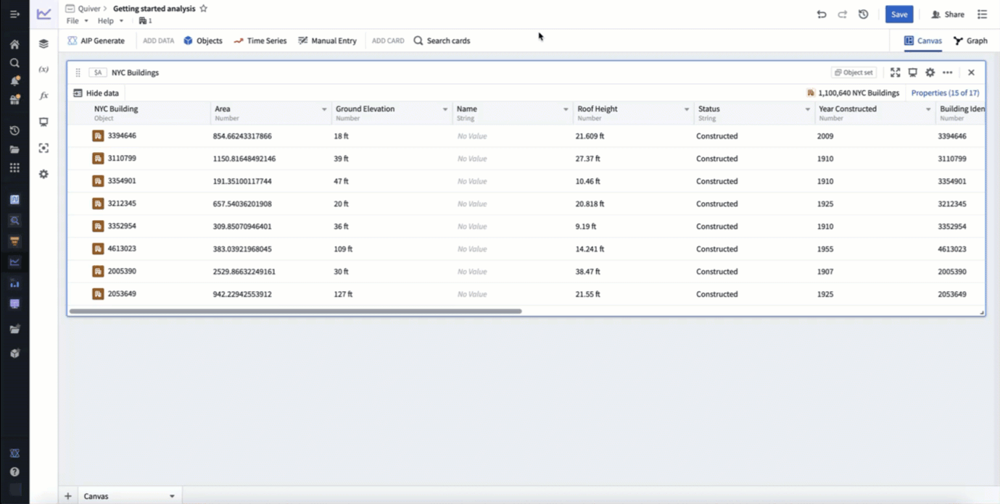
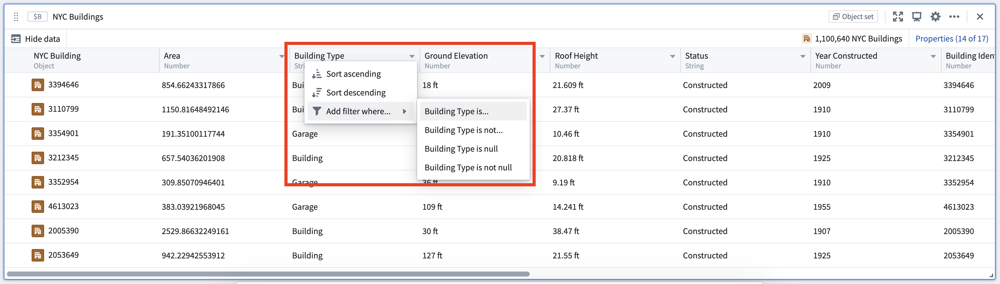
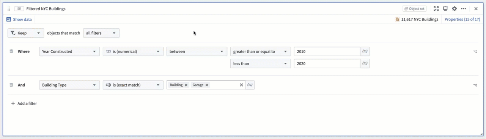
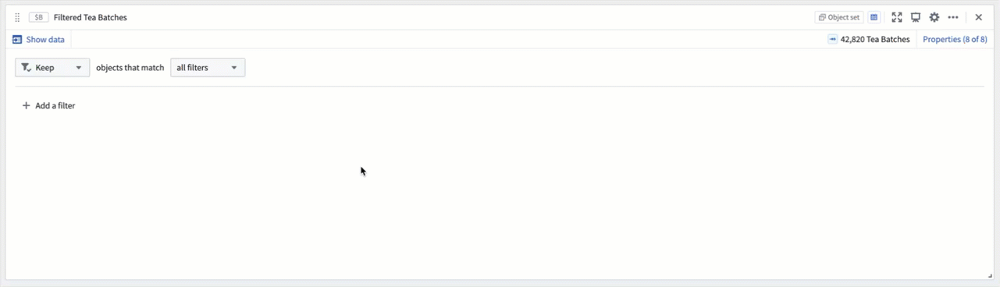
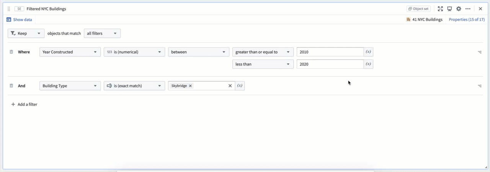
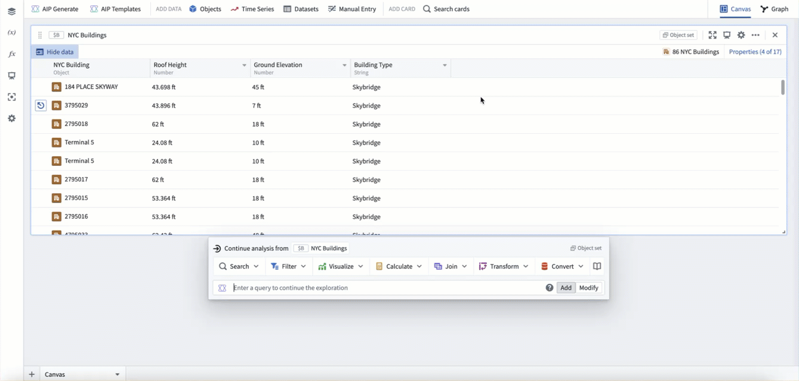

<!-- source: https://palantir.com/docs/foundry/quiver/objects-filter/ · mirrored 2026-08-22 from Palantir Foundry docs -->

# Filter object sets

The most common way to filter objects in Quiver is to use the [filter object set](/docs/foundry/quiver/card-filter-object-set/) card. Hover over any object set card to display the [next actions menu](/docs/foundry/quiver/analysis-toolbars/#next-actions-menu) below the card. Then, select **Filter > Filter object set** to add the filter card.

The example below uses a filter to only include building objects constructed between 2010 and 2020 that are of type `building` or `garage`, resulting in a new object set of 11,617 buildings (out of 1,100,640 in the input object set).

You can also create a filter card for a specific property directly from the column headers in the object set card's table. To do this, open the dropdown menu on the right side of a property column header, and then hover over **Add filter where...**. Each property column header includes quick options for exact match and null filtering. Adding a filter this way adds a filter object set card with the selected property preconfigured.

## Viewing filter results

Select the **Show/Hide data** button to switch between the **results** view and the card **configuration** view.

## Filtering on linked properties

The filter object set card also supports filtering by linked object properties. This is useful when your filter condition does not relate to a property of the object you are working with, but rather a property of an object to which it is linked.

To add a linked property filter, when adding a filter select the linked object type from the **Filter by linked objects** list and then click the linked property to add it.

The example below filters an object set of Tea Batches.  Each batch of tea is linked to a Tea Tasting object, which rates the batch on a scale of 1-10.  In this example, we are looking for good batches, so you can filter to all Tea Batches linked to a Tea Tasting that had a rating greater than 8.

When filtering by linked properties, if the starting object set is under 100k, the scale is unlimited. If the starting object set is over 100k, the set of linked objects must be less than 10m.

## Nesting filters

For advanced filtering workflows that require both `AND` and `OR` operators together, the filter card supports nesting filters.  To do this, select the **Insert Nested Filter** button on the right side of a property filter. This will open a menu allowing you to select if the nested filter should use an `AND` or `OR` condition, and which property it should filter on.  While filters can be nested indefinitely, for readability we suggest limiting the depth.

In the example below, our original filter includes building objects constructed between 2010 and 2020 that are of type `skybridge`. We want these to also include any skybridges constructed between 1990 and 2000, so we nest an `OR` condition on the year constructed filter.

## Filtering on derived properties

If you would like to filter on a property that is derived locally in your analysis, you can do this with either a [transform table](/docs/foundry/quiver/cards-transform-table/), or a [materialization](/docs/foundry/quiver/cards-index-materializations/).  These two options have scale and performance tradeoffs, but both support deriving properties locally and then filtering on these derived properties.

The example below uses the transform table to derive a new height property by subtracting a building's roof height from its ground elevation, then filters to where this new height property is greater than 50.

