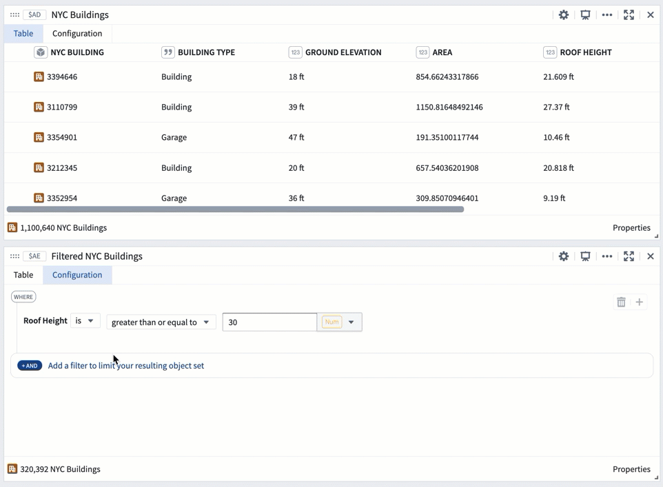
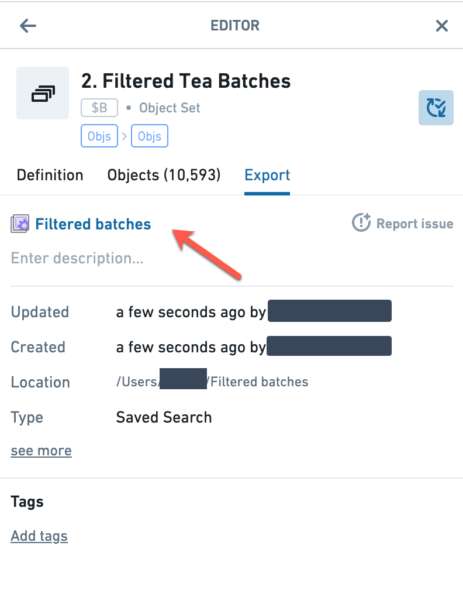
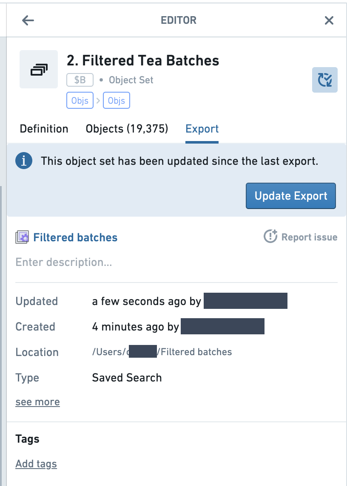
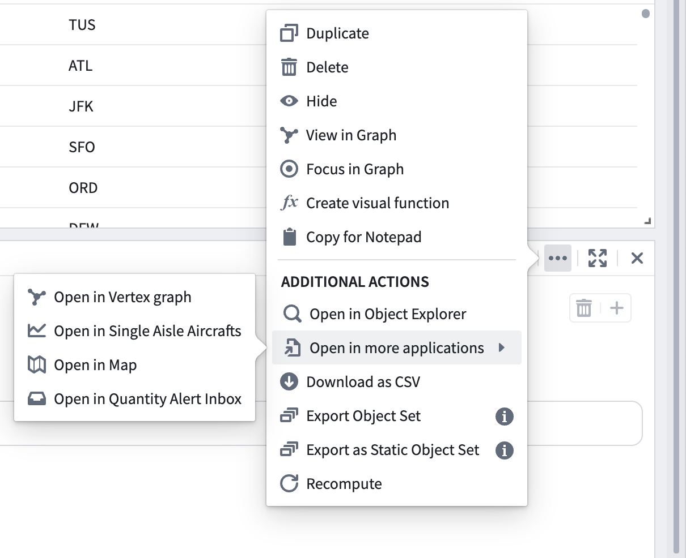

<!-- source: https://palantir.com/docs/foundry/quiver/objects-import-export/ · mirrored 2026-08-22 from Palantir Foundry docs -->

# Export an object set

Any object set created in Quiver can be exported and saved for later use within Quiver or other Foundry applications. To export an object set, open the **More Actions** menu by selecting the  icon in the upper right corner of the card. Then, select one of two options:

* **Export Object Set:** Exports based on object set filters. New objects matching criteria will be automatically added to set.
* **Export Static Object Set:** Exports based on currently returned objects. Can improve performance if object set size is small.

Next, choose a name and location for saving.

Once an object set is exported, you can import the object set into a new Quiver analysis, or open the object set in another application in Foundry, such as Object Explorer. This can be done by either selecting the hyperlinked object set name in the object set’s **Export** tab, or by selecting the object set directly in the folder it has been saved in.

After exporting an object set, if the object set is updated in Quiver, you will be prompted to update the saved object set.

## Open an object set in Foundry applications

You can open any object set created in Quiver directly in other Foundry applications without exporting or persisting the object set, streamlining cross-application workflows. To open an object set in another application, select one of the following options under the **More Actions** menu () found on the top right corner of the object set card:

* **Open in Object Explorer:** Start a new exploration from the object set.
* **Open in more applications:** Open the object set in applications developed in Foundry and published as Carbon modules. These modules include Foundry maps, Workshop modules, Vertex modules, and Quiver dashboards.

