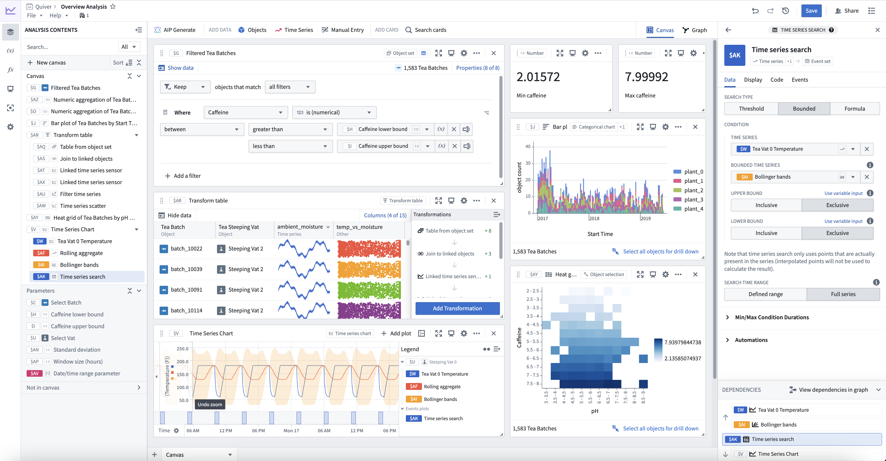

<!-- source: https://palantir.com/docs/foundry/quiver/overview/ · mirrored 2026-08-18 from Palantir Foundry docs -->

# Quiver

Quiver provides a point-and-click interface to perform data analysis on object and [time series](/docs/foundry/time-series/time-series-overview/) data from the [Ontology](/docs/foundry/ontology/core-concepts/). You can use these analyses to create interactive [dashboards](/docs/foundry/quiver/dashboards-overview/) that allow others to explore and investigate the data in operational workflows. For simpler use cases, Foundry offers streamlined interfaces for [time series analysis](/docs/foundry/quiver/analysis-types/#time-series-analysis) and [object set analysis](/docs/foundry/quiver/analysis-types/#object-set-path-analysis). Review our documentation on [analysis types](/docs/foundry/quiver/analysis-types/) for a comparison.

## Key features

Quiver enables you to:

* Visualize, filter, and transform object and time series data without code.

* Build analyses using [canvas mode](/docs/foundry/quiver/analysis-canvas/) for organizing and presenting cards, or [graph mode](/docs/foundry/quiver/analysis-graph/) for inspecting card dependencies and data flow.

* Quickly navigate the relationships between linked object types.

* Parameterize analyses to easily switch between different views of the data and results.

* Create interactive dashboards that you can embed in operational applications such as [Workshop](/docs/foundry/workshop/overview/).

* Create charts that you can embed in reporting applications such as [Notepad](/docs/foundry/notepad/overview/).

* Save and share analyses directly with colleagues.

* Leverage Quiver's [formula language](/docs/foundry/quiver/cards-formula-syntax/) for more advanced calculations.

* Use [transform tables](/docs/foundry/quiver/cards-transform-table/) and [materializations](/docs/foundry/quiver/cards-index-materializations/) for more advanced transformations and aggregations.

## When to use Quiver

Quiver is a good fit for analytical use cases where:

* **Your data is mapped in the Ontology:** Links between objects are natively represented in the Ontology, so Quiver users do not have to perform joins or identify primary or foreign keys. Joins represented as links are returned by performing a [search around](/docs/foundry/quiver/objects-import-linked/) on an object or object set to retrieve any linked objects.
* **You are working with time series data:** Quiver has been optimized to work with time series data. Quiver includes a specific time series library with sensor and signal processing functions, and can be backed by a proprietary time series database that has been optimized for specific operations on high frequency signals. See the [time series overview](/docs/foundry/time-series/time-series-overview/) for more information.
* **You want to embed your findings into other object-aware applications:** Quiver dashboards can be embedded into operational applications such as [Workshop](/docs/foundry/workshop/overview/).
* **You want to write back to the Ontology:** Quiver can be used to write analytical decisions back to the Ontology using an [Action](/docs/foundry/action-types/overview/). This allows you to capture analytical conclusions immediately for use by others.

You can learn more about when to use Quiver and when to use other Foundry applications in:

* [Ontology-aware application comparison](/docs/foundry/ontology/applications/#application-comparison)
* [Point-and-click analysis comparison](/docs/foundry/analytics/types-of-analysis/)

:::callout{theme="success" title="Palantir Learning portal"}
For a deep dive into data analysis in Quiver, visit [learn.palantir.com ↗](https://learn.palantir.com/deep-dive-data-analysis-in-quiver).
:::
