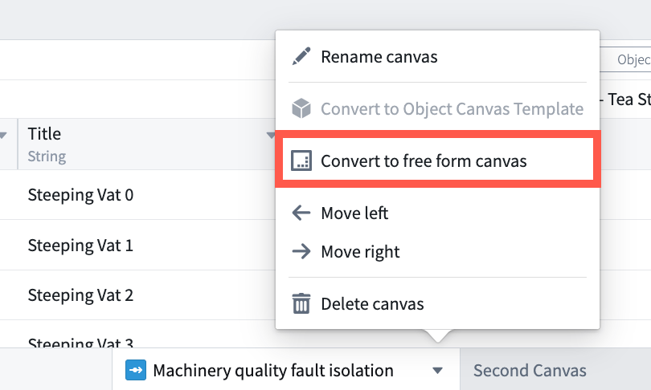
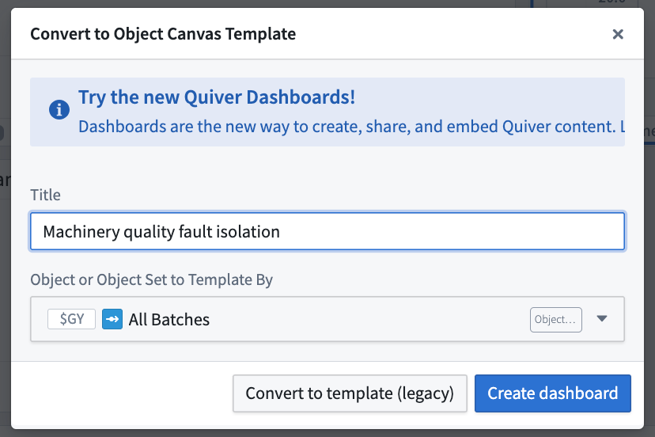

<!-- source: https://palantir.com/docs/foundry/quiver/templates-convert-to-dashboard/ · mirrored 2026-08-18 from Palantir Foundry docs -->

# Convert a canvas template (deprecated) to a dashboard

Object and object set canvas templates are a deprecated method for sharing and embedding content from a Quiver analysis. We recommend using [dashboards](/docs/foundry/quiver/dashboards-overview/) instead of canvas templates. Dashboards are the preferred method of creating, sharing, and embedding content from a Quiver analysis. Though existing canvas templates continue to be supported and editable, the creation of new canvas templates is deprecated. We encourage any existing canvas templates to be converted to dashboards.

## Key differences between dashboards and templates

| Templates  | Dashboards |
| --- | --- |
| **Inputs** |
| Object type input can be changed in published mode | Object type input cannot be changed in published mode |
| Supports only one input  | Supports multiple inputs |
| Input types limited to an object or object set | Multiple input types |
| **Creation** |
| Resize cards on your canvas, and add containers to organize content. | Drag-and-drop content into your dashboard, and easily resize, align, position and structure content with tabs and sections without using containers. Containers are still available as an advanced functionality. |
| No collapsible sections | Collapsible sections |
| One-to-one mapping between canvases and templates | A dashboard can contain content from multiple canvases |
| Can create one template per canvas in the analysis  | Unlimited number of dashboards in an analysis, independent of the number of canvases used for the analysis |
| **Consumption** |
| Templates cannot be displayed as a card in an analysis | A dashboard can be displayed as a card in an analysis |
| RID required to embed in another application | Directly select available dashboards from dropdown, no RID needed |

:::callout{theme="neutral"}
Quiver does not require existing templates to be rebuilt as dashboards. Templates will continue to work as expected. You will still be able to share, embed, and edit Quiver templates.
:::

To convert an existing **object canvas template** to a **[dashboard](/docs/foundry/quiver/dashboards-overview/)**, you first need to convert the **object canvas template** back to a **free form canvas**. To do this, select **Convert to free form canvas** from the canvas menu of an **object canvas template**.

Then, from the canvas menu at the bottom of the application, accessible through the down arrow by the canvas name, select **Convert to object canvas template**.

The dialog presents a choice between converting the canvas to a template (a deprecated feature) or creating a new [Dashboard](/docs/foundry/quiver/dashboards-overview/) containing all the cards in the selected canvas.

Enter the dashboard title and select an object or object set to use as the object type input. Then select **Create dashboard** instead of convert to template.

Alternatively, it is also possible to [create a dashboard](/docs/foundry/quiver/dashboards-create/) and add cards to dashboards one by one manually if converting the entire template to a dashboard is not desired.
