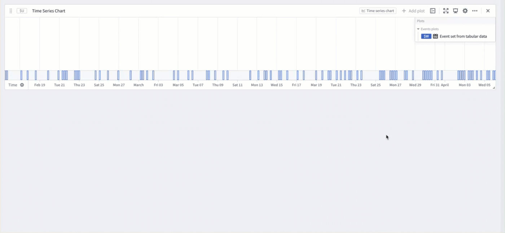
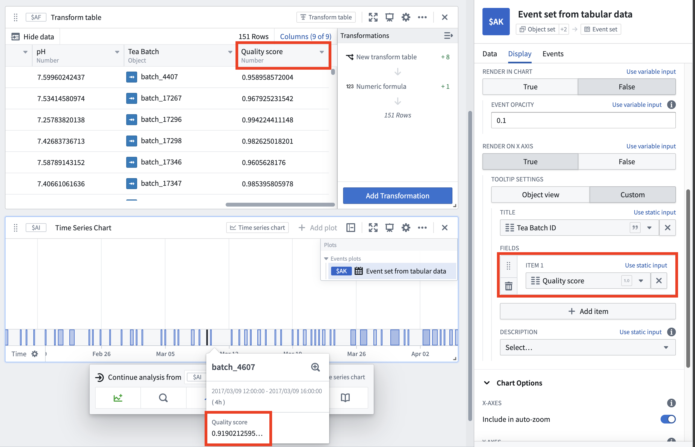

<!-- source: https://palantir.com/docs/foundry/quiver/timeseries-analyze-events-data/ · mirrored 2026-08-18 from Palantir Foundry docs -->

# Analyze events data

Quiver provides robust tools for visualizing and analyzing events data, enabling targeted investigation into periods of interest within time series data. In the simplest case, an *event* is defined by a start and end timestamp, but events can also be enriched with additional properties to support deeper analysis. This flexible structure can represent a wide range of occurrences, such as equipment downtime, maintenance windows, production batches, and more.

Quiver supports the following features:

* Construction of event sets from a variety of data sources.
* Customization of each event's color, tooltip, and visibility using column variables.
* Modification and enrichment of event sets with transform table operations.
* Comparison of time series behavior across multiple events.
* Calculation of event-based metrics and statistics.
* Advanced workflows for anomaly detection and [reference profile](/docs/foundry/quiver/timeseries-reference-profiles/) construction.

## Add events data

To begin event analysis in Quiver, first construct an event set with the desired data. Review the options below for Ontology-based event sets and event sets created using other methods.

### Ontology-based event sets

**Object set to event set:** The [event set from tabular data](/docs/foundry/quiver/card-event-set-from-tabular-data/) card converts an object set to an event set after the object set has been added to the analysis. Select which object properties to use for the start and end of the events. Object types with the [event capability](/docs/foundry/map/integrate-objects/#event-objects) automatically have start and end properties selected.

**Linked objects to event set:** Starting from a single object, perform one or multiple [search-arounds](/docs/foundry/quiver/objects-import-linked/) and use the set of linked objects as events. Optionally, filter the results and select properties for the start and end of the events. See the [linked event set](/docs/foundry/quiver/card-linked-event-set/) details page to learn more.

### Other methods for creating event sets

**Manual ranges:** The [event set from ranges](/docs/foundry/quiver/card-event-set-from-ranges/) card takes inputs to individually define each event in the event set. An event can be defined using a single range card or by two timestamps representing the start and end of the event. The timestamp inputs can be cards, allowing the values to dynamically update, or static values that are chosen manually.

**Time series search:** The [time series search](/docs/foundry/quiver/card-time-series-search/) card creates event sets by defining and evaluating conditions against time series data. Events are created when the condition is met, such as when a threshold is exceeded, bounds are crossed, or a formula is satisfied. This approach is especially useful for [detecting and analyzing anomalies](/docs/foundry/quiver/timeseries-search-anomalies/) in time series data.

**Other tabular data:** [Transform tables](/docs/foundry/quiver/cards-transform-table/) and [materializations](/docs/foundry/quiver/cards-index-materializations/) are also accepted as input to the [event set from tabular data](/docs/foundry/quiver/card-event-set-from-tabular-data/) card. Instead of selecting object properties for the start and end dates, select the appropriate columns.

## Display options

Events data is primarily visualized through [events plots](/docs/foundry/quiver/cards-index-event-sets/#events-plots), which offer flexible display options. Most options can be configured on a per-event basis, enabling detailed information about each event to be displayed. Configure the colors, tooltips, and more in the **Display** tab of any events plot. Below is a summary of the options available. [Learn more](/docs/foundry/quiver/cards-index-event-sets/#display-options).

* **Time series chart visibility:** Quickly toggle the event set to be visible on compatible time series charts.
* **Colors:** Select a color for each event using a static value, a string event column representing hexadecimal color values, or auto-cycle by event column value.
* **Render in chart:** Show events as chart highlights and adjust the highlight opacity.
* **Render on X axis:** Show an events axis and customize tooltips.
  * **Object view:** Show prominent object properties and title.
  * **Custom:** Choose which event columns to use as the tooltip content, title, and description.

## Transform events data

Several cards are available to transform event sets:

**Time shift:** Modify an existing event set by shifting the start and end timestamps forwards or backwards by a duration. This is helpful for adding an offset to either side of the events. Both the value and duration of the offset can be controlled by variables, allowing event-level customization if the information is present in the object set, transform table, or transform table backing the event set. [Learn more about time shift event sets](/docs/foundry/quiver/card-time-shift-event-set/).

**Deduplicate:** Deduplicate all overlapping events in an event set. This is useful as a pre-processing step to reduce computation time or normalize events data. [Learn more about deduplication](/docs/foundry/quiver/card-deduplicate-event-set/).

Further customization can be achieved by converting the events plot to a [transform table](/docs/foundry/quiver/cards-transform-table/).

To perform the conversion, follow these steps:

1. Access the [next actions menu](/docs/foundry/quiver/analysis-toolbars/#next-actions-menu) of the event set by selecting the time series chart where the event set is displayed.
2. Select the **Continue analysis from** menu and then select the desired event set.
3. Select **Convert > New transform table**.

A wide variety of transforms are available to modify or enrich the underlying events data. For example, computing a quality score value for each event and displaying it the event tooltip. After transforming the data, use the [event set from tabular data](/docs/foundry/quiver/card-event-set-from-tabular-data/) card to convert the data back to an events plot and use it in subsequent time series operations.

## Use event sets for time series analysis

Event sets serve as effective tools for investigating periods of interest in time series data. Quiver provides capabilities to summarize, compare, and filter time series data based on the context provided by events, making it easier to extract actionable information.

* **Event statistics:** Aggregate a time series plot over intervals where an event occurs. This card returns a new time series with one point per event, enabling summary statistics or comparisons across events. [Learn more](/docs/foundry/quiver/card-event-statistics/).
* **Event indicator:** Create a time series out of an event set that indicates the number of events occurring at a given time. This is useful for visualizing event frequency or overlap. [Learn more](/docs/foundry/quiver/card-event-indicator-series/).
* **Filtering:** Filter time series data to only include periods occurring during an event in the event set. This is useful for focusing analysis on relevant intervals within time series data, which is often large and complex. [Learn more](/docs/foundry/quiver/card-filter-time-series/).
* **Event comparison plot:** Compare the behavior of a time series across multiple events by overlaying time series segments from each event. This makes it easy to spot patterns, trends, or outliers that occur across the event set, relative to the start or end of each event. [Learn more](/docs/foundry/quiver/card-event-comparison-plot/).

## Related topics

* [Event set cards](/docs/foundry/quiver/cards-index-event-sets/)
* [Time and value ranges](/docs/foundry/quiver/timeseries-ranges/)
* [Transform tables](/docs/foundry/quiver/cards-transform-table/)
* [Reference profiles](/docs/foundry/quiver/timeseries-reference-profiles/)
