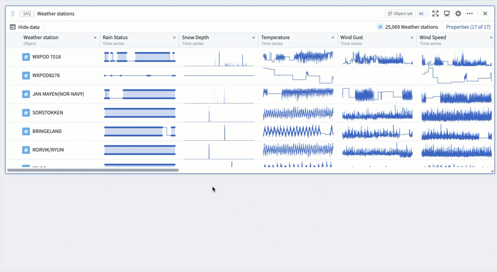
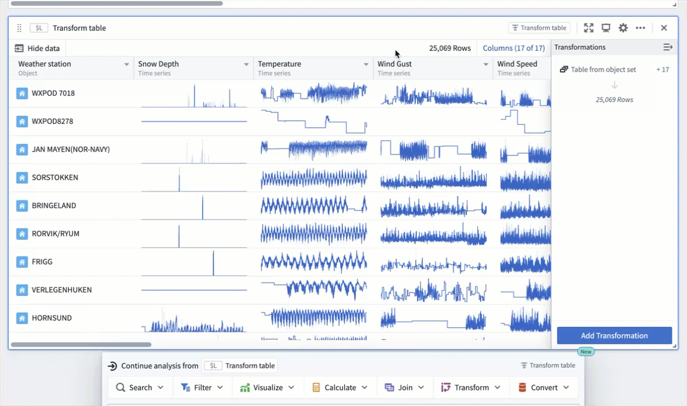
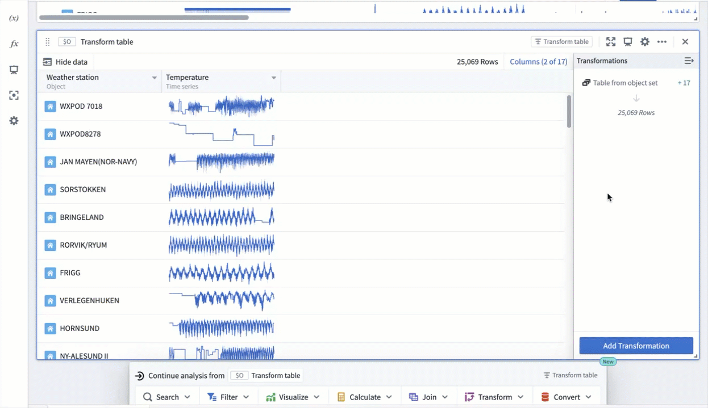
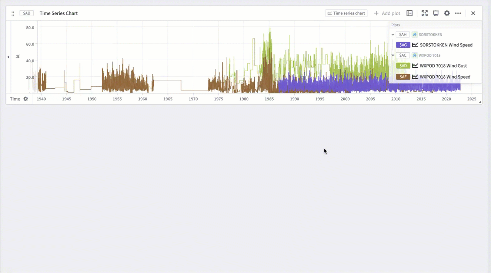

<!-- source: https://palantir.com/docs/foundry/quiver/timeseries-batch-analyze/ · mirrored 2026-08-18 from Palantir Foundry docs -->

# Batch analyze time series

Quiver provides powerful tools for analyzing multiple time series simultaneously, enabling efficient investigation and comparison of time series data at scale. This guide covers the main approaches for batch time series analysis using [transform tables](/docs/foundry/quiver/cards-transform-table/), [grouped time series plots](/docs/foundry/quiver/card-grouped-time-series-plot/), [multi-time-series searches](/docs/foundry/quiver/card-time-series-search/), and [linear aggregations](/docs/foundry/quiver/card-linear-aggregation/).

## Transform table workflows

[Transform tables](/docs/foundry/quiver/cards-transform-table/) are a powerful tool for batch analysis of time series data. Transform tables allow you to operate on multiple time series simultaneously through various workflows. For detailed information about available operations, see [time series operations in transform tables](/docs/foundry/quiver/cards-transform-table-index-timeseries-operations/).

### Time series columns

This section will show you how to use time series columns in a transform table to calculate the 30-day rolling average of temperatures across a hypothetical `Weather Station` object set. Starting off from the `Weather Station` object set, where the `Weather Station` object type contains a `Temperature` time series property:

1. Create a transform table from the next actions menu by selecting **Convert > Transform table from object set**.

2. Add the time series property as a column using the **Properties** button in the transform table. This is only required if the time series property is not already in your table. In the example below, the existing columns are removed with the \**Clear all* button before the `Temperature` time series column is added.

3. Apply transformations to the time series column in batch using the **Add Transformation** button. In the example below, a 30-day rolling average transform of the `Temperature` time series column is added by selecting **Add Transformation**, choosing the **Rolling aggregate** transformation, then setting the window configuration time duration value to `30` and the unit to `Day`.

This workflow is particularly useful if you want to:

* Apply the same transformation (such as rolling average or derivative) to multiple time series.
* Compare transformed series across different objects.
* Create derived metrics from multiple time series.

## Grouped time series plots

[Grouped time series plots](/docs/foundry/quiver/card-grouped-time-series-plot/) provide a powerful way to visualize and analyze multiple time series together. For more information about visualizing time series in Quiver, see [visualize time series](/docs/foundry/quiver/timeseries-visualize/).

To create a grouped time series plot:

1. Start with multiple time series (from a transform table, or object set).
2. Add a grouped time series plot card from the **Next Actions** menu by selecting **Visualize > Grouped time series plot**.
3. Configure the plot by selecting:
   * The input time series column from the table.
   * The page size to control how many time series to overlay.

Grouped time series plots maintain the connection to the underlying data, allowing you to:

* Apply transformations to all series simultaneously.
* Create derived calculations from the grouped data.
* Export or share the analysis results.

This visualization approach is particularly useful for:

* Comparing trends across multiple time series.
* Identifying patterns or correlations between series.
* Analyzing the behavior of related metrics over time.

Grouped time series plots support the same set of time series operations that are available in transform tables. For details, see [time series operations](/docs/foundry/quiver/cards-transform-table-index-timeseries-operations/).

### Time series from time series charts

You can analyze multiple time series from a chart by following these steps:

1. Select the time series chart (not individual plots) in your analysis.
2. Create a transform table using **Compute metrics > Table from time series chart** from the **Next Actions** menu.
3. Each time series plot becomes a row in the table; apply transformations to the table to analyze the series collectively.

This approach is valuable if you want to:

* Compare metrics across different time series.
* Apply statistical analysis to a group of series.
* Create derived calculations from multiple plots.

## Multi-time-series searches

[Time series searches](/docs/foundry/quiver/card-time-series-search/) enable you to find specific patterns or conditions across multiple time series simultaneously. This is particularly powerful for batch analysis through the multi-search feature.

This approach is valuable for:

* Finding patterns across multiple sensors or measurements.
* Identifying when multiple conditions occur simultaneously.
* Analyzing large sets of time series for specific behaviors.

The events identified through time series search can be saved as objects in the Ontology using [time series alerting](/docs/foundry/time-series/alerting-overview/). This allows you to track and monitor specific conditions of interest across your time series data.

## Linear aggregations

[Linear aggregations](/docs/foundry/quiver/card-linear-aggregation/) provide a way to compute aggregate metrics across multiple time series. For related functionality, see [linked series aggregations](/docs/foundry/quiver/card-linked-series-aggregation/) and [how interpolation affects linear aggregations](/docs/foundry/quiver/cards-interpolation-usage/#linear-aggregation).

To perform linear aggregation:

1. Start with multiple time series (from a transform table, grouped plot, or object set).
2. Add a linear aggregation card from the **Next Actions** menu by selecting **Visualize > Linear aggregation** for object sets and transform tables, **Add plot > Linear aggregation** for grouped plots.
3. Configure the aggregation to compute metrics across the time series set.

This feature is valuable for:

* Computing average behavior across multiple sensors.
* Creating composite metrics from related time series.
* Analyzing the overall trend of a group of measurements.

Unlike rolling or periodic aggregates that operate on a single time series, linear aggregation combines multiple series into a single aggregated result, making it ideal for batch analysis scenarios.

## Best practices

When performing batch time series analysis:

1. Consider the size of your dataset. Transform tables have a limit of 50,000 rows for performance reasons, however time series operations tend to slow down at much lower scales. For this reason we recommend limiting the number of rows to 1,000 or less.
2. Use appropriate sampling when working with large time series datasets:
   * For time series plots as input, choose between **Sampled** or **Unsampled** data options.
   * Adjust the number of sampling buckets as needed.
3. Leverage the transform table's ability to operate on time series columns for efficient batch processing.
4. Combine different approaches (transform tables, grouped plots, linear aggregation) based on your analysis needs.

## Related topics

* [Transform tables](/docs/foundry/quiver/cards-transform-table/)
* [Time series operations](/docs/foundry/quiver/cards-transform-table-index-timeseries-operations/)
* [Grouped time series plots](/docs/foundry/quiver/card-grouped-time-series-plot/)
* [Time series searches](/docs/foundry/quiver/card-time-series-search/)
* [Linear aggregations](/docs/foundry/quiver/card-linear-aggregation/)
