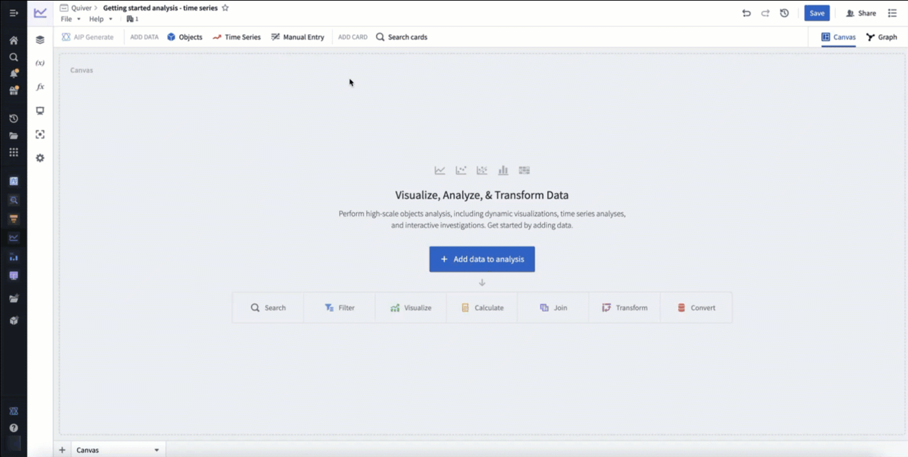
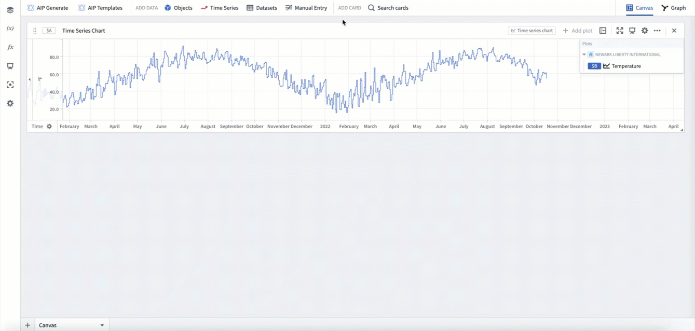
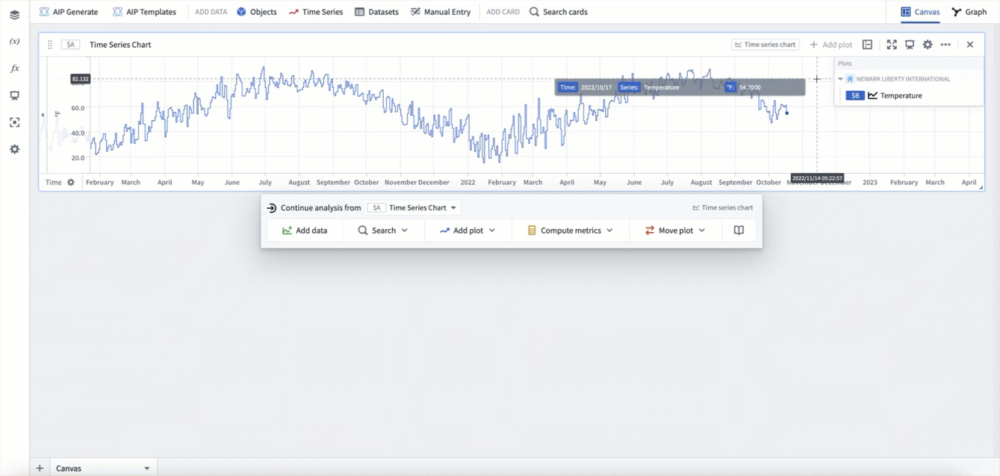
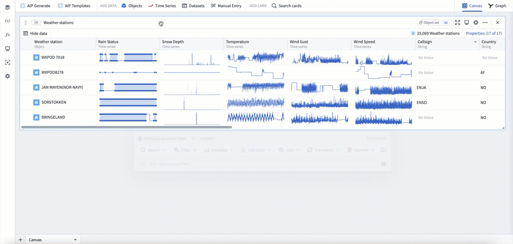
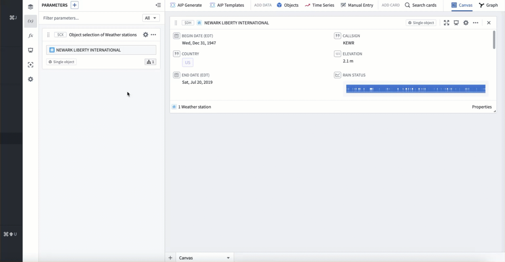
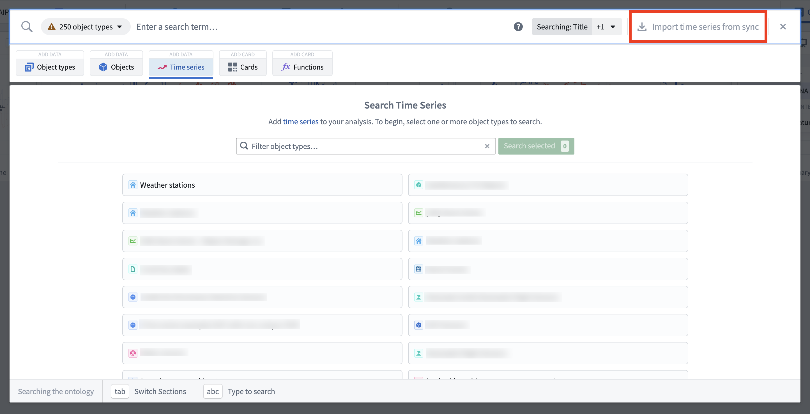
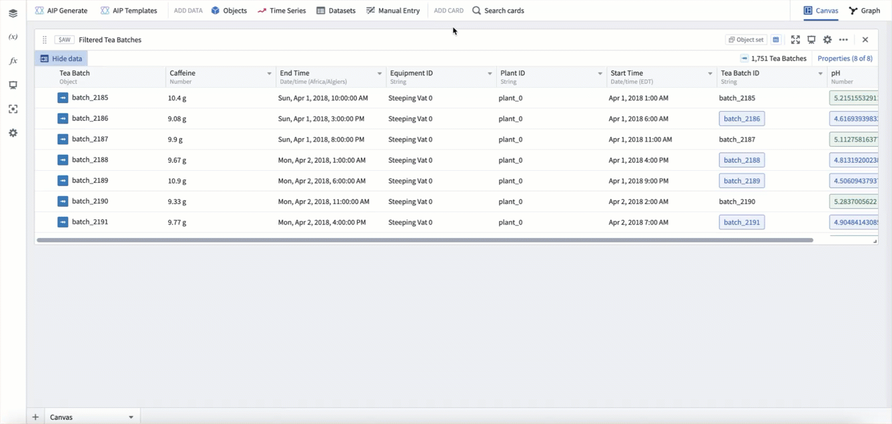
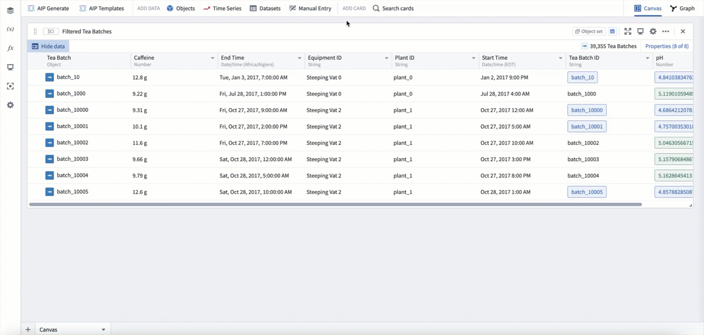

<!-- source: https://palantir.com/docs/foundry/quiver/timeseries-overview/ · mirrored 2026-08-18 from Palantir Foundry docs -->

# Add time series

[Time series](/docs/foundry/time-series/time-series-overview/) data are a series of measurements taken over time, usually at a regular interval. Some examples are measurement of sales volumes per year, total flights per day, production outputs per hour, or high frequency temperature readings at sub-second resolution.

Quiver has first-class support for time series analysis. Time series are primarily added to Quiver through [time series properties](/docs/foundry/time-series/time-series-properties/); however, [time series syncs](/docs/foundry/time-series/time-series-syncs/) and [function-backed time series](/docs/foundry/time-series/function-backed-time-series-overview/) can also be viewed directly. Quiver provides an extensive library of transformations and visualizations for time series data. The first step in working with time series in Quiver is to add a time series to your analysis.

Below, we will walk through several different ways of adding time series data to a Quiver analysis. Once you are comfortable adding time series, you can learn more about [visualizing](/docs/foundry/quiver/timeseries-visualize/) and [transforming](/docs/foundry/quiver/timeseries-transform/) time series.

[Learn more about how to set up time series in Foundry.](/docs/foundry/time-series/time-series-setup/)

## Adding a time series property

The most common way to add time series to a Quiver analysis is through [time series properties](/docs/foundry/time-series/time-series-properties/) in the Ontology. You can add time series properties to your Quiver analysis by selecting **Time Series** in the **Add data** section of the [analysis top bar](/docs/foundry/quiver/analysis-toolbars/#analysis-top-bar). This will open a time series search bar, allowing you to browse objects with time series and add their time series properties to your analysis.

For example, to enable analysis of data about the temperature over time at Newark EWR airport, you might search the `Weather stations` object type for "newark", then add the `Temperature` time series property for `Newark Liberty International` airport. After closing the search bar, the data will be added in a [time series chart](/docs/foundry/quiver/timeseries-visualize/) with the temperature plot. The following animation displays this workflow.

## Adding from a chart

Once a time series chart is in your analysis, you can also open the time series search bar from the next actions menu when hovering over a time series chart, as shown below.

You can also add related time series data from the legend of a time series chart. In the legend, time series will be grouped by the object they are associated with. You can hover over this object and select the **+** button to add other time series associated with the object.

For example, say you want to add wind speed to an existing analysis of Newark EWR temperature to form a more detailed picture of the weather. Start by opening a chart that already has the `Temperature` series for `Newark Liberty International` airport added, as was created above. You can then use the chart legend to add the `Wind Speed` series for `Newark Liberty International` airport.

## Adding from an object set card

Time series can also be "popped out" from an object set card. In the table view of an object set card, hovering over a time series cell will show the button **Pop out property**. Selecting this button will open the underlying time series property as a new time series plot in your analysis. The pop out button will also add an [object selector parameter](/docs/foundry/quiver/card-object-selector/) for the object that the property is popped out from.

In the example below, you can see pop-outs for the `Rain status`, `Snow depth`, and `Temperature` series from station `WXPOD 7018`. This adds all three series as time series plots to a new time series chart. You can then use the object selector to switch the plots to instead use station `CHITRAL`.

## Adding from a single object

Time series can also be added from a single object in your analysis, such as the object selector. Hover over the single object card to open the next actions menu and select **Visualize > Time series property**. You can then configure the selected time series property from the plot's editor.

In the example below, we add a time series property from our object selector, which currently has `Newark Liberty International` selected. This adds the default time series property, which in this case is `Temperature`. We then switch the time series property to be `Wind speed`.

## Adding a time series sync

If you have synced your time series as a [time series sync](/docs/foundry/time-series/time-series-syncs/), but have not integrated it as a [time series property](/docs/foundry/time-series/time-series-properties/) in the Ontology yet, you can still analyze the time series in Quiver. To do this, in the top right of the time series search menu select **Import time series from sync**. This will open the file selector and allow you to select a time series sync to add to your analysis.

## Add a function-backed time series

You can add time series that Python functions generate dynamically by using [function-backed time series](/docs/foundry/time-series/function-backed-time-series-overview/). This supports forecasting with custom models and on-demand data generation.

To add a function-backed time series, add a **Code function time series** card to your analysis. Then, select your published function, choose the version, and configure its inputs. The resulting time series is treated as a first-class time series and can be further transformed using Quiver's standard time series operations.

[Learn more about getting started with function-backed time series.](/docs/foundry/time-series/function-backed-time-series-getting-started/)

## Adding from tabular objects data

If your data has not been synced as a time series, but the data exists as objects with a timestamp property and a value property, your data can still be visualized and transformed in Quiver as time series. This will be subject to scale and performance limitations, however can be useful for exploration.

Time series derived from an object set are tied to that object set, and so will dynamically update based on changes to the object set. For example, if you filter the input object set, the time series will change to only reflect the objects in that filtered object set. This allows for workflows where time series can be generated dynamically based on various user inputs.

### Tabular time series

From an object set or transform table card, you can use the [tabular time series](/docs/foundry/quiver/card-tabular-time-series/) plot to convert tabular data to time series data. To do this, hover over the card and use the next actions menu to select **Convert > Tabular time series**. Then configure the plot with which column to use for each point's timestamp and value.

In example below, we use the tabular time series plot to convert our Tea Batch object set to a time series, using the start time property as the timestamp, and the caffeine property as the value.

### Categorical time series

You can also convert any categorical objects chart grouped by a time property to a time series using the categorical time series plot. In these cases, the categorical chart acts as a "downsampling" method, allowing you to group by week, month, year, etc, and scalably compute a value for each time period before converting to a time series.

In the example below, starting from our Tea batch object set, we first create a bar chart grouped by start time, bucketed by week, computing the average caffeine per week. We then add a categorical time series plot to convert this chart to time series.

