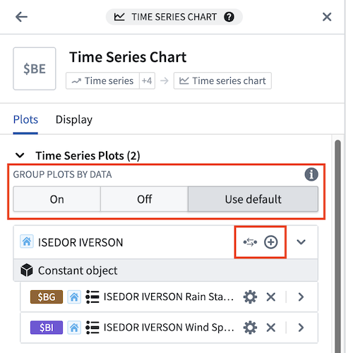
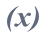
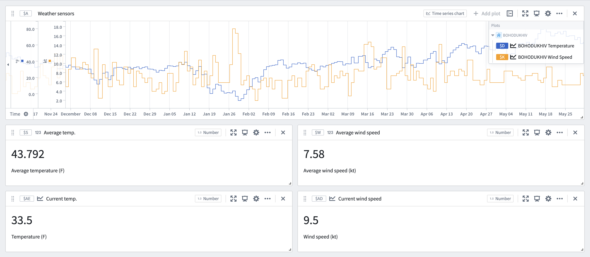
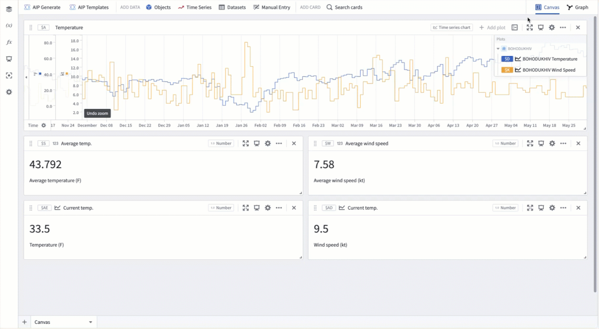
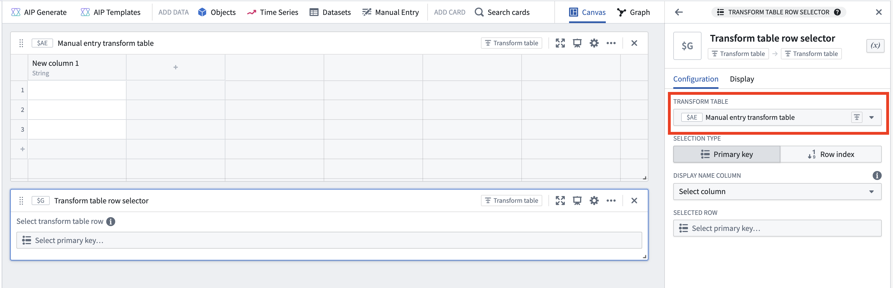
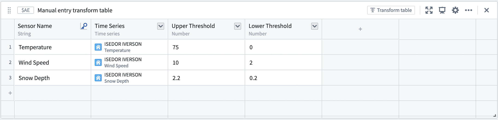
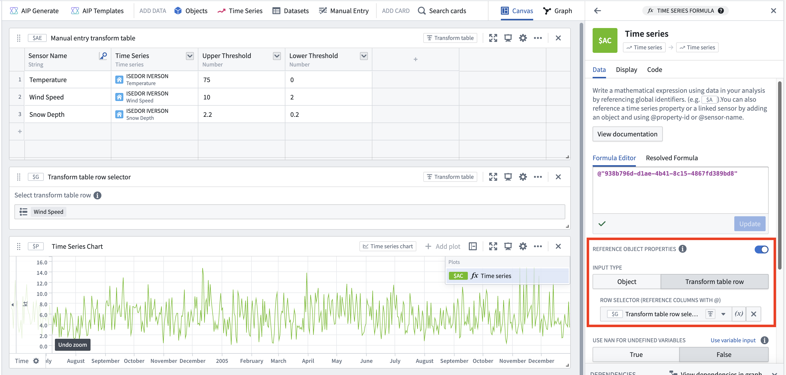
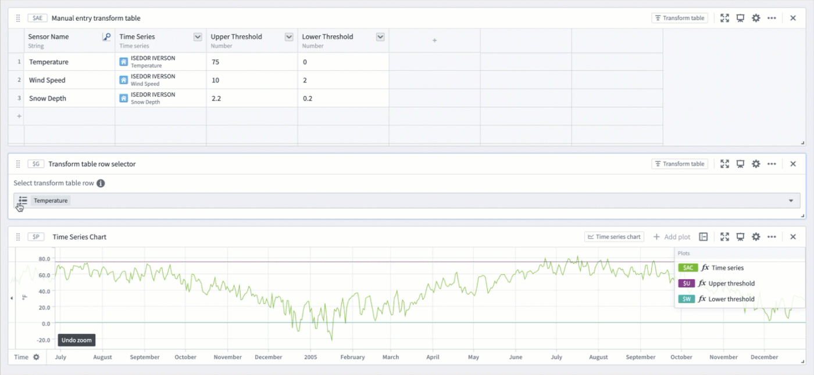

<!-- source: https://palantir.com/docs/foundry/quiver/timeseries-parameterize-pivot/ · mirrored 2026-08-18 from Palantir Foundry docs -->

# Parameterize and pivot time series

Time series data can be easily swapped or “pivoted” using [object selection parameters](/docs/foundry/quiver/card-object-selector/) in Quiver, saving time and simplifying comparison workflows. This can be especially useful for analyzing sensors across multiple root objects without reconfiguring individual cards. By changing a single parameter, an entire analysis can update to reflect the data of a different object, making it easier to explore patterns.

Quiver offers several ways achieve this, accommodating different Ontology configurations.

## Parameterize all existing time series

Use **Parameterize all data** in the **Global Settings** panel to create or reuse object-selector parameters for every existing parameterizable time series instead of configuring each chart individually.

To parameterize all time series at once:

1. Open the [settings panel](/docs/foundry/quiver/analysis-settings/) by selecting the settings icon in the analysis header.
2. In the **Global Settings** section, select **Parameterize all data**.
3. A toast notification will indicate how many time series were successfully parameterized.

The button is disabled when there are no eligible time series to parameterize.

:::callout{theme="neutral"}
The **Parameterize all data** button affects existing time series in the analysis. To automatically parameterize newly added time series, use the **Parameterize added data** toggle in the Global Settings panel.
:::

## Grouping plots by data

For ontologies with [time series properties](/docs/foundry/time-series/time-series-properties/#time-series-properties-tsps) or [sensor object types](/docs/foundry/time-series/time-series-overview/#sensor-object-types), Quiver automatically displays time series plots grouped by the associated root object. Data groups are shown in both the time series chart configuration editor panel and legend, and can be controlled from either location.

The following grouping options are available in the time series chart configuration editor panel:

* **On:** Plots will appear under a heading with information and actions related to the root object, ordered alphabetically by [global identifier](/docs/foundry/quiver/analysis-global-identifiers/).
* **Off:** Plots will appear ungrouped and ordered alphabetically by global identifier by default. The plot order can be customized when plots are ungrouped.
* **Use default:** Plots will be shown according to the **Group plots by data** setting in the **Time Series axes and legends** section of the [settings panel](/docs/foundry/quiver/analysis-settings/). This setting controls whether or not plots are initially grouped when creating a new time series chart.

Grouping can be toggled from the legend by selecting **Group plots by data** () or **Ungroup plots** ().

When plots are grouped by data, the following options are available in the plot group header:

* **Add series from the root object** () to the chart. This button opens a menu of [time series properties](/docs/foundry/time-series/time-series-concepts-glossary/#time-series-property-tsp) on the root object and [sensor objects](/docs/foundry/time-series/time-series-concepts-glossary/#sensor-object-type) that are linked to the root object.
* **Control with object selection parameter** () to update the object references of the plots in the group from a direct object reference to an [object selection parameter](/docs/foundry/quiver/card-object-selector/) reference. If there is already an existing parameter with the root object selected, that parameter will be reused. Otherwise, a new parameter will be created with the root object as the selected value. This button is available when the root object is not already an object selection parameter.
* **View object selection parameter** () to open the [parameters panel](/docs/foundry/quiver/cards-parameters/#the-parameters-panel) and highlight the parameter that controls the plots in the group. From there, you can change the parameter’s selected object to update the plots in that group. This button is available when the root object is an object selection parameter.

### Example workflow: Weather station analytics

This example shows how to parameterize a time series analysis that is based around a single object, allowing the same analysis to be applied to any object of the same type. The analysis below monitors temperature and wind conditions around the **BOHODUKHIV** weather station to detect potential winter weather events.

To parameterize an existing analysis, perform the following steps for each time series chart:

1. Open the chart configuration editor by selecting the gear icon in the top right of the card.
2. Select the **Control with object selection parameter** button for the object to pivot.
3. A single object selection parameter will be created to control all series on the chart that share the same root object, along with downstream cards.

Once the series are parameterized, simply update the object selection parameter to see the same analysis steps using the data of a different weather station.

## Pivoting values with the manual entry transform table

For custom pivoting use cases, such as when series do not share a common object type or when ontology relations are incomplete, a [manual entry transform table](/docs/foundry/quiver/card-manual-entry-transform-table/) can be used in conjunction with row and column selectors to dynamically update values throughout the analysis.

### Example workflow: Temperature thresholds

This example shows how to visualize manually set thresholds for each sensor at the **ISEDOR IVERSON** weather station using a manual entry table. The first step is to set up the manual entry table and row selector parameter:

1. Add a **manual entry transform table** using the **Manual entry** or **Search cards** buttons in the analysis header.
2. Add a **transform table row selector** parameter through the **Search cards** button in the analysis header or the [parameters panel](/docs/foundry/quiver/cards-parameters/#add-a-parameter).
3. In the row selector's configuration editor, select the new manual entry table under **Input transform table**.

Next, add the desired values to the manual entry table:

1. Create a **primary key column** by opening the column options menu (next to the column name) and selecting **Yes** for the **Is primary key** option. This label will appear in the row selector parameter, so ensure it is descriptive and unique.
2. Create a new **time series column** by clicking the column header to the right of the primary key column and selecting **Time series**. Click within the column's cells to open a modal for adding time series data. Choose the desired series for each row. In this example, a few sensors from the **ISEDOR IVERSON** weather station are selected.
3. Create numeric columns in the same manner and manually input values for the upper and lower thresholds.
4. Select **Apply edits** at the bottom right of the manual entry table to save the changes.

Now, use the values from each column to create custom visualizations for each sensor in the station:

1. Add a **Time series formula** card using the **Search cards** button at the top of the analysis.
2. Enable the **Reference object properties** toggle within the card editor.
3. Select **Transform table row** for the **Input type** and choose the **transform table row selector** from the **Select...** dropdown.
4. Reference series and numeric values in formula inputs using the **@** symbol.

To complete the example, create a time series formula plot for each of the three columns in the manual entry table. Quickly create several formula plots by opening the **...** menu to the right of the plot in the chart legend and selecting **Duplicate**. Then, change the property referenced in the formula editor.

Finally, pivot the sensor and values by selecting a new value from the transform table row selector. This will update the plots to show the next sensor's measurements in relation to its manually specified thresholds.

