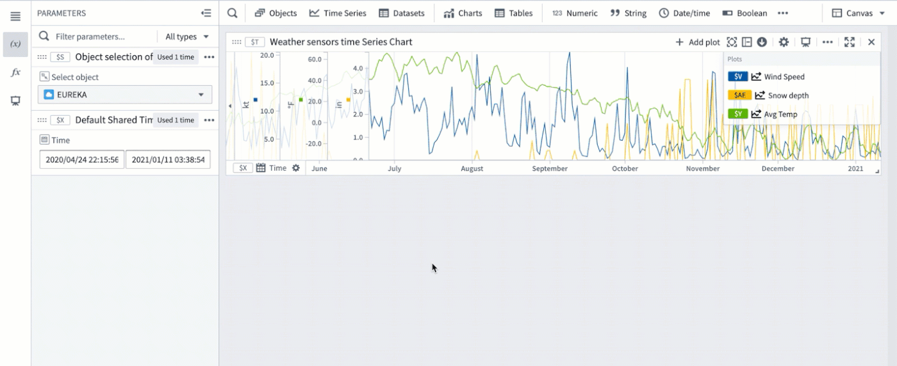
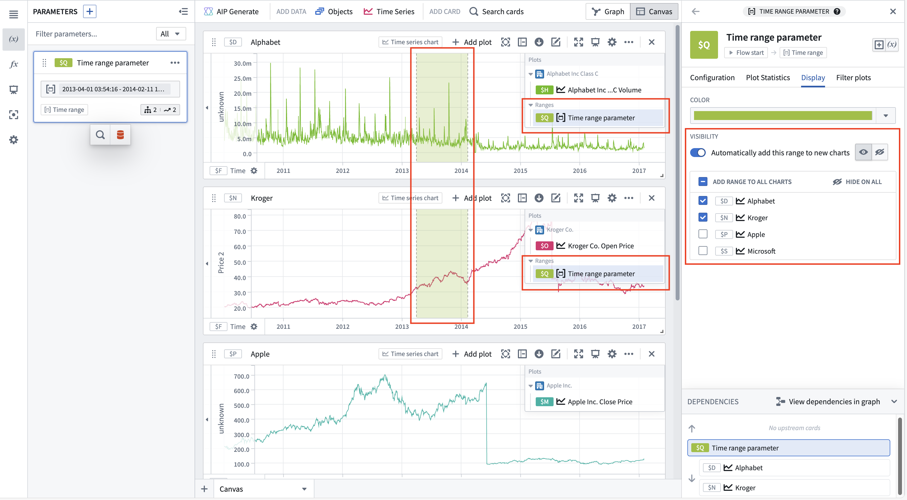
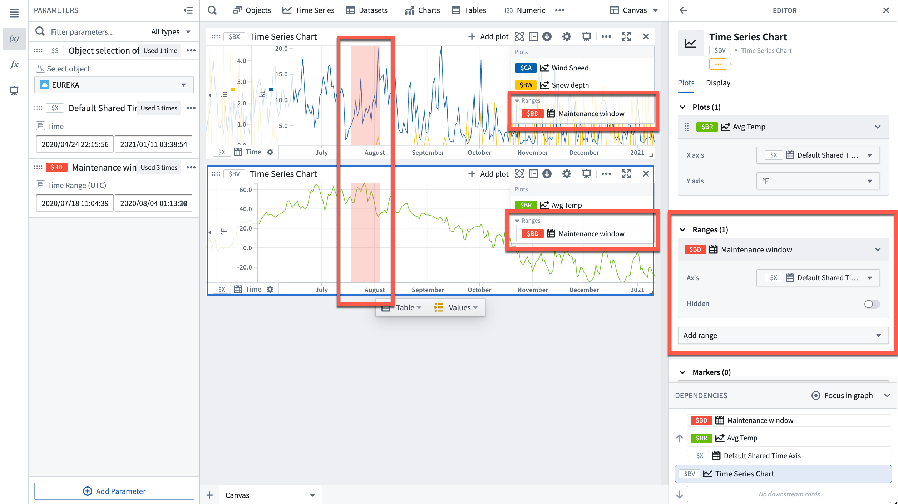
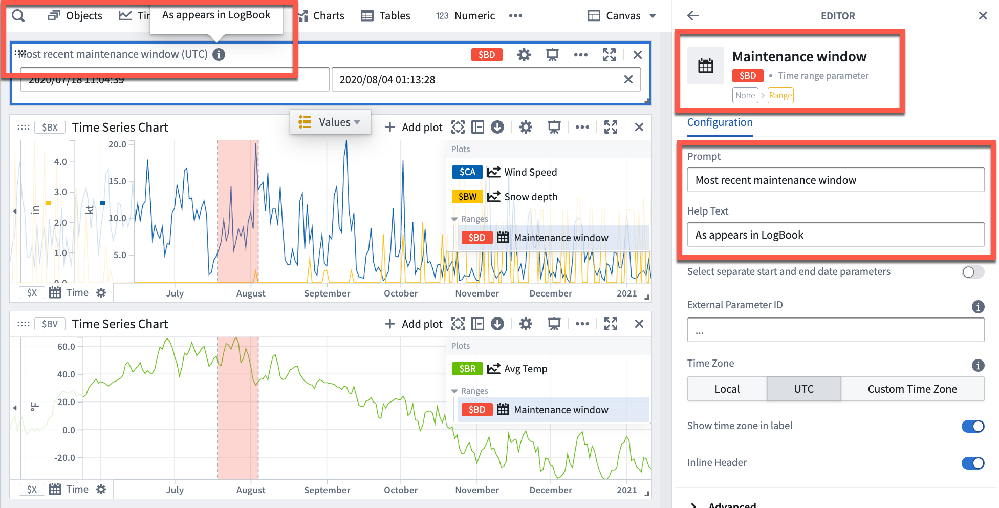
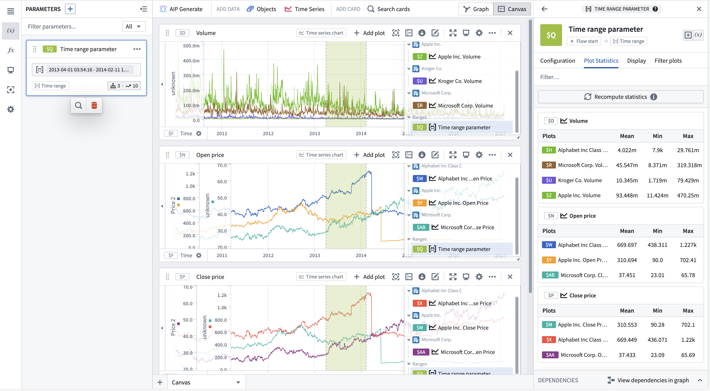
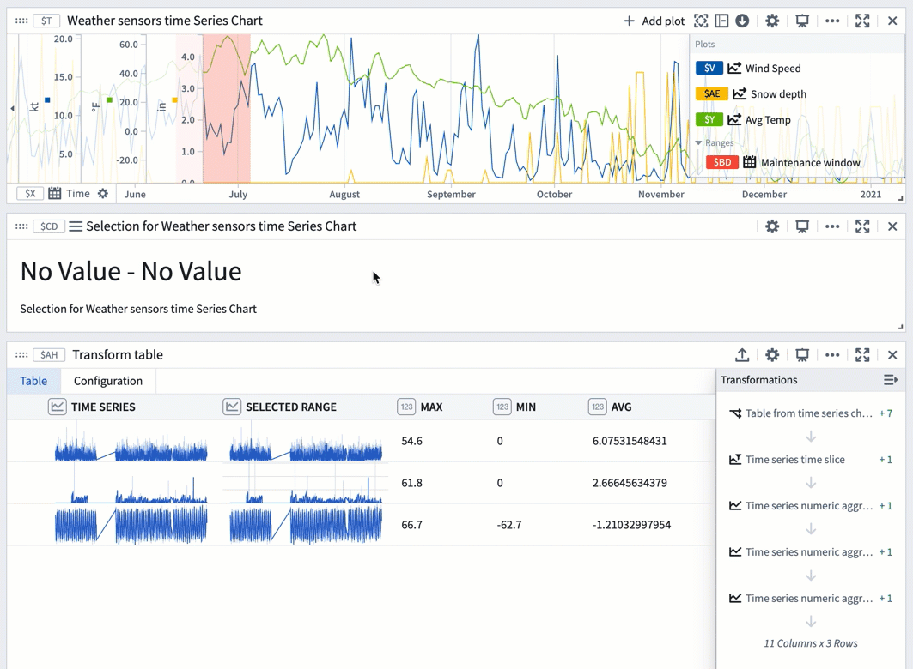
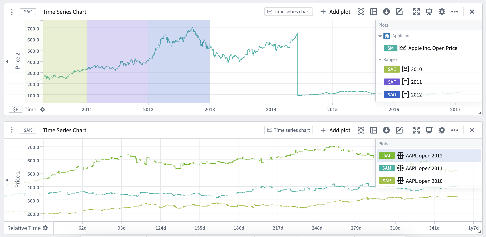
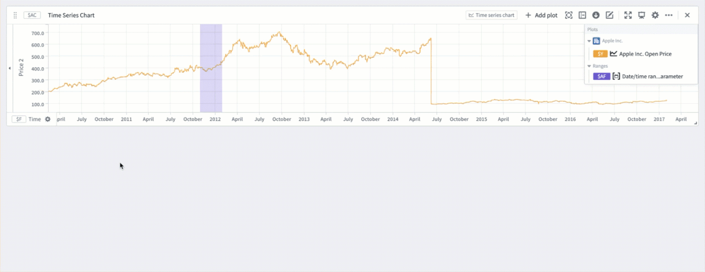

<!-- source: https://palantir.com/docs/foundry/quiver/timeseries-ranges/ · mirrored 2026-08-18 from Palantir Foundry docs -->

# Time and value ranges

Time and value ranges are commonly used when analyzing real-world phenomenons using time series data, such as in manufacturing optimization or financial markets analysis. Ranges can be used to highlight and drill down on anomalies in the data, such as specific time periods when an issue was observed or the temperature range when equipment was operating in optimal capacity. Ranges can also be used to enrich the time series data by capturing context on specific time periods or value ranges, such as periods when equipment maintenance took place.

* [Save a new range](#save-a-new-range)
* [Control a range using parameters](#control-a-range-using-parameters)
* [Use the same range with multiple charts](#use-the-same-range-with-multiple-charts)
* [Contextualize ranges](#contextualize-ranges)
* [Use a range to compute range statistics](#use-a-range-to-compute-range-statistics)
* [Use ranges to compare series over multiple periods of time](#use-ranges-to-compare-series-over-multiple-periods-of-time)

## Save a new range

To save a new range from a time series chart:

1. Move the cursor over the chart and select a range by dragging the cursor over the chart. You can select a vertical, horizontal, or box range.
2. The selected range will be highlighted in blue and the **selection menu** will automatically pop up. If the selection menu is collapsed, select **...** to see the menu options.
3. Select **Save new range** from the selection menu to create a new range. This action has the following consequences:
   * A **range parameter** will be added to the [Parameters](/docs/foundry/quiver/cards-parameters/#the-parameters-panel) side panel and configured as a range parameter for the chart. The type of the range parameter added (**Time range** or **Value range**) depends on the axis on which the range selection was made (time axis or value axis). When the selected range is a box selection, two range parameters will be added and configured for the chart.
   * The selected range color will change from blue to a different color, signifying that this range was persisted as a range parameter. You can change the range color by selecting the variable name in the Parameters panel or the card editor.
   * The range parameter will take the selected range boundaries as the start and end timestamps/values. Changing the start or end values of the range parameter will update the range highlighted on the chart.

## Control a range using parameters

Time and numerical ranges in Quiver are controlled by distinct parameter types:

* A **time range parameter** is defined by a start and an end timestamp.
* A **numerical range parameter** is defined by a start and an end value.

Learn more about how to [parameterize an analysis](/docs/foundry/quiver/cards-parameters/).

## Use the same range with multiple charts

You can add a range parameter to multiple charts from the time range parameter editor or the chart editor.

To add a time range from the time range parameter editor, select the range from the **Parameters** side panel, and then navigate to the **Display** tab. The **Visibility** section contains all compatible charts that the range can be added to. Select the checkbox next to a chart to add the range. Hovering over a chart in the list will show options to navigate to the chart's editor or hide the range on that chart (if the range has been added). Bulk actions are available in the list's header, allowing the range to quickly be added or hidden on all charts.

To automatically add the range to new charts, toggle **Automatically add this range to new charts**. Once toggled on, the default visibility can be customized.

To add a range from the chart editor, open the editor panel for the desired chart and select **Add range** under the **Ranges** section.

## Contextualize ranges

By default, Quiver names new time ranges and numerical ranges as "Time range parameter" and "Numerical range parameter" respectively. Consider giving meaningful names to ranges to help keep track of what each range represents (for example, "Maintenance window" or "Optimal output").

To rename a range, open the **Parameters** side panel and select the parameter name. Edit the name, then select **Enter** to save the change.

Additionally, consider configuring the **Prompt** and **Help text** of a range parameter which are visible when adding range parameters to dashboards.

## Use a range to compute range statistics

You can view range statistics (min, max, and average) in the **Plot statistics** tab of the time range parameter editor. After selecting **Compute statistics**, metrics will be shown for plots on time series charts with this range. Statistics are only computed for plots with one time axis and one numeric axis, incompatible plots will not be shown. Hovering over a plot or chart will show the option to navigate to the respective editor.

You can also use a range selection or a [saved range](#save-a-new-range) with a transform table to compute range statistics like max, min, and average. Range selections, as opposed to saved ranges, are not persisted; they offer an interactive way to quickly view statistics for different ranges.

The example below shows a [transform table](/docs/foundry/quiver/cards-transform-table/) with one row for each time series plot from the chart above it. Learn more about [using time series charts as inputs to transform tables](/docs/foundry/quiver/cards-transform-table/#input-time-series-charts).

To use a chart range selection within the transform table:

1. Select a range on the chart, then choose 'Save X axis selection' or 'Save Y axis selection'.
2. Select **Add Transformation** to add a **Filter to time range** transform.
3. Set **Input time series** to the `Time series` column and the **Time range** to the chart range selection.
4. Click **Add Transformation** to add a `Time series numeric aggregation` for each of the metrics you wish to compute.
5. Select a different range on the chart to see the computed stats for that range.

## Use ranges to compare series over multiple periods of time

You can use time ranges to compare a series (or multiple series) over different periods of time. This is achieved by using the ranges to create [filter time series plots](/docs/foundry/quiver/card-filter-time-series/) and [relative time series plots](/docs/foundry/quiver/card-relative-time-series/). Creating a filter plot isolates the series data over the range, while a relative time plot visually aligns the series across multiple periods of time. The picture below shows the result of using filter and relative time plots to visualize the open price of AAPL stock over multiple years.

Relative comparison views like the one above can be created directly from the desired time ranges. To create a relative time plot from a range, select the range from the **Parameters** side panel and navigate to the **Filter plots** tab. Select the desired plot from the **Create filtered plots** dropdown, and then select **Relative time series plot**. A filter plot will be created using the range and selected plot, and then used as the input to a new relative time plot. Repeat this process for all of the series and time ranges you want to compare. You can also choose to only create the filter plot by using the same dropdown and selecting **Filter time series plot** after choosing a source plot. All filter and relative plots created using the range are displayed in the **Current filtered plots** section of the tab.

A more focused version of this workflow is available from the **Filter plots** button found by hovering over the range display on a chart. The source plot selection menu here is filtered to only contain plots on the selected chart.

