<!-- source: https://palantir.com/docs/foundry/quiver/timeseries-relative-time/ · mirrored 2026-08-18 from Palantir Foundry docs -->

# Compare time series in relative time

Quiver’s time series charts have two types of time axes:

| Type | Description | Example |
| --- | --- | --- |
| Absolute time | Plots time series values at a real-world date/time | 2025/01/01 12:00:00 UTC |
| Relative time | Plots time series values at a duration from a start time (also called an "alignment timestamp") | 2 hours, 5 minutes|

When a time series is in relative time, its x-axis will have a **Relative Time** label, as shown below.

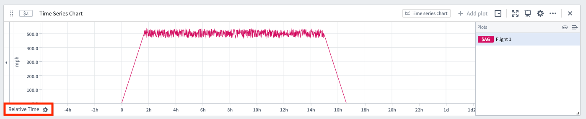

Some examples where analyzing time series in relative time is useful include:

* **Aligning series to a comparable interval:** Two flights take off and land at different real-world times. You want to compare the altitude sensor of each flight against each other, aligned to the start of the flight. Analyzing in relative time can tell you, for example, how quickly each flight ascended 10 minutes after takeoff.
* **Analyzing trends during a period of interest:** A manufacturing vat has a temperature sensor. Sometimes the vat is producing, sometimes it is idle. If you want to measure trends in the vat's temperature sensor while the vat is producing, you can analyze the data in relative time aligned to the start of the production process.
* **Investigating behavior during a key event:** An equipment outage causes a spike in some sensor readings. You want to view the sensor readings aligned to the start of the outage; this can be accomplished by analyzing in relative time.

## How to display time series in relative time

There are a few different ways to change a time series to be plotted on a relative time axis.

### Relative time toggle

Most plots have a **Relative time options** section in the editor. Turn on the toggle and the plot will be converted into relative time. The relative time can be aligned to the start of the series, the end of the series, or a fixed timestamp.

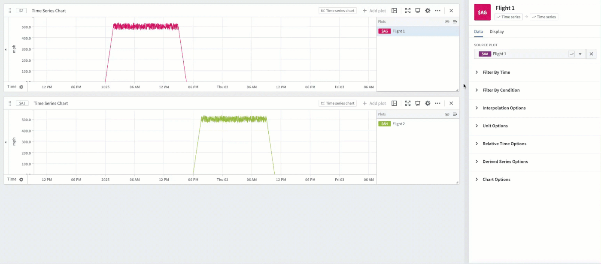

### Relative time plot

:::callout{theme="warning" title="Sunset"}
The [relative time series plot](/docs/foundry/quiver/card-relative-time-series/) card is in the [sunset phase of development](/docs/foundry/platform-overview/development-life-cycle/) and is no longer being updated. We recommend using the [Relative time toggle](#relative-time-toggle) instead.
:::

Use the [**Relative time series plot**](/docs/foundry/quiver/card-relative-time-series/) card to add a new plot that converts an existing plot into relative time. This transform behaves the same way as the relative time toggle.

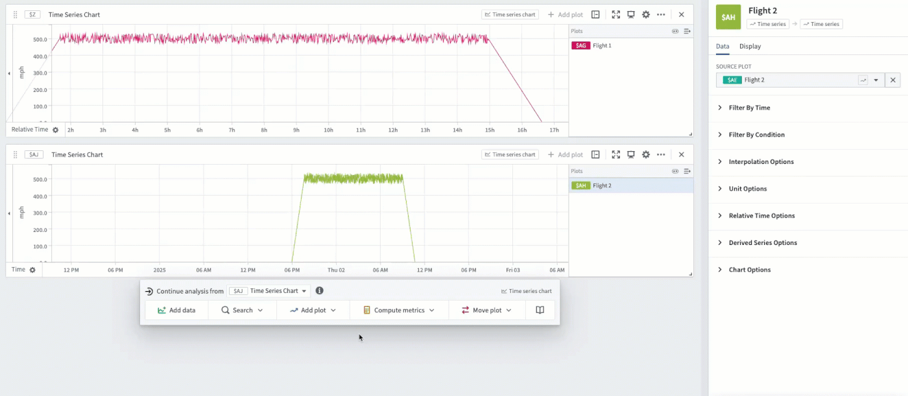

After two series are aligned in relative time, drag them on the same chart in order to evaluate trends. In the example below, Flight 1 and Flight 2 are both aligned to the start of the flight, enabling analysis of differences in their speedometers throughout the course of their flights.

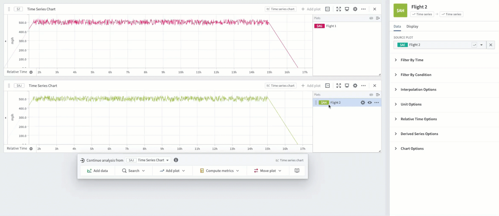

### Time range filter

You may want to isolate a particular time range of a series, and view this specific range in relative time. For example, you can filter a manufacturing vat's sensor to a particular time range during which the vat was producing and view it aligned to the start of the range.

One way to achieve this in Quiver is using a [time range](/docs/foundry/quiver/card-datetime-range-parameter/). Highlight a section of the chart and select **Save new range** to create a range, then hover over the created range and select the **Filter plots** button. Select the plot you want to analyze and choose the **Filter time series in relative time** option.

The highlighted range of that plot will now be extracted and aligned in relative time (to the start of the range).

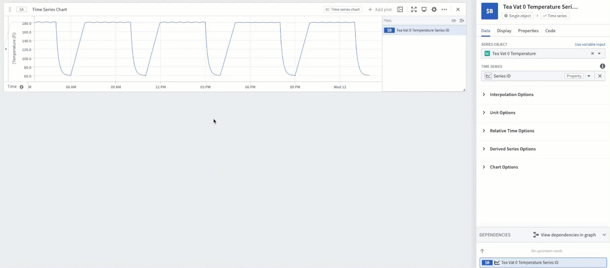

This method allows you to easily change the analyzed range by dragging the endpoints of the highlight. In the example below, you can see how dragging the endpoints to remove the ramp-up and cool-down periods of the production process enables you to analyze the specific period during which the vat was producing at full utilization.

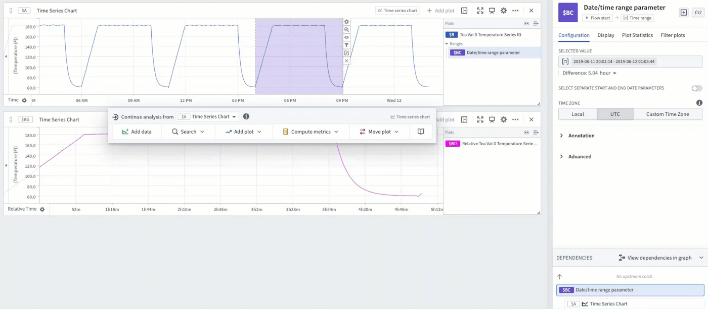

These filtered relative plots can also be created from the editor of the time range. [Read more about using time ranges.](/docs/foundry/quiver/timeseries-ranges/#use-ranges-to-compare-series-over-multiple-periods-of-time)

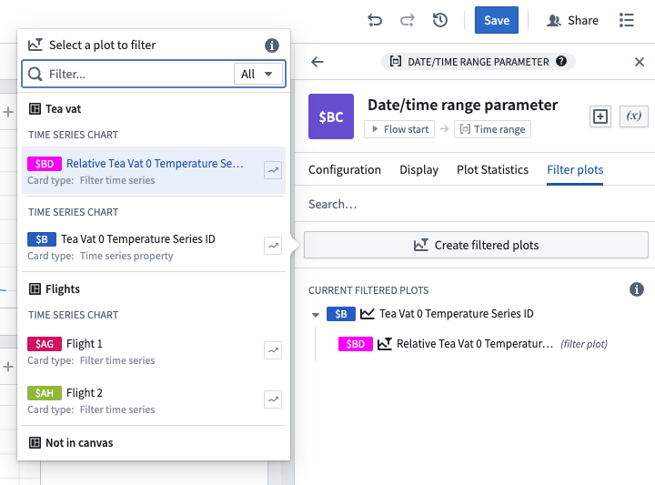

### Event comparison plot

The [time range filter](#time-range-filter) method described above is flexible and easy to use, but can require a lot of manual effort if there are many timeframes to compare, since each timeframe would require creating a new range. [Event sets](/docs/foundry/quiver/timeseries-analyze-events-data/) reduce this manual effort. If you have an event set containing the start and end of each production process, you can use the [**Event comparison plot**](/docs/foundry/quiver/card-event-comparison-plot/) card to streamline the workflow of comparing sensor readings during these events.

The example below shows an event set consisting of three events, which represent the three timeframes during which a vat was producing tea. Using the event comparison plot will display a [grouped plot](/docs/foundry/quiver/card-grouped-time-series-plot/) with three subplots - one subplot for each event - and align each subplot in relative time to the start of its respective event.

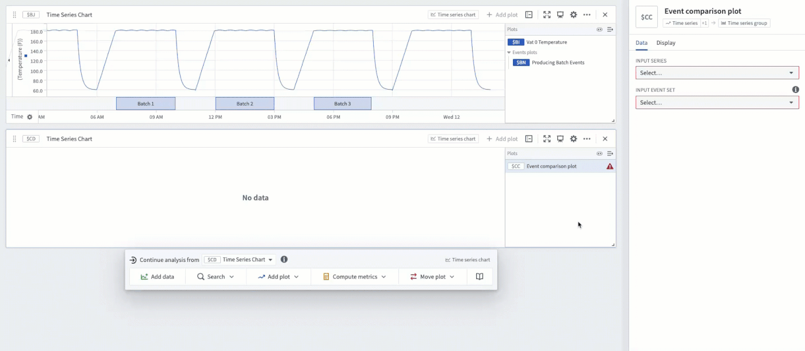

### Advanced: Using a transform table

For advanced use cases, relative time plots are supported in [transform tables](/docs/foundry/quiver/cards-transform-table/).

For example, an equivalent to the Event comparison plot can be constructed through a series of transform table steps. To begin, start with a transform table containing an event start time, an event end time, and a linked time series sensor.

The screenshot below shows an analysis of a single vat with an ambient moisture sensor. Each row of the table represents a "batch" event, during which the vat is producing. Each batch event has a defined start and end time.

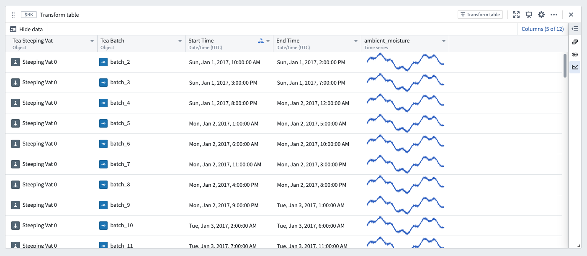

The next step is to add a [Filter time series](/docs/foundry/quiver/card-filter-time-series/) transform in order to filter the linked sensor to the event start and end date. In the example below, this creates a new column filtering ambient moisture to timeframes while the vat is producing.

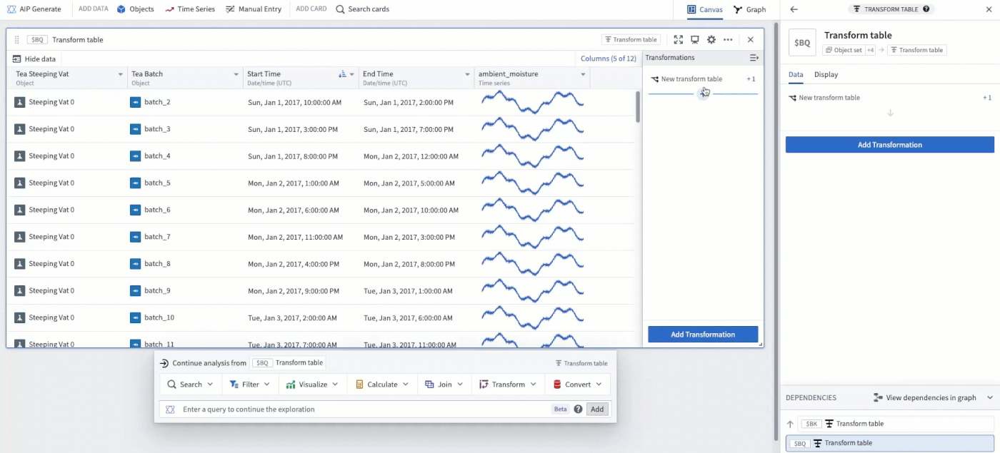

To align each time series in relative time, add a [Relative time series](/docs/foundry/quiver/card-relative-time-series/) transform. After doing this, the example below shows ambient moisture over the start and end of each batch event, aligned in relative time to the start of the batch.

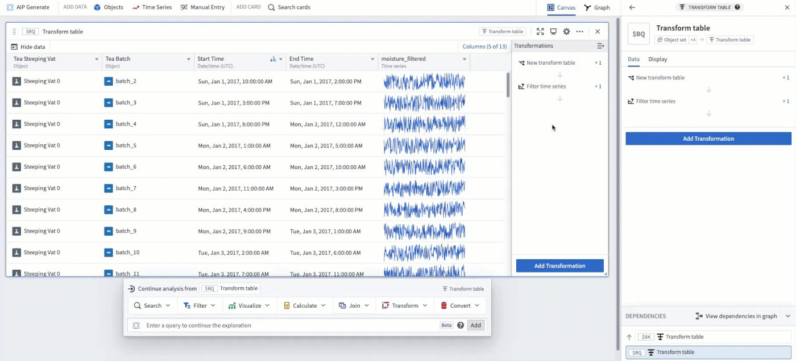

Finally, popping out the column as a [grouped plot](/docs/foundry/quiver/card-grouped-time-series-plot/) results in a similar visualization as the Event comparison plot.

Following these steps, the example below shows one subplot for each batch event, with each subplot aligned in relative time to the start of its respective batch.

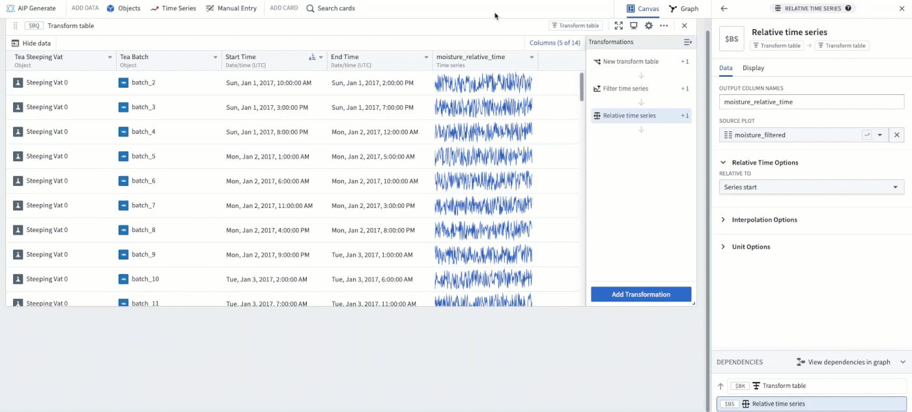
