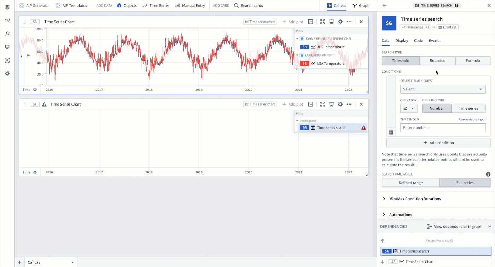
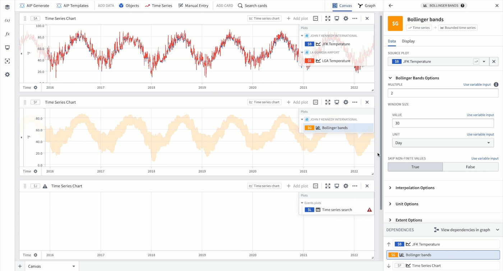
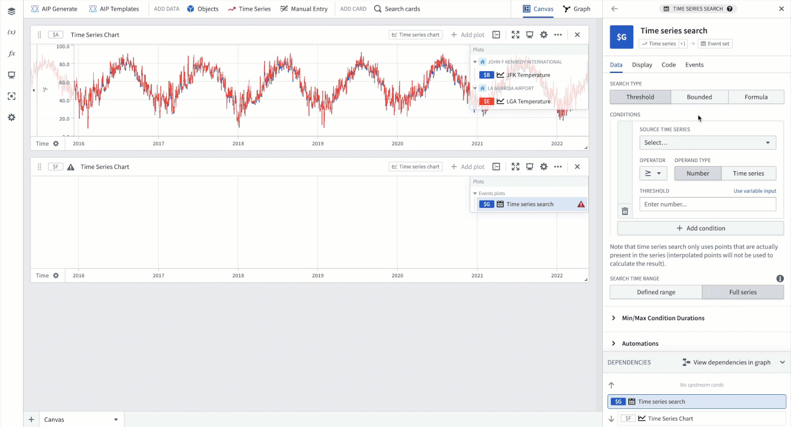
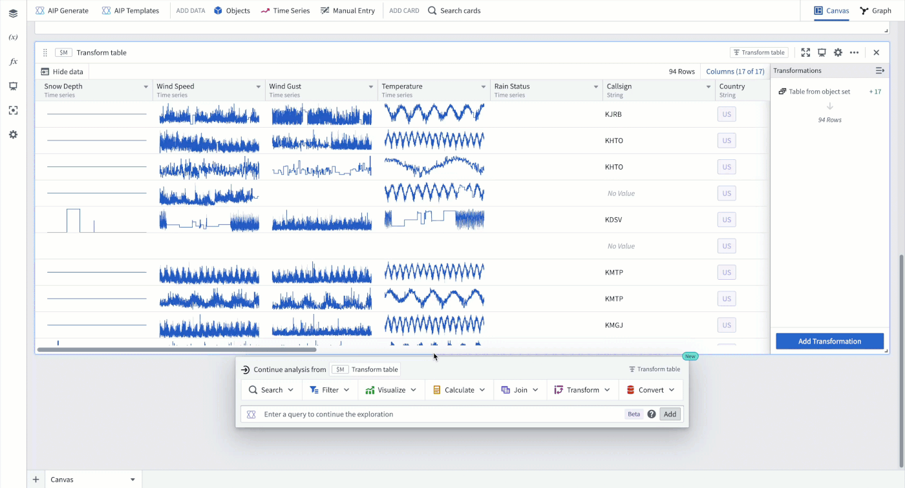
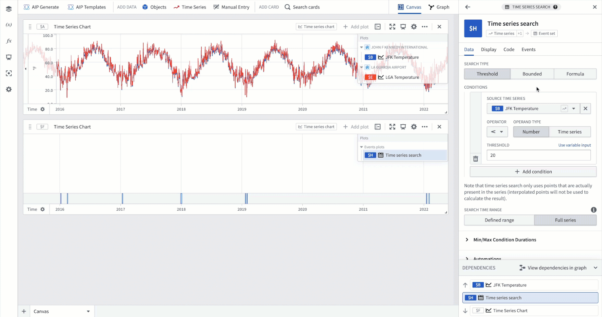

<!-- source: https://palantir.com/docs/foundry/quiver/timeseries-search-anomalies/ · mirrored 2026-08-22 from Palantir Foundry docs -->

# Search time series for anomalies

Quiver offers the ability to detect anomalies (or periods of interest) by evaluating time series data against user-defined conditions using the [time series search](/docs/foundry/quiver/card-time-series-search/) card. This card outputs an event set containing one event for each time interval where the specified conditions are met. This event set can be visualized as an *events plot* or [analyzed further](/docs/foundry/quiver/timeseries-analyze-events-data/) in Quiver. The time series search logic can also be used in [time series alerting](/docs/foundry/time-series/alerting-overview/) to save identified events as objects in the Ontology.

## Example workflow: Detecting extreme weather events

This example explores how to use the [time series search](/docs/foundry/quiver/card-time-series-search/) card to detect periods of extreme temperature for airports in New York City, New York.

### Add time series data

The first step is to [add time series data](/docs/foundry/quiver/timeseries-overview/) to your analysis; in this example, temperature data for John F. Kennedy JFK and LaGuardia LGA airports. Follow the instructions in the documentation on [how to add time series data to a Quiver analysis](/docs/foundry/quiver/timeseries-overview/) for more information.

### Basic threshold search

Assume that a temperature drop below 20 degrees Fahrenheit at the JFK airport is considered an extreme event. To find periods where this temperature drop occurred, you can add a time series search card to analysis with the following configuration:

1. Select the `JFK Temperature` plot as the **Source Time Series** for the threshold condition.
2. Set the threshold operator to less than `<` and the threshold value to `20`.

### Use time series as threshold

Quiver enables you to easily compare time series by using one time series as a threshold; for instance, you may want to find periods where the temperature at LGA is higher than the temperature at JFK. To find these periods, add a time series search card to your analysis and set the threshold condition's operand type to `Time series`. Then, configure the time series search card as follows:

1. Select the `LGA Temperature` plot as the **Source Time Series** for the threshold condition.
2. Set the threshold operator to greater than `>`.
3. Select the `JFK Temperature` plot as the **Numeric Time Series** used as the threshold.

### Bounded time series search

Quiver also provides the ability to compare a source time series against a *bounded time series* and find periods where the source time series is outside the bounds of the bounded time series. This enables [Bollinger bands](/docs/foundry/quiver/card-bollinger-bands/) analysis, in which you can detect when a time series differs from the rolling average by a certain number of standard deviations. For example, you might want to detect when the temperature at JFK is more than 2 standard deviations away from the 30 day rolling average. To achieve this, follow the steps below:

1. Add a Bollinger bands card to your analysis and set the source plot to `JFK Temperature`, the multiple (number of standard deviations) to `2`, and the window size to `30 days`.
2. Add a time series search card to your analysis and change the search type to `Bounded`.
3. Select the `JFK Temperature` plot as the source **Time series** and the Bollinger bands card created in the first step as the **Bounded time series**.

### Custom formula search

If you need to perform more complex searches than are possible with the other search types, you can use a custom formula search. For example, you may want to detect when the temperature at JFK is more than 1 degree Fahrenheit above the temperature at LGA. This can be achieved with a formula search, which allows you to reference any time series plots or parameters in your analysis. To run this search, follow these steps:

1. Add a time series search card to your analysis and change the search type to `Formula`.
2. Input a formula that references the `JFK Temperature` and `LGA Temperature` plots. If you enter `$` in the conditions text box, you will be shown a list of available time series and parameters in your analysis. Select the `JFK Temperature` and `LGA Temperature` plots, which are substituted for their identifiers `$B` and `$E`, respectively. You can then write the [formula](/docs/foundry/quiver/cards-formula-syntax/) as `$B > $E + 1` and **Apply** the formula to run the search.

## Multi time series search

You can also use Quiver to find periods of interest across multiple time series; for example, you might want to detect when the temperature at any weather station in New York is above 80 degrees Fahrenheit. Quiver has a built-in way to do this using the `Multi` time series search which performs a search across each row of a transform table (limited to 1,000 rows) and returns one event for each time interval that satisfies the specified conditions. To detect when the temperature at any weather station in New York is above 80 degrees Fahrenheit, follow these steps:

1. Create a [filtered object set](/docs/foundry/quiver/card-filter-object-set/) that contains only weather stations in New York and convert it to a transform table.
2. Hover over the transform table to access its next actions menu and select **Visualize** > **Time series search**.
3. Input a formula that references the temperature property for each weather station in the transform table. If you type `@` in the conditions text box, you will be shown a list of available properties. Select the `Temperature` property, which is substituted for its identifier `@tdp_temp`. Then, write the [formula](/docs/foundry/quiver/cards-formula-syntax/) as `@tdp_temp > 80` and **Apply** the formula to run the search.

## Convert to automation

The events identified through the time series search can be saved as objects in the Ontology using [time series alerting](/docs/foundry/time-series/alerting-overview/). This allows you to track and monitor specific conditions of interest across your time series data. You can create an Automation from your time series search logic by clicking the **Add automation** button in the **Automations** section of the time series search card editor.

There are some restrictions on creating an Automation from a time series search in Quiver:

* You cannot convert a `Multi` time series search to an Automation.
* Time series alerting logic must contain *a single root object*. Time series properties on the root object and sensor objects linked to the root object can be used. Learn more about [time series object types](/docs/foundry/time-series/time-series-overview/#store-time-series-in-the-ontology) for clarity between root and sensor object types.
* Certain time series operations are not supported in time series alerting. Review the full list of [supported operations](/docs/foundry/time-series/alerting-common-questions/#which-quiver-cards-are-supported-in-time-series-alerting-logic) for time series alerting logic.

For more information on the [requirements](/docs/foundry/time-series/alerting-overview/#requirements) for creating time series alerts and how to use them, see [time series alerting](/docs/foundry/time-series/alerting-overview/).

