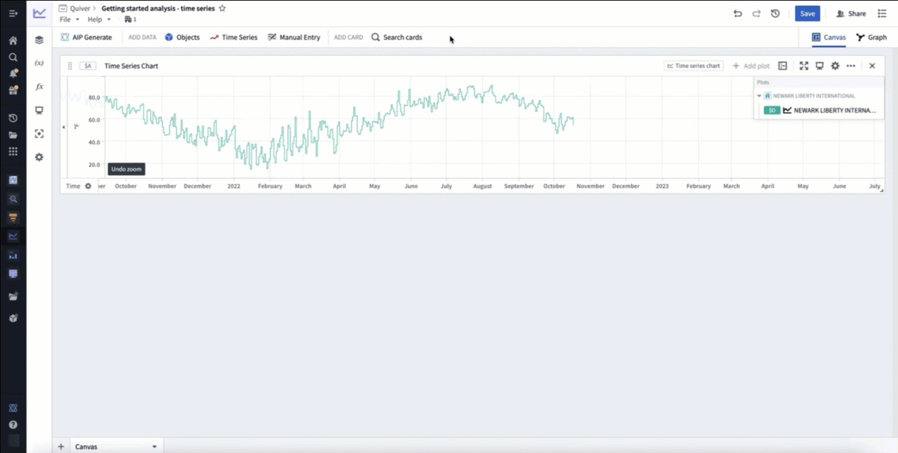

<!-- source: https://palantir.com/docs/foundry/quiver/timeseries-transform/ · mirrored 2026-08-22 from Palantir Foundry docs -->

# Transform time series

Quiver provides a wide range of transformations that take a time series as input and transform it to create a new time series plot.

For example, with time series transformations you can:

* Use a rolling aggregate to smooth a series.
* Apply a custom mathematical formula.
* Compute a derivative of a time series.
* Union or coalesce multiple time series.

For the full list of available transforms see the [time series cards index](/docs/foundry/quiver/cards-index-time-series/).

If you would like to use your transformed series outside of Quiver, you can save it as a [derived series](/docs/foundry/time-series/derived-series-overview/).

## Apply a time series transform

The simplest way to add a time series transformation is through the next actions menu of a time series chart. Select **Add plot** to browse the list of possible transformations. Choose a transform to add a new time series plot to your chart. You can then configure this plot using the editor panel on the right.

In the example below, we transform our input temperature time series by using the **Rolling aggregate** plot to derive a 30 day rolling average.

Alternatively, open the [search bar](/docs/foundry/quiver/analysis-toolbars/#search-bar), search for the desired transform and add it to the canvas.

### Transform time series in batch

To apply transformations to times series in batch, use [transform tables](/docs/foundry/quiver/cards-transform-table/#). For a comprehensive guide on batch time series analysis, see [batch analyze time series](/docs/foundry/quiver/timeseries-batch-analyze/). Documentation for available transformations can be found in the [time series operations page](/docs/foundry/quiver/cards-transform-table-index-timeseries-operations/).

Transform tables can take time series as input in different forms, and provides various methods to transform the time series data:

1. **Time series as a column:** Apply a transform to a time series column. This column can either come from a time series property of an [object set](/docs/foundry/quiver/cards-transform-table/#input-object-sets) or when using a [time series chart](/docs/foundry/quiver/cards-transform-table/#input-time-series-charts) as input in a transform table.
2. **Individual time series data points:** Apply a transform to time series data points by using a [time series plot as input](/docs/foundry/quiver/cards-transform-table/#input-time-series-plots) to a transform table.
