<!-- source: https://palantir.com/docs/foundry/quiver/timeseries-visualize/ · mirrored 2026-08-18 from Palantir Foundry docs -->

# Visualize time series

Quiver provides a wide range of capabilities for visualizing time series.

When discussing time series visualization in Quiver, we use the following terminology:

| Term | Description |
| --- | --- |
| Chart | A time series chart is a card on the Quiver canvas that serves as a container for viewing time series. Time series charts are automatically created when you add time series data to your analysis. Charts can have multiple time series plots on them. They also contain one or more x and y axes. |
| Plot | The visual representation of a single time series. A plot can only be viewed on a single chart at a time. |
| Axis | An x or y axis that defines the view range on a chart. Axes can be of type time, relative time, numeric, or ordinal. Axes can be shared across multiple charts. |

For example, in the image below, we have two time series charts. The first chart, Chart 1, has three time series plots on it: `Gulkana Temperature`, `Newark Temperature`, and `Newark Wind Gust`. This chart also has two, numerical, y-axes: `kt` and `°F`. The two temperature plots use the `°F` axis, and the wind gust plot uses the `kt` axis. The second chart, Chart 2, has a single, categorical time series plot on it: `Newark Rain Status`. This uses the ordinal y-axis: `Status`. Both charts share the same x-axis: `Time`.

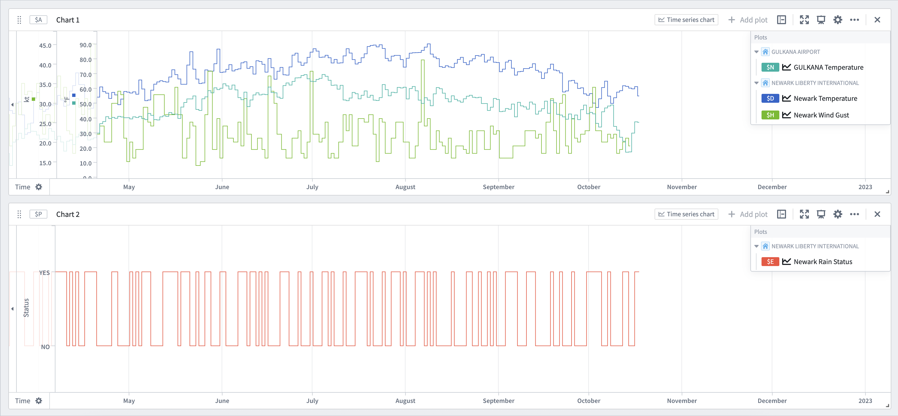

## Panning and zooming

Time series charts are interactive, allowing you to pan and zoom. Hovering over an axis will show buttons to pan, zoom in, and zoom out. Axis can additionally be panned by dragging them directly, and zoomed in or out by holding Cmd (macOS) or Ctrl (Windows) while scrolling up or down on the axis. You can also zoom to a specific part of the chart by clicking and dragging on the main chart area to select a range, and then selecting **Zoom to selection**.

After panning and zooming, you can select the **Fit to extent** button on an axis. This will snap the axis to show the full data range.

Quiver automatically links all time axes across time series charts. As a result, when you pan or zoom one chart's time axes, the zoom range of other time series charts in the canvas will update synchronously.

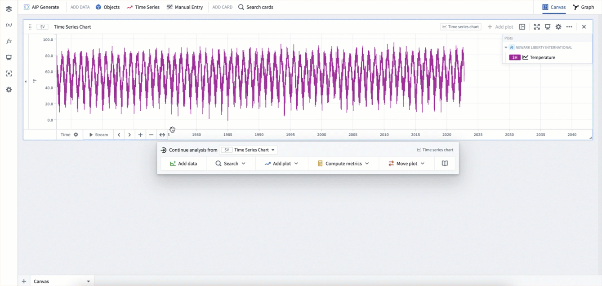

## Moving plots between charts

There are several ways to organize your plots by moving them between charts.

First, you can move plots by dragging them from the chart legend. Dragging a plot onto another chart will move it to that chart. Dragging a plot onto the canvas will create a new chart. If grouping by a root object, you can similarly drag that object to move all plots using that object to a different chart.

Second, you can move plots using the **Move plot** section of a chart's next actions menu.  This allows moving plots in the current chart to other charts, and also supports bringing in plots from other charts into the current chart.

Lastly, you can use the analysis contents panel to drag and drop plots between charts.

In the example below, we first drag the plot `Newark Rain Statis` from the legend onto the canvas to move it to a new chart. Then, we drag the root object `NEWARK LIBERTY INTERNATIONAL` from the legend onto the new chart, which moves the plots `Newark Wind Gust` and `Newark Temperature` onto the new chart. Lastly, we use the **Move plot** section of the next actions menu to move some of these plots back into the original chart.

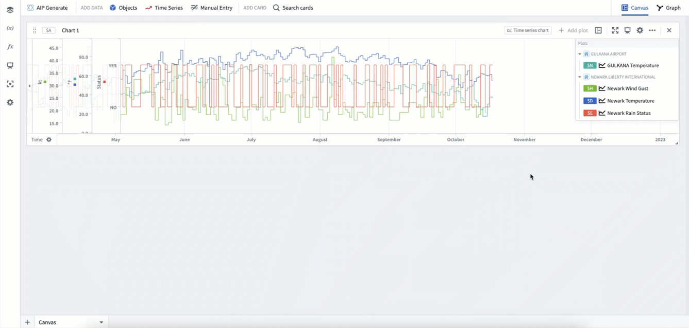

## Formatting plots

Plots have many different display options for visualization. To view the full configuration options for an individual plot, select the **Configure plot** () icon in the chart legend, then open the **Display** tab in the editor panel.

Common plot display options include:

* Display as lines or points
* Line width
* Showing a subtle gradient below time series lines
* Showing points and configuring point size, shape, and fill options
* Rendering as a dashed or solid line
* Line color

Configuring a plot's [interpolation](/docs/foundry/quiver/cards-interpolation-usage/) can also be used to update the shape of the time series line between any two points.

In the example below, we first select **Configure plot** in the legend to open the plot's editor panel. Then, we rename the plot. Next, we update its internal intpolation to `Previous`. Lastly, we select the **Display** tab and update the line width, gradient, and color.

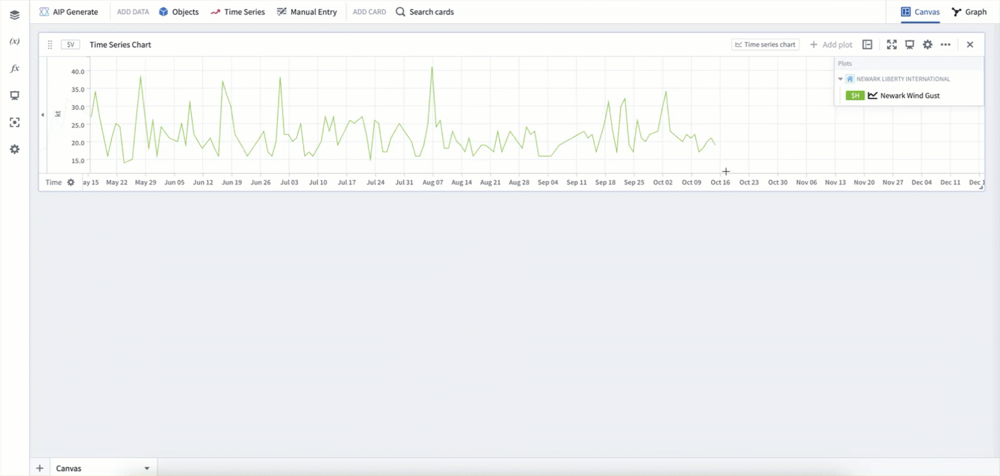

## View backing object properties

When configuring a time series plot, you can view the properties of all objects backing the series using the **Properties** tab in the editor panel. From this tab, you can also open the object view in a new tab for more detailed exploration.

To view backing object properties:

1. Select the **Configure plot** () icon in the chart legend to open the plot's editor panel.
2. Select the **Properties** tab to view properties of all objects backing the series.

## Formatting charts

Charts have their own set of display options. Both the y-axes and the legend can be moved through drag and drop. Additionally, configuring a chart and selecting the **Display** tab in the editor panel will give additional display options such as showing global identifiers, legend style, and axis style.

A chart caption can also be toggled on or off through the **More actions** menu in the chart card's header. The **More actions** menu also contains other chart actions such as downloading the data as a CSV, duplicating the chart, and deleting it.

In the example below, we drag the legend to the right-hand side, and the y-axis to the left-hand side. Then we select the chart's **Configure** button and open the **Display** tab to update the legend style to `Side` and the overlay y-axis setting to `False`. These two display settings can be useful if you do not want your axes or legends to cover any plot data.

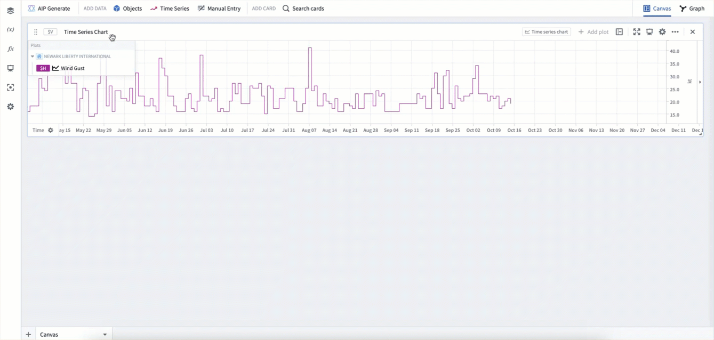

## Analysis time series settings

Along with plot and chart specific display options, Quiver supports a large number of additional time series display options at the analysis level in the [settings panel](/docs/foundry/quiver/analysis-settings/). Here, you can configure time series tooltips, time series axes and legends, and time series date/number formatting.

[View the full list of configurable settings.](/docs/foundry/quiver/analysis-settings/#time-series-axes-and-legends)

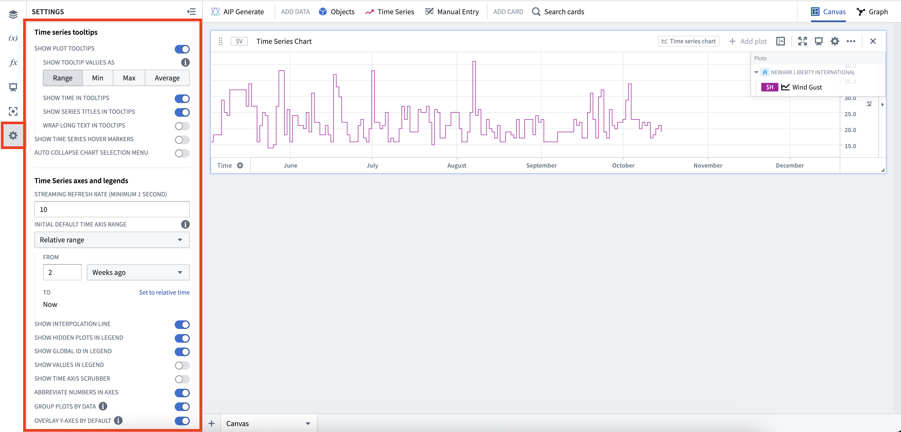

## Configuring axes

Select an axis label to open its configuration window.

#### Value axis (y-axis) configuration

From the value axis (y-axis) configuration window, you can:

* Customize the axis label (by default, Quiver uses the unit of an axis as the axis label).
* Manually set the default display range.
* Choose logarithmic scale display.
* Invert the scale (change scale to increase from top to bottom).
* Change the axis format (for example, choosing percentage or currency format, adding a suffix or prefix, choosing scientific notation, displaying negative numbers in parentheses, and more).

Y-axes can also be collapsed on one or both sides of the chart to maximize the chart display area. To do this, select the small triangle icon next to the axis.

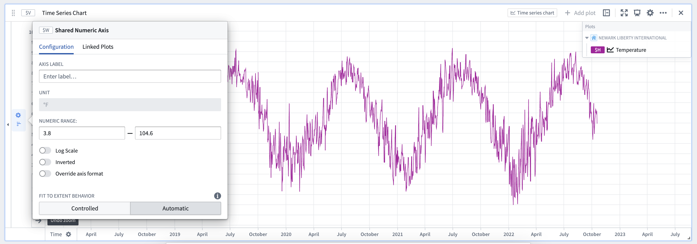

#### Time axis (x-axis) configuration

From the time axis (x-axis) configuration window, you can:

* Customize the axis label (by default, Quiver uses the unit of an axis as the axis label).
* Manually set the default display range.
* Configure the fit to extent behavior
* Control the behavior of the **Stream** button

The time axis (x-axis) supports two modes of fit to extent behavior:

* **Automatic:** Find the earliest and latest points for all plots using the axis. This is the default mode for all time series charts.

* **Controlled:** Allows controlling the endpoints directly or from a time-range source such as a [time range parameter](/docs/foundry/quiver/card-datetime-range-parameter/). If the **Re-enable fit to extent on updates** toggle is turned on, the fit to extent configuration will switch back to **Automatic** mode when any of the plots data updates.

By default, activating the **Stream** button enables [analysis-wide streaming](/docs/foundry/quiver/analysis-settings/#time-series-axes-and-legends). This behavior can be configured to only stream the selected axis by enabling the **Stream individual axis** setting in the configuration window. If streaming is turned on for a time axis, you can also configure the streaming axis behavior by selecting one of the following options:

* **Rolling** A fixed-size window that rolls forward as new data points are streamed
* **Growing** A view range with a fixed start time, and a dynamic range end that will grow with streaming updates
* **Fixed** A fixed view range that will not change with streaming updates

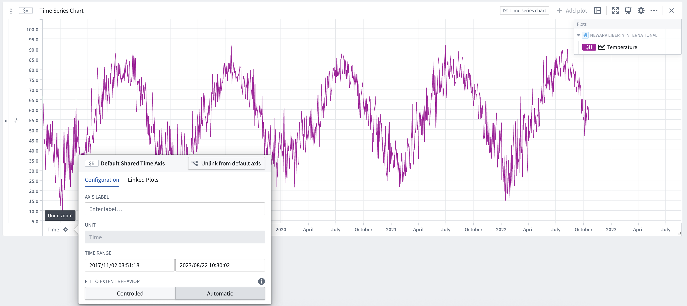

## Linking and sharing axes

By default, Quiver automatically links all time axes across time series charts. As a result, when you pan or zoom one chart's time axes, the zoom range of other time series charts in the canvas will update synchronously.

For value axes, by default, axes are unlinked across charts. When on the same chart, plots use the same y-axis if they share the same units. If you would like to force two plots to be on the same axis, you can configure a plot's **Unit options** to override its unit. Y-axes in the same chart can also be dragged and dropped on top of each other to merge them.

While Quiver defaults axes to the settings above, you can also manually link and unlink axes, and configure which plots are connected to which axes. To do this, after opening an axis's configuration window, select the **Linked Plots** tab. From here you can individually move plots between axes, regardless of which chart they are on.

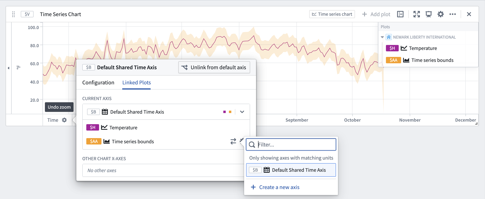

## Time and values ranges

Time and value ranges can be used to highlight and drill down on anomalies in the data, such as specific time periods when an issue was observed or the temperature range when equipment was operating in optimal capacity. Ranges can also be used to enrich the time series data by capturing context on specific time periods or value ranges, such as periods when equipment maintenance took place.

[Learn how](/docs/foundry/quiver/timeseries-ranges/) to configure and use time and value ranges.

## Date markers

Date markers are visual symbols (vertical lines) that help identify and distinguish individual data points in the plotted time series. The data points from time series plots that intersect with the date marker are shown in labels on the chart for each plot.

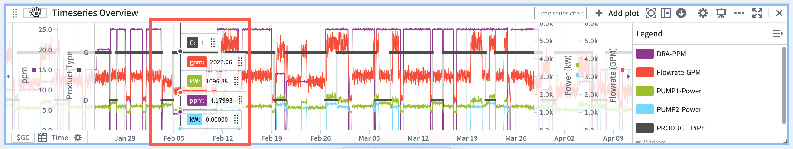

Date markers are controlled by [date/time parameters](/docs/foundry/quiver/card-datetime-parameter/). When adding a marker to a time series chart, a date/time parameter will automatically be added and used as input to the date marker.

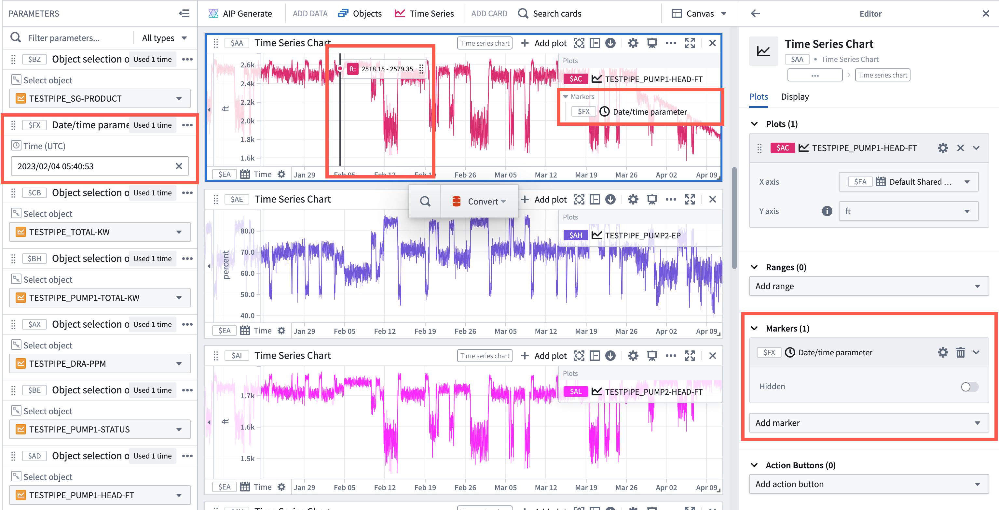

#### Add a marker

To add a marker to a time series chart:

1. Move the cursor over the chart to the desired time and select the chart.
2. Select **Save new date marker**.

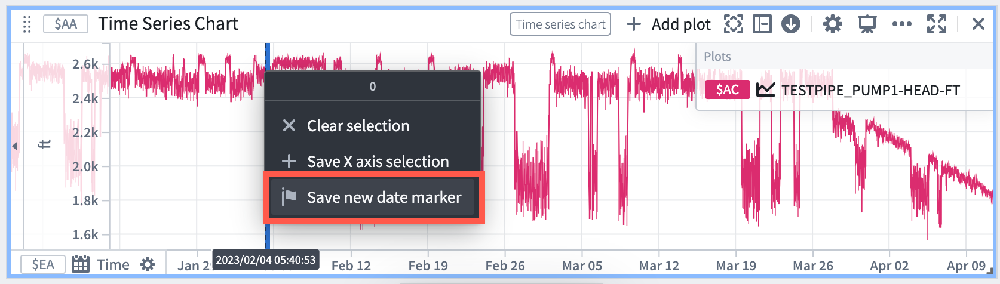

#### Delete a marker

To delete a marker from a time series chart, hover over the marker in the time series chart and select the **trash icon**.

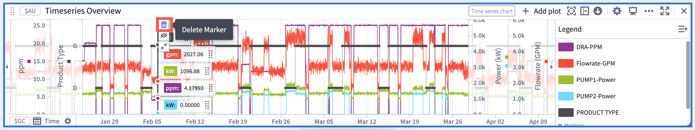

Alternatively, open the time series chart editor, navigate to the **Markers** section and select the **trash icon** next to the desired marker. 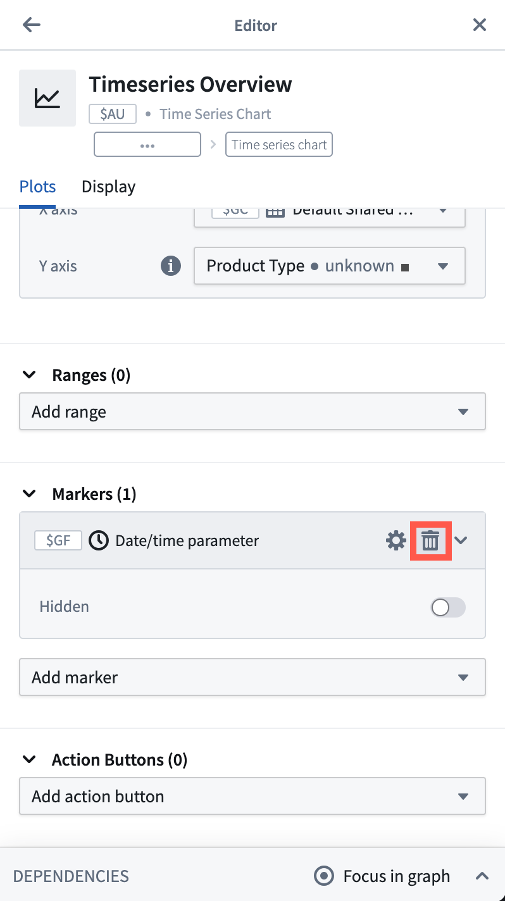

## Annotate ranges with action buttons

[Action buttons](/docs/foundry/quiver/card-action-button/) can be added to a time series chart to allow users to write data back to the Ontology. For example, users can create objects, update properties on existing objects, or modify object links.

[Learn how](/docs/foundry/quiver/cards-index-writeback/#invoke-ontology-actions-directly-from-a-time-series-chart) to expose Ontology Action buttons directly from the selection menu of a time series chart.

## Shade areas with bounded time series

You can use [bounded time series](/docs/foundry/quiver/analysis-data-model/) to shade areas of a time series chart. Bounded time series consist of an upper-bound series and a lower-bound series, and shades the area in between them.

Common bounded time series plots include:

* [Bollinger bands](/docs/foundry/quiver/card-bollinger-bands/): Plotting Bollinger bands over a rolling time window.
* [Time series bounds](/docs/foundry/quiver/card-time-series-bounds/): Plots the region bounded by two time series.

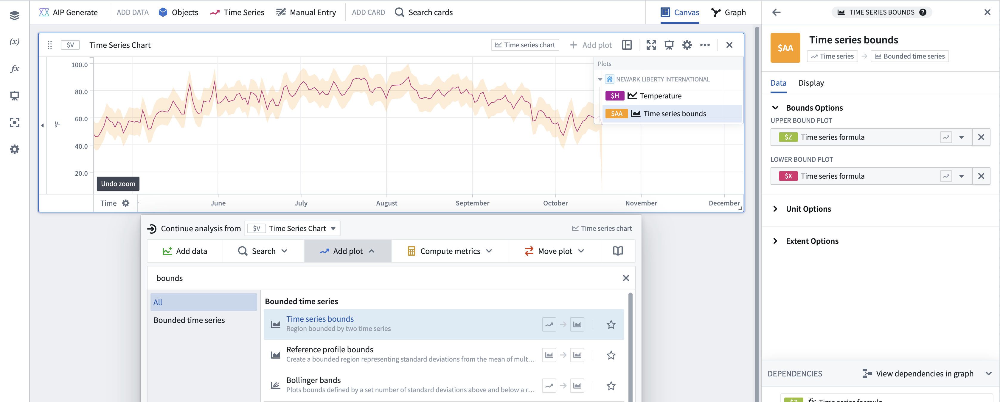
