<!-- source: https://palantir.com/docs/foundry/quiver/visual-functions-create/ · mirrored 2026-08-22 from Palantir Foundry docs -->

# Create and use visual functions

A [visual function](/docs/foundry/quiver/visual-functions-overview/) consists of one or more Quiver cards that load, combine, and transform data. Visual functions in Quiver do not impact the underlying data in Foundry or make any ontology change; rather, visual functions automatically apply a set of logical steps to data inputs within a Quiver analysis.

## Create a function

Add cards to your analysis to create the logical path of your function, including the inputs and output you would like to have in the function. Note that visualization and table cards cannot be part of a function.

In this example, we have created a KPI that returns the average caffeine of high quality batches in a tea plant. In the analysis this is computed for a specific plant object, and using a numeric parameter (to filter on high quality batches).

The logical steps include importing linked objects, filtering and aggregating, but the logic can be arbitrarily complex.

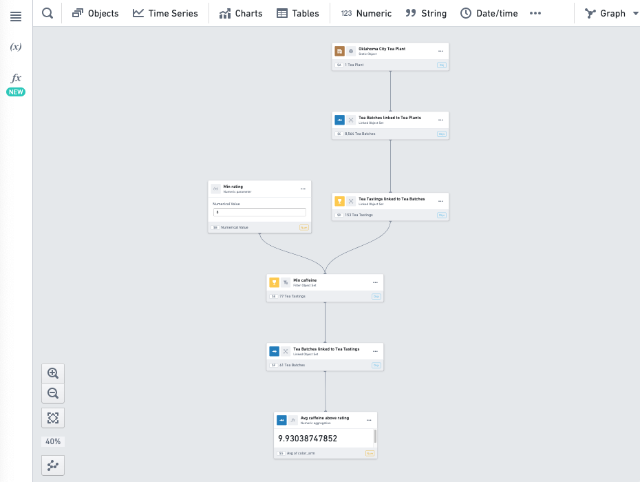

Open the functions panel by selecting the ***fx*** icon on the upper-left side of the screen and then select **Create new function**.

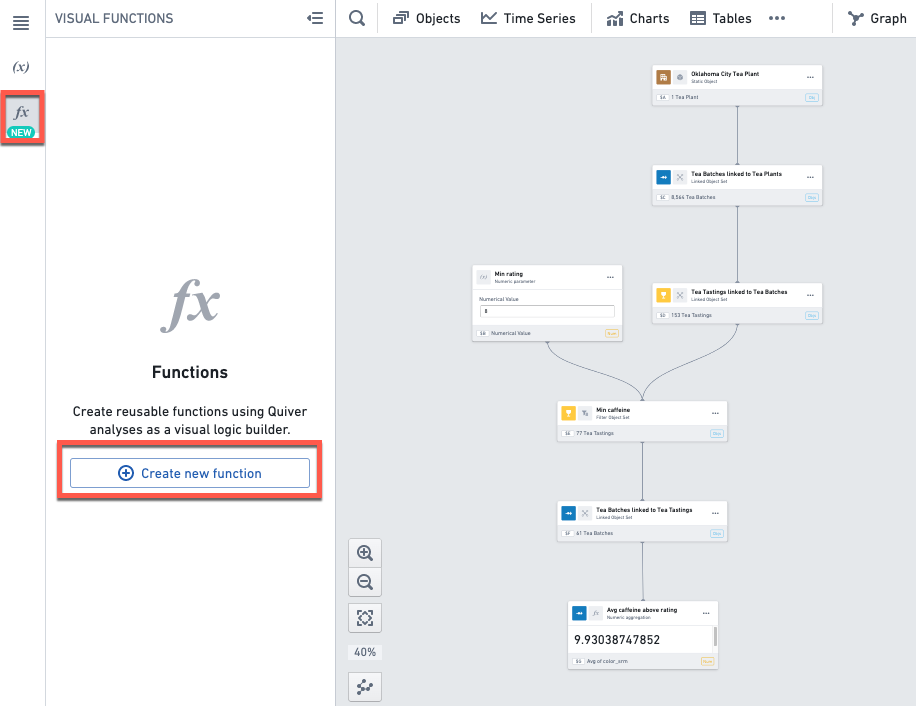

This will open the function editing mode and create a new unpublished function in the functions panel. The panel on the right-hand side is the function editor.

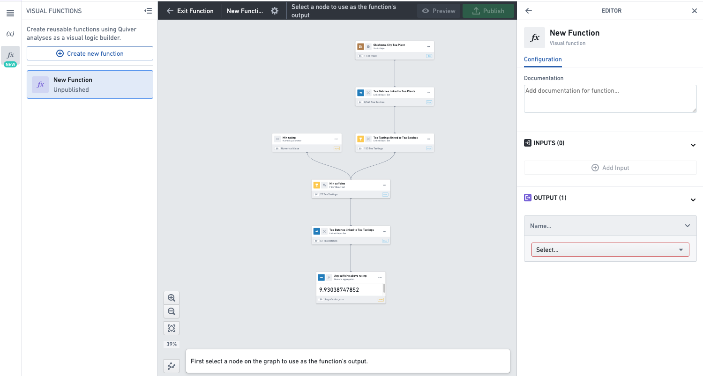

Select the card on the graph which contains the output of your function. In our example, this is the numeric metric card which contains our KPI.

Click **Set as output** at the bottom of the screen.

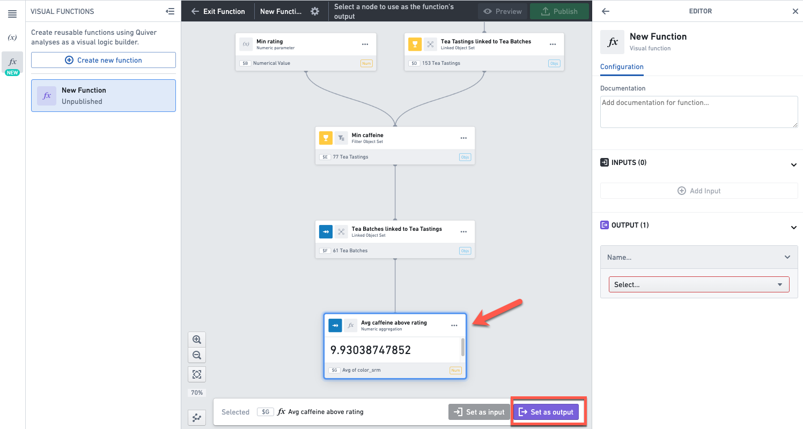

Alternatively, you can select the output by using the dropdown in the output section in the function editor on the right.

Once you have set the output, eligible inputs in the analysis graph will be highlighted in purple. This means you can select any of the highlighted cards as input to the function.

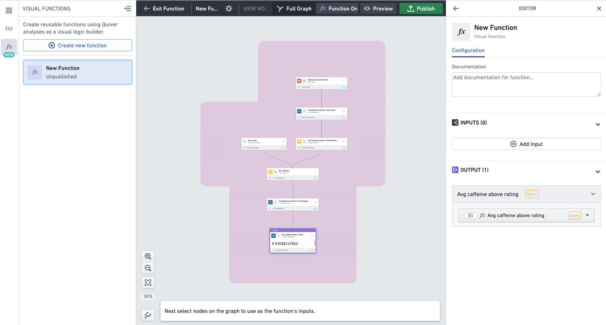

Select the cards you want to set as inputs, and for each click **Set as input**. Those are objects or metrics that you want to allow users of the function to configure.

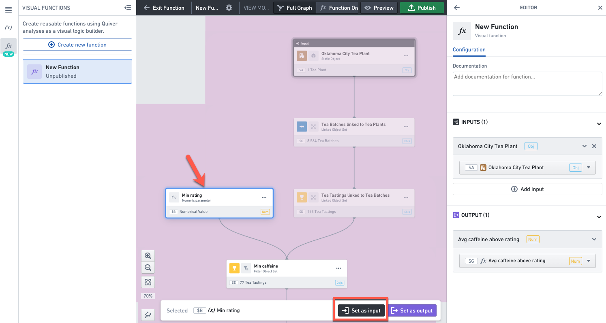

Alternatively, you can select the inputs by clicking **Add input** in the function editor on the right.

Give a name and description to the function.

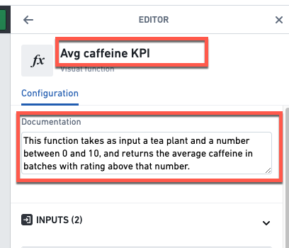

## Preview a function

To open the preview mode, click on the **Preview** button in the top header.

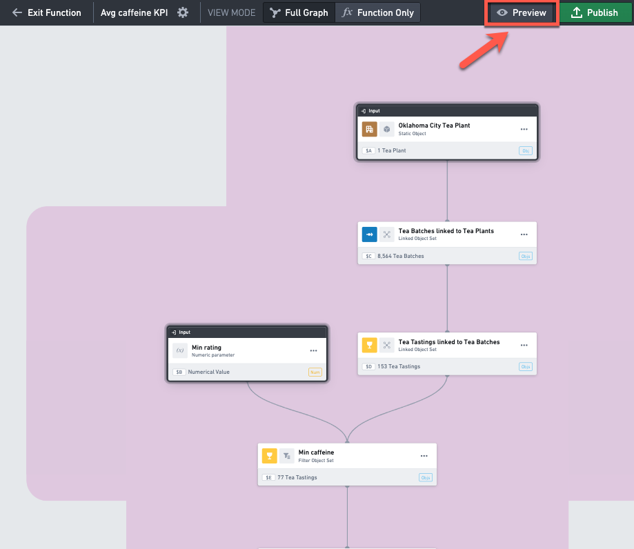

In preview mode, you can change the input values on the left side bar, and see how it impacts the output value of the function at the bottom left.

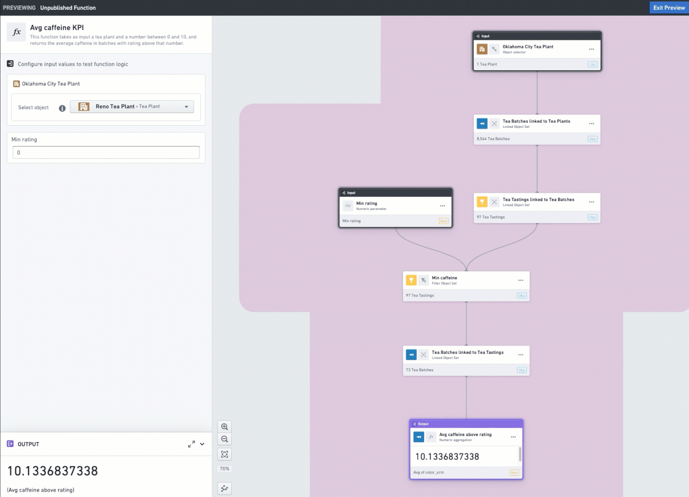

## Publish a function

Publish the function by clicking **Publish** in the top right corner. Make sure to publish in a folder that has the appropriate permissions so that other users can see and use the function.

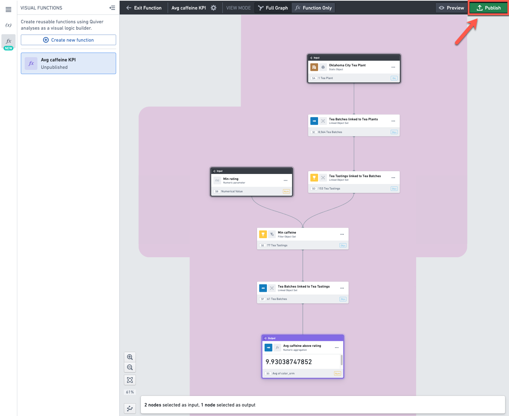

The function is now ready to be used.

## Use a function

From the top menu or using the [search bar](/docs/foundry/quiver/analysis-toolbars/#search-bar), select the **Cards** tab and search for cards that start with "visual function" and select one with the desired output type (For example, **Num** for a number).

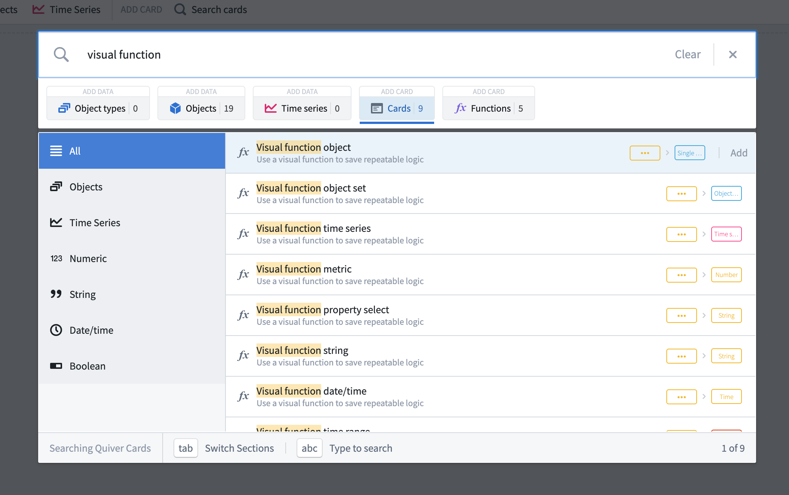

In the [search bar](/docs/foundry/quiver/analysis-toolbars/#search-bar), select the **Quiver functions** tab to see all the visual functions you have access to, regardless of where the functions were created. Select the one you want to use.

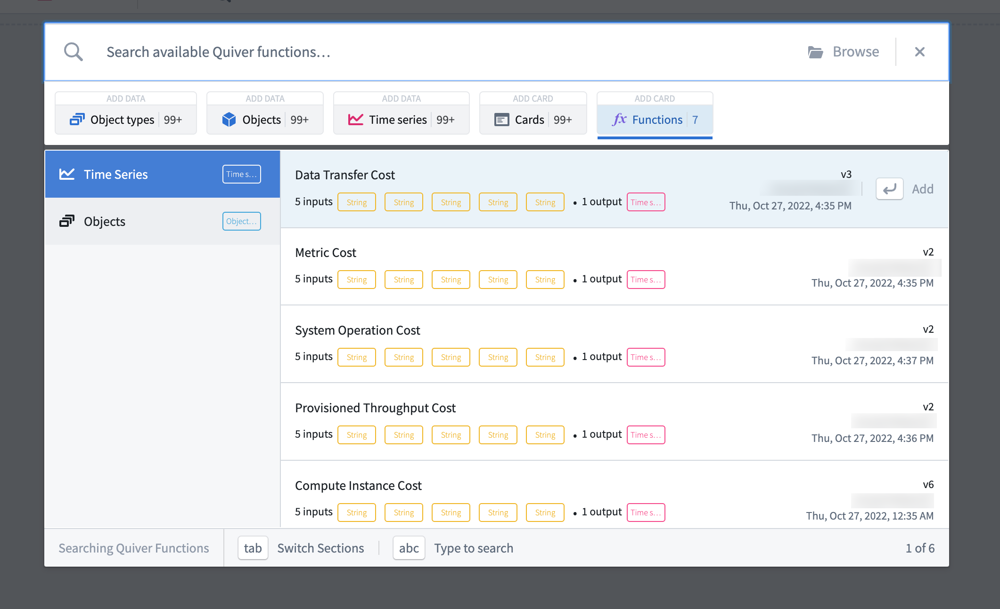

You can also use the **Code functions** tab in the search bar to find and add code functions that return object sets, categorical plots, values, or time series.

If the function was created in this analysis, you can also use the **+** button on the function in the functions panel.

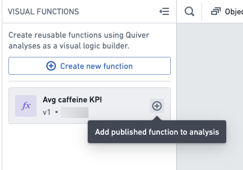

Once selected, a card will be added to your analysis. You can configure the function’s inputs in the editor panel. Once the inputs are configured, the card will return the result of the function.

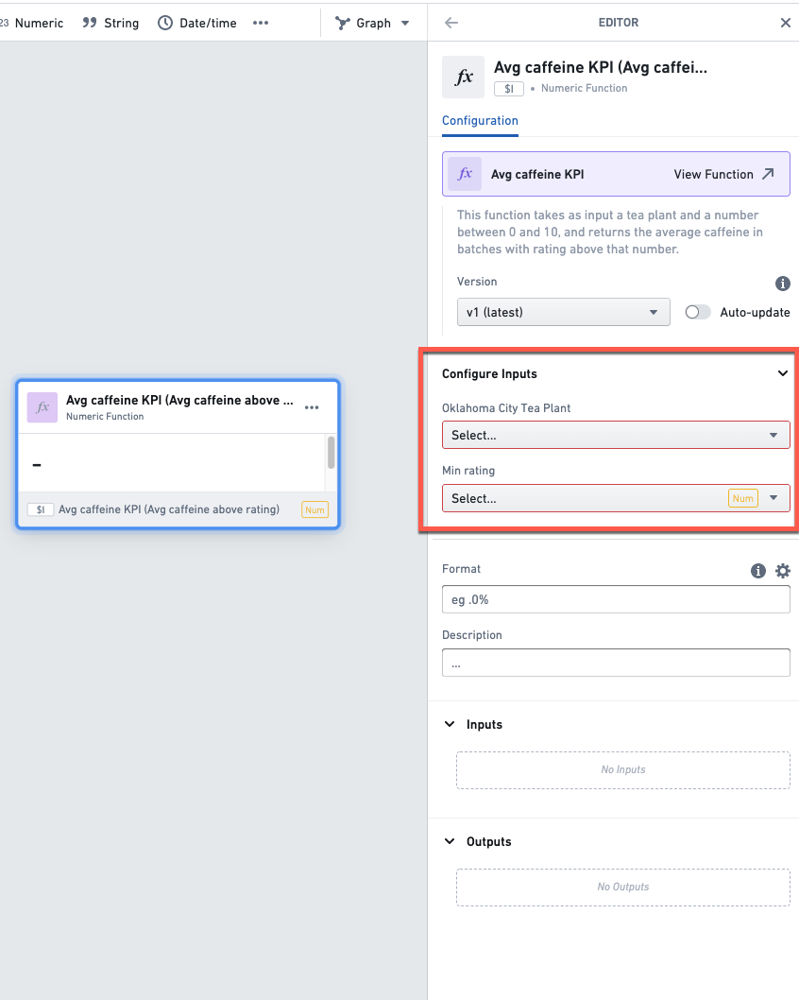

You can also use the editor panel to change the function’s version. If you want to make sure the card always returns the results from the latest version of the function, make sure to enable the auto-update toggle.

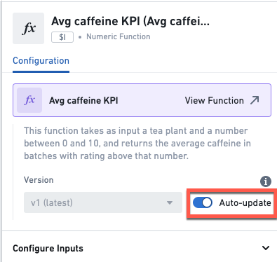

## Update a function

Once you have published a function, it is possible for users who have owner or editor access on the function to edit it. First, you need to open the function's editor panel.

If you are in the analysis where the function was created, open the functions panel and click on the function you want to edit.

If not, you can open the function directly by clicking on the function's file in Foundry. Then click the **Edit** button at the top.

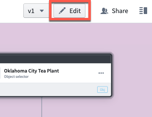

This will open the function in the analysis in which it was created.

Finally, click on the Settings icon () next to the function's name in the top header, to open the function editor panel.

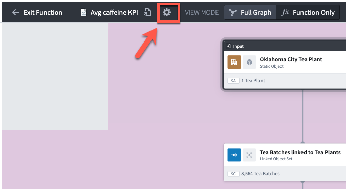

In the editor panel on the right-hand side, make the desired changes to the title, description, inputs and outputs. When ready click the **Republish** button.

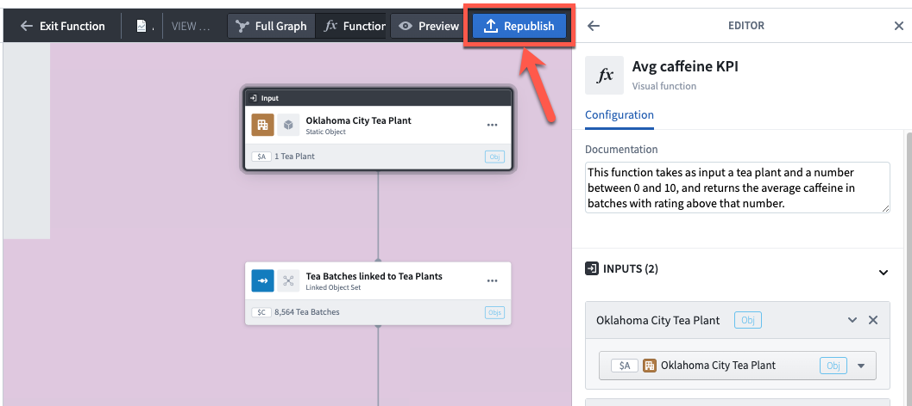

This will save a new version of the function. When using a function in an analysis, you can choose which version to apply. You can inspect the logic of previous versions by opening the function in a separate tab (clicking on the function's name in the top header ), and changing the version using the dropdown menu at the top right of the screen.

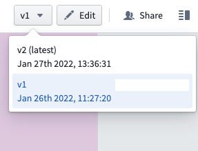

## Share a function

When you publish a function, the function will inherit the users permissions on the folder it has been saved in, meaning that users who have access to this folder will be able to use this function in their analysis.

Additionally, you can further share the function with users or groups of users by using the Share panel. To do so, open the function in a separate tab (clicking on the function's name in the top header ) and click on **Share** in the top right corner.

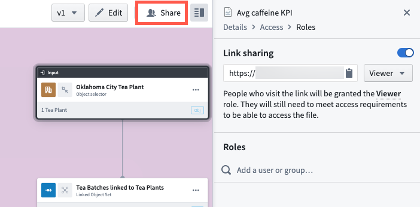

## FAQ

### How many outputs can a function have?

A function can have only one output.

### How many inputs can a function have?

A function can have as many inputs as desired.

### What output types are supported?

A function can return a single object, an object set, a time series or any type of metric.

Tables and visualizations (categorical or not) are not supported as outputs in functions.

### What is the difference between a visual function and a code function?

[Code functions](/docs/foundry/functions/overview/) are written in code (TypeScript) outside of Quiver, in a code repository. They can be used in Quiver analyses and in other applications such as Workshop.

Build visual functions in Quiver without writing code. Anyone with access to a visual function can use it in a Quiver analysis, but not outside Quiver.
