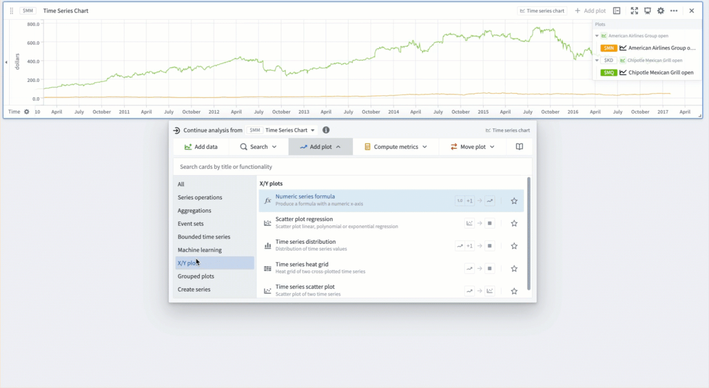
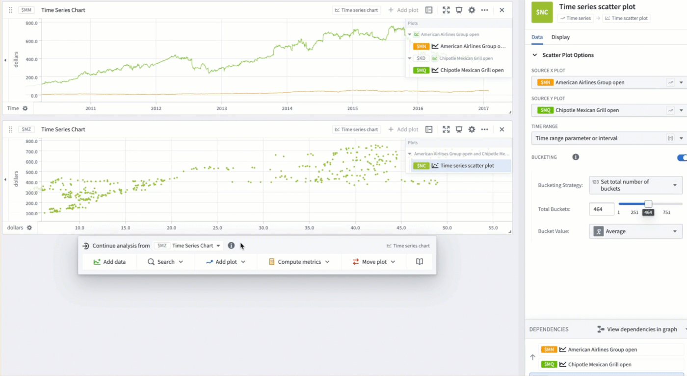
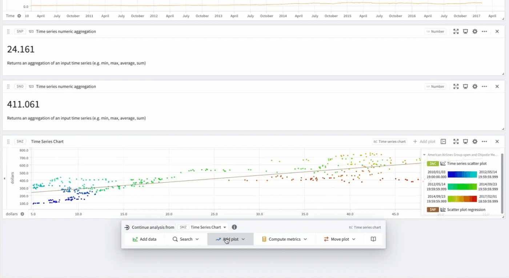
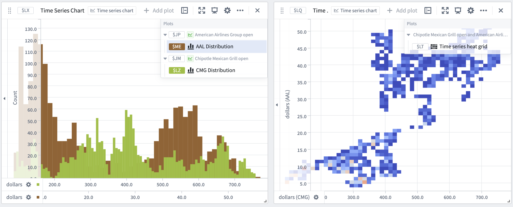

<!-- source: https://palantir.com/docs/foundry/quiver/xy-plots/ · mirrored 2026-08-18 from Palantir Foundry docs -->

# Time series X/Y plots

Quiver contains several cards for finding trends by comparing time series values between series or analyzing the frequency of values within the same series.

Quiver supports the following features:

* Creating [time series scatter plots](/docs/foundry/quiver/card-time-series-scatter-plot/) by plotting one time series against another.
* Performing [linear regression](/docs/foundry/quiver/card-scatter-plot-regression/) on a time series scatter plot to detect trends.
* Adding [numeric formulas](/docs/foundry/quiver/card-numeric-series-formula/) based on object properties to scatter plot charts.
* Creating an empirical [distribution](/docs/foundry/quiver/card-time-series-distribution/) of time series values over a given time period.
* Creating an empirical [distribution](/docs/foundry/quiver/card-time-series-heat-grid/) of two time series using a heat grid.

## Example workflow: Exploring trends in stock data

In this example, we will compare trends in prices between the CMG and AAL stocks. We start by [adding both series](/docs/foundry/quiver/timeseries-overview/) to our analysis.

### Adding a scatter plot

We would like to investigate whether these stock prices are correlated. To test this, we create a [scatter plot](/docs/foundry/quiver/card-time-series-scatter-plot/). For each bucketed timestamp, Quiver generates a point representing the prices of CMG and AAL:

1. Hover over the chart to open the next actions menu.
2. Select **Add plot** > **X/Y plots** > **Time series scatter plot**.
3. Input the AAL time series as the `Source X Plot` and the CMG time series as the `Source Y plot`.
4. Creating a scatter plot may be quite expensive for larger time series. Toggle on the **Bucketing** option and decrease the number of buckets if needed. This will result in fewer points being generated which can improve performance.

### Plotting a scatter plot regression

There appears to be a positive correlation between the prices of these two stocks. To quantify this, we can run a [scatter plot regression](/docs/foundry/quiver/card-scatter-plot-regression/):

1. Hover over the chart to open the next actions menu.
2. Change the card next to **Continue analysis from** in the menu header from `Time Series Chart` to the scatter plot from the previous section.
3. Select **Visualize** > **Scatter plot regression**.

While we choose to use linear regression for this example, you can also perform exponential and polynomial regression.

To extract the regression equation coefficients as an array for further analysis, you can add a [scatter plot regression coefficients](/docs/foundry/quiver/card-scatter-plot-regression-coefficients/) card from the scatter plot regression next actions menu.

We would now like to see whether time plays a role in this trend. For this, we can toggle on the **Color points by time** option in the **Display** tab of the scatter plot. Toggling on **Show color time legend** allows us to see at a glance what time ranges correspond to different colors.

### Marking plot averages

Finally, we would like to mark the average prices of CMG and AAL on the chart. To do this, we first use the [time series numeric aggregation](/docs/foundry/quiver/card-time-series-numeric-aggregation/) card to compute the averages. We can use the [numeric series formula](/docs/foundry/quiver/card-numeric-series-formula/) to draw a horizontal line depicting the average price of CMG:

1. Hover over the chart to open the next actions menu.
2. Select **Add plot** > **X/Y plots** > **Numeric series formula**.
3. Reference the metric card with the average stock price for CMG in the formula.
4. Change the `X Unit Label` and the `Y Unit Label` to *dollars* to match the labels on the scatter plot chart.
5. Drag the numeric series formula plot into the chart with the scatter plot and drag its x-axis into the existing chart x-axis to combine them.

Finally, we add a numeric marker on the chart to draw a vertical line depicting average price of AAL:

1. Select the gear icon in the chart header.
2. Scroll down to the **Markers** section and select **Add marker**. Input the metric card with the average stock price for AAL.

### Distributions and heat grids

Now, we would like to compare the distributions of the CMG and AAL stocks. We can do this using the [time series heat grid](/docs/foundry/quiver/card-time-series-heat-grid/) and [time series distribution](/docs/foundry/quiver/card-time-series-distribution/) cards. To configure the time series heat grid:

1. Hover over the chart to open the next actions menu.
2. Select **Add plot** > **X/Y plots** > **Time series heat grid**.
3. Input the AAL time series as the `Source X Plot` and the CMG time series as the `Source Y plot`.

By configuring the number of bins, we can adjust the granularity of the distributions. We can also change the color scheme of the heat grid from the **Display** tab.

To configure the time series distribution:

1. Hover over the chart to open the next actions menu.
2. Select **Add plot** > **X/Y plots** > **Time series distribution**.
3. Select the AAL time series as the `Source plot`.
4. Repeat steps 1 - 3 for the CMG time series.
5. To display the two distributions on the same chart, drag one distribution plot into the chart containing the other plot.

