<!-- source: https://palantir.com/docs/foundry/reports/add-content-from-other-apps/ · mirrored 2026-08-26 from Palantir Foundry docs -->

# Add content from other Foundry applications

## Add boards from Contour

If you want to present the results of a single Contour analysis, consider using Contour Dashboard Mode to create an interactive dashboard. [Learn more about Contour Dashboard mode.](/docs/foundry/contour/dashboards-overview/)

*Both editors and viewers of an analysis can add a board to a report.*

To add a Contour board to a report:

1. Open your Contour analysis.

2. Scroll to the appropriate board, then click the **More actions** button in the board header (`...`).   
   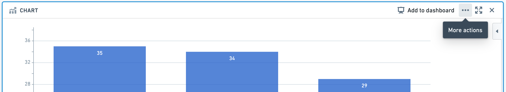   

3. Click **Send to report**, then select a report from the menu:

   * Select a recent report from the **Recent reports** section, or
   * Click **New report** to create a new report, or
   * Click **Browse files** to select a report from elsewhere in Foundry.   
     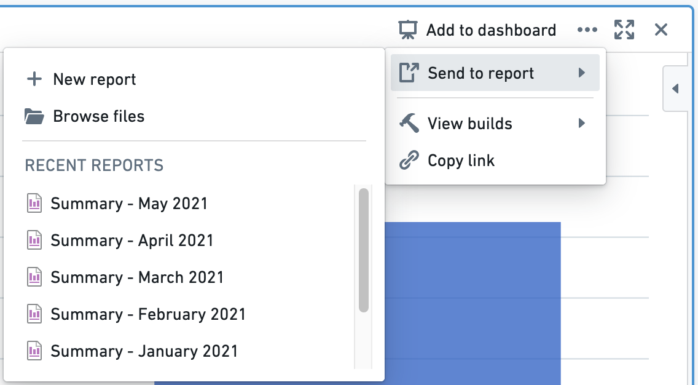   

   You should see a confirmation toast when the board has been successfully added to the report that you selected.   
   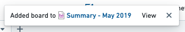   

## Add boards from Code Workbook

Reports are a great place to consolidate content from disparate workflows into one place.

:::callout{theme="neutral"}
To view and interact with Code Workbook visualizations in Reports, we recommend granting users Edit permissions on the underlying Code Workbook. Users with View permissions will only be able to see combinations of input data and parameters that have previously been computed by users with Edit permissions.
:::

To add a board from Code Workbook to a report:

1. Open your Code Workbook.

2. Find the appropriate board, then right-click in the board header, or click the **Actions** button (`···`).   
   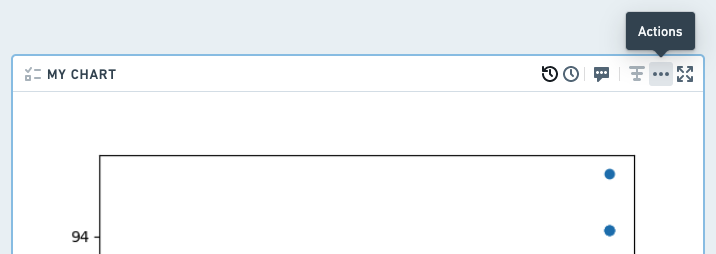   

3. Click **Add to Report**, then select a report from the menu:

   * Select a recent report from the **Recent reports** section, or
   * Click **New report** to create a new report, or
   * Click **Browse files** to select a report from elsewhere in Foundry.   
     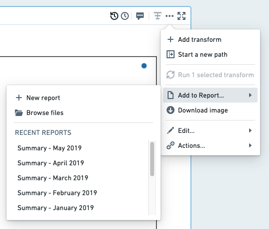   

   You should see a confirmation toast when the board has been successfully added to the report that you selected.   
   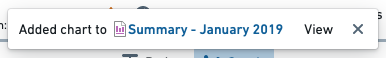   

## Add views from Object Explorer

Reports are a great place to consolidate content from disparate workflows into one place.

Object Explorer offers several types of views that can each be added to a report:

* **[Object](#add-an-object-view-to-a-report)** - a full view of a particular object
* **[Section](#add-an-object-view-section-to-a-report)** - a section within an object view
* **[List](#add-a-list-to-a-report)** - a tabular list of several object

## Add an object view to a report

To add an object view from Object Explorer to a report:

1. Open an object view in Object Explorer.

2. Click **Actions** in the top right of the page.

3. Click **Add to Report.**   
   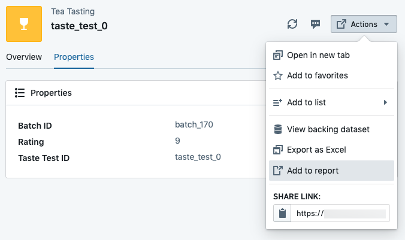   

4. Select a report from the menu.

   * Select a recent report from the **Recent reports** section, or
   * Click **New report** to create a new report, or
   * Click **Browse files** to select a report from elsewhere in Foundry.   
     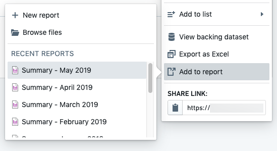   

## Add an object-view section to a report

:::callout{theme="neutral"}
This workflow may be disabled on some Foundry installations. Contact your Palantir representative if you do not see an “Add to Report” button as described below.
:::

To add an object view from Object Explorer to a report:

1. Open an object view in Object Explorer.

2. Scroll to the section you would like to add to a report, then click \*\*Add to Report \*\*in the section header.   
   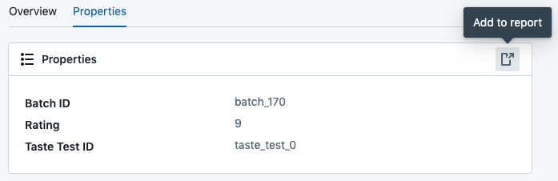   

3. Select a report from the menu.

   * Select a recent report from the **Recent reports** section, or
   * Click **New report** to create a new report, or
   * Click **Browse files** to select a report from elsewhere in Foundry.   
     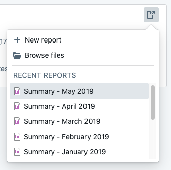   

## Add a list to a report

To add an object list from Object Explorer to a report:

1. Open a **List** in Object Explorer.

2. Click **Actions** in the application header bar.

3. Click **Add to Report** in the menu that appears.   
   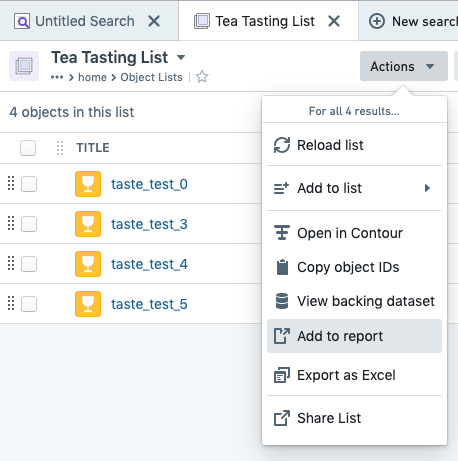   

4. Select a report from the menu:

   * Select a recent report from the **Recent reports** section, or
   * Click **New report** to create a new report, or
   * Click **Browse files** to select a report from elsewhere in Foundry.   
     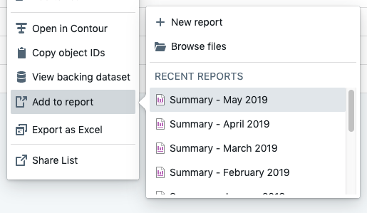   

In each workflow above, you should see a confirmation toast when the board has been successfully added to the report that you selected.

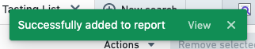

## Add spreadsheets from Fusion

Reports are a great place to consolidate content from disparate workflows into one place.

To add a Fusion spreadsheet to a report:

1. Open a spreadsheet in Fusion.

2. Click the **Document** tab.

3. Click **Add to Report**   
   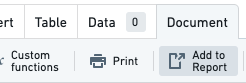   

4. Click **Choose report** in the sidebar that appears, and select a report from the menu.   
   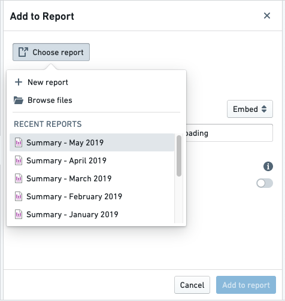   

5. Customize any other settings in the sidebar.

6. Click the blue **Add to report** button in the footer of the sidebar.   
   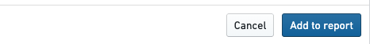   

   You should see a confirmation toast when the board has been successfully added to the report that you selected.   
   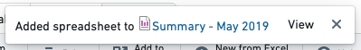   

If you navigate to the report, you will see your Fusion spreadsheet at the very bottom:

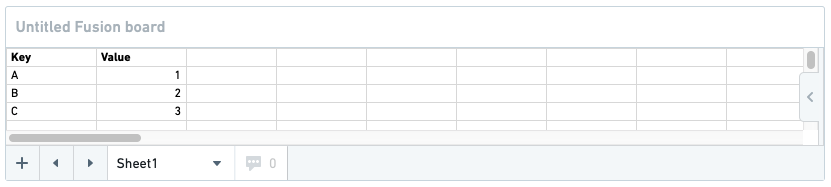

## Add charts from Quiver

Reports are a great place to consolidate content from disparate workflows into one place.

:::callout{theme="neutral"}
Reports only supports adding Quiver time series charts from Quiver v1. [Notepad](/docs/foundry/notepad/overview/) is the recommended tool for most new reporting use cases and supports embedding all Quiver charts.
:::

To add a Quiver chart to a report:

1. Open a Quiver analysis.

2. Find the appropriate board, then click **Add Chart to a Report** in the board's header.   
   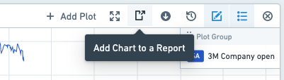   

3. Select a report from the menu that appears.   
   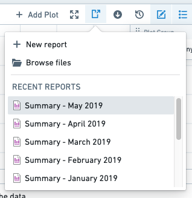   

4. Click **OK** in the “Confirm Save” dialog that appears.
   *Note:* This will also save your analysis.   
   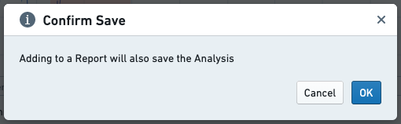   

   You should see a confirmation toast when the board has been successfully added to the report that you selected.   
   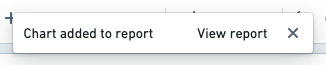   

If you navigate to the report, you will see your Quiver chart at the very bottom:

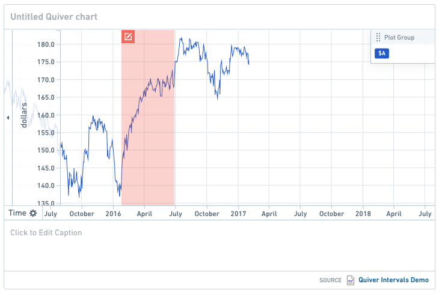
