<!-- source: https://palantir.com/docs/foundry/reports/add-content/ · mirrored 2026-08-26 from Palantir Foundry docs -->

# Add content

## Add text in a report

#### If the report is empty

1. *(If needed)* Switch to Editing mode.
2. *(If needed)* In the report body, click on the “Start typing, or” message.
3. Start typing.

#### If the report already has content

1. *(If needed)* Switch to Editing mode.
2. Move your cursor above or below any widget or row of widgets.
3. Click the `+` icon (Widget Creator) element that appears on hover.
4. Start typing.

## Edit text in a report

Report text can be freely formatted while the report is in Editing mode. In particular, text can be styled using both **[block styles](#block-styles)**, which affect how an entire text block is formatted, and **[inline styles](#inline-styles)**, which affect how a particular word or string of text is formatted.

### Inline styles

Use inline styles to emphasize snippets of text within a larger block.

#### Add inline styles

You can apply an inline style in two ways: via a keyboard shortcut or by selecting text and clicking the appropriate button in the formatting toolbar.

Reports supports the following inline styles:

|Style          |Keyboard shortcut |Button   |Example   |
|---            |---               |---      |---       |
|Bold           |Cmd + B           |         | 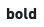         |
|Italic         |Cmd + I           |         | 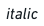         |
|Underline      |Cmd + U           |         | 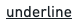         |
|Strike through |Cmd + Shift + X   |         |          |
|Code snippet   |Cmd + Shift + K   |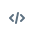         | 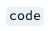         |
|Link           |Cmd + K           |         |          |
|Highlight      |None              |         | 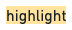         |

#### Remove inline styles

To remove a particular inline style, click its corresponding button in the toolbar or use the corresponding keyboard shortcut again.

### Block styles

Block styles affect how an entire text block is formatted, such as in [paragraphs](#paragraphs), [headings](#headings), [lists](#lists), [blockquotes](#blockquotes), or [code blocks](#code-block).

#### Paragraphs

Text blocks are formatted as paragraphs by default. Paragraphs have no special styling other than a bottom margin when other paragraphs follow. To style or restyle a block as a paragraph:

1. Select some text.
2. Click the block-style button in the inline toolbar.
3. Click **Paragraph** in the menu that appears.

#### Headings

You can add up to six levels of headings in a report. Headings add visual structure to your report, and they will also appear and indent content in the report **Outline**. To create a heading:

1. Type one of the following at the beginning of a line:
   * `#` for Heading 1 *(the most prominent)*
   * `##` for Heading 2
   * `###` for Heading 3
   * `####` for Heading 4
   * `######` for Heading 5
   * `#######` for Heading 6 *(the least prominent)*
2. Use the Spacebar key.

or

1. Select some text.
2. Click the block-style button in the inline toolbar.
3. Click **Header one** or **Header two** in the menu that appears.

:::callout{theme="neutral"}
Although Reports supports six levels of headings, only the first two are shown in the block-style menu.
:::

#### Lists

##### Numbered List

To add an ordered/numbered list to a report:

1. Type `1.` at the beginning of a line.
2. Use the Spacebar key.

or

1. Select some text.
2. Click the block-style button in the inline toolbar.
3. Click **Numbered list** in the menu that appears.

:::callout{theme="neutral"}
Numbered lists will always start at 1.
:::

##### Bulleted List

To add a bulleted (or “unordered”) list to a report:

1. Type `-` or `*` at the beginning of a line.
2. Use the Spacebar key.

or

1. Select some text.
2. Click the block-style button in the inline toolbar.
3. Click **Bulleted list** in the menu that appears.

Bulleted lists support up to 11 levels of indentation:

* To indent a bullet, use the Tab key.
* To de-indent a bullet, use the Shift+Tab keyboard shortcut.

##### Checklist

Use a **checklist** to track to-do's, follow-ups, and other action items. To create a checklist:

1. Type `[]` at the beginning of a line.
2. Use the Spacebar key.

or

1. Select some text.
2. Click the block-style button in the inline toolbar.
3. Click **Checklist** in the menu that appears.

#### Blockquotes

Use a **blockquote** to present quotations, excerpts, and other callouts. To create a blockquote:

1. Type `>`  at the beginning of a line.
2. Use the Spacebar key.

or

1. Select some text.
2. Click the block-style button in the inline toolbar.
3. Click **Blockquote** in the menu that appears.

#### Code block

Use a **code block** to present multiple lines of code or other fixed-width text. To create a code block:

1. Type \`\`\` (three back-ticks) at the beginning of a line.
2. Use the Enter key.

or

1. Select some text.
2. Click the block-style button in the inline toolbar.
3. Click **Code block** in the menu that appears.

### Other styling options

#### Horizontal line

To insert a horizontal line (also known as a horizontal rule or horizontal divider) into a report:

1. Type **`---`** on a blank line.
2. Use the Enter key.

#### Inline parameters

You may wish to display the current value of a parameter within a block of text ([learn more about parameters](#inline-parameters)). To do this:

1. Select some text.
2. Click the **Parameter** button in the formatting toolbar to create a new string parameter.
3. Merge the new parameter into the desired Contour parameter ([learn more about merging parameters](/docs/foundry/reports/merge-multiple-parameters/)).

The current value of the merged parameter will now appear inline when in Viewing mode (in Editing mode, only the name of the parameter will appear inline).

## Add a table to a report

Reports supports several different types of tables. **Table widgets** are the most basic: you can create them inside of a report to format manually inputted information into a simple row-and-column layout.

Table widgets are different from data-backed tables from other Palantir Foundry applications. For instance, a report can also contain:

* **[Contour Table boards](/docs/foundry/reports/add-content-from-other-apps/#add-boards-from-contour)** to see a preview of a particular dataset, or
* **[Fusion spreadsheets](/docs/foundry/reports/add-content-from-other-apps/#add-spreadsheets-from-fusion)** to show richly formatted tables optionally backed by a dataset.

### Steps

You can add a **Table widget** to a report at any time. Once you have added a table, you can type freely into its cells and also change its size (for details, see [Resize a table in a report](#resize-a-table-in-a-report)).

#### If the report is empty

1. *(If needed)* Switch to Editing mode.

2. Click the table icon next to the “Start typing, or” message.   
   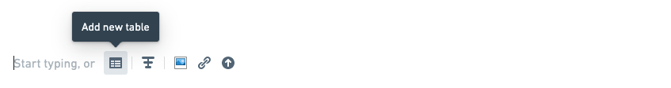   

3. Drag out the initial number of rows and columns the table should have.   
   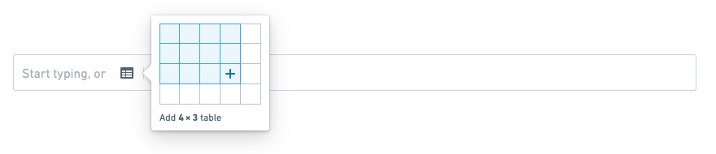   

4. Click to create the table.   
   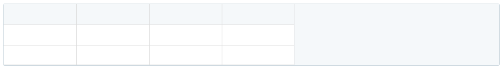   

#### If the report already has content

1. *(If needed)* Switch to Editing mode.

2. Move your cursor above or below any row of widgets, and click the **Widget Creator** element that appears on hover.   
   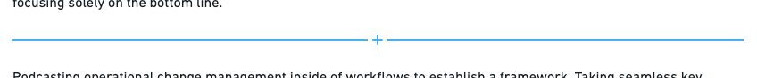   

3. Click the table icon next to the “Start typing, or” message.   
      

4. Drag out the initial number of rows and columns the table should have.   
      

5. Click to confirm.   
      

## Resize a table in a report

After adding a Table widget, you can easily add or remove rows and columns within it.

:::callout{theme="neutral"}
Table widgets always have a single header row. You can insert rows above any row except the header row.
:::

### Insert rows and columns

#### Insert a single row or column

Rows and columns can be inserted below or to the right of the currently focused cell.

1. *(If needed)* Switch to Editing mode.
2. *(If needed)* Click a cell to clear the current selection.
3. Right-click the cell.
4. Click any of the available insert options to insert a row or column where appropriate:

   * **Insert column left**
   * **Insert column right**
   * **Insert row above**
   * **Insert row below**

#### Insert multiple rows or columns

You can insert multiple rows or columns by selecting a larger region first. In particular, if there are *N* rows and *M* columns in your current selection, then you can insert *N* rows or *M* columns at once.

1. *(If needed)* Switch to Editing mode.
2. Select a region of *N* rows and/or *M* columns.
3. Right-click any cell in the selected region.
4. Click any of the available insert options to insert a row or column where appropriate:

   * **Insert *M* columns left**
   * **Insert *M* columns right**
   * **Insert *N* rows above**
   * **Insert *N* rows below**

### Delete rows and columns

#### Delete a single row or column

1. *(If needed)* Switch to Editing mode.
2. *(If needed)* Click a cell to clear the current selection.
3. Right-click the cell.
4. Click **Delete row** or **Delete column**.

#### Delete multiple rows or columns

You can delete multiple rows or columns by selecting a larger region first. In particular, if there are *N* rows and *M* columns in your current selection, then you can delete *N* rows or *M* columns at once.

:::callout{theme="neutral"}
Table widgets always have a single header row. The header row cannot be deleted.
:::

1. *(If needed)* Switch to Editing mode.
2. Select a region of *N* rows and/or *M* columns.
3. Right-click any cell in the selected region.
4. Click **Delete *N* rows** or **Delete *M* columns**.

### Change row and column sizes

#### Changing row height

Changing row heights is not supported at this time. Table widgets will display only a single line of text per cell.

#### Changing column width

1. *(If needed)* Switch to Editing mode.
2. Move your mouse cursor over the right edge of a column's header cell (the top-most cell in the column).
3. Click and drag to resize the column.
4. Release the mouse button to save.

## Add a new image or video to a report

There are three different ways to add images, video, and other resources to a report:

1. **Upload media directly to a report.** Media will be stored within the report resource and will appear with no additional background, footer, or borders. Only images and video can be uploaded in this way.
2. **Link to a resource in your files directory.** Resources already in Foundry can be added to a report, appearing with a footer linking back to the original resource. For more information on this approach, see [Link to a Foundry resource in a report](#link-to-a-foundry-resource-in-a-report) below.
3. **Upload a resource to Foundry within a report, then link to it.** This is an old and outdated approach for adding media to a report. It is functionally identical to linking to a resource, though it has been superseded by **1** above.

### Upload to a report

You can upload images and videos directly to a report. With this approach, the images and videos will be “bundled” with the report, so they will not appear as separate files in Foundry.

To upload an image or video directly to a report:

1. *(If needed)* Switch to Editing mode.

2. Click the image icon next to the “Start typing, or” message.   
   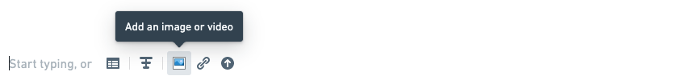   

3. Click the drop zone to choose a file, or drag a file from your computer into the drop zone.   
   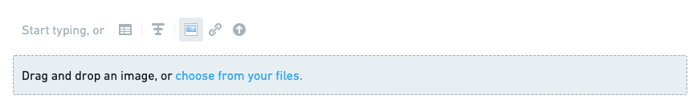   

### Upload to Foundry and link from a report \[Deprecated]

:::callout{theme="warning"}
This approach has been deprecated in favor of the approach described above in **[Upload to a report](#upload-to-a-report)**.
:::

From a report, you can also upload an image and video to Foundry as a standalone resource—and then link to the resource (as described in [Link to a Foundry resource in a report](#link-to-a-foundry-resource-in-a-report) below).

To do this:

1. *(If needed)* Switch to Editing mode.

2. Click the upload icon next to the “Start typing, or” message.   
      

3. Select a file to upload via the dialog that appears.   
   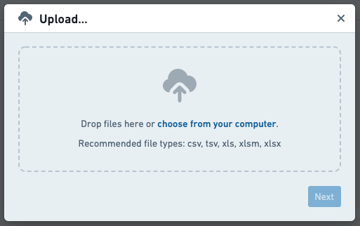   

4. Click **Next** to upload the image to Foundry. The resource should then appear in the report automatically (if it does not appear, you can link to it as described in [Link to a Foundry resource in a report](#link-to-a-foundry-resource-in-a-report)).   
   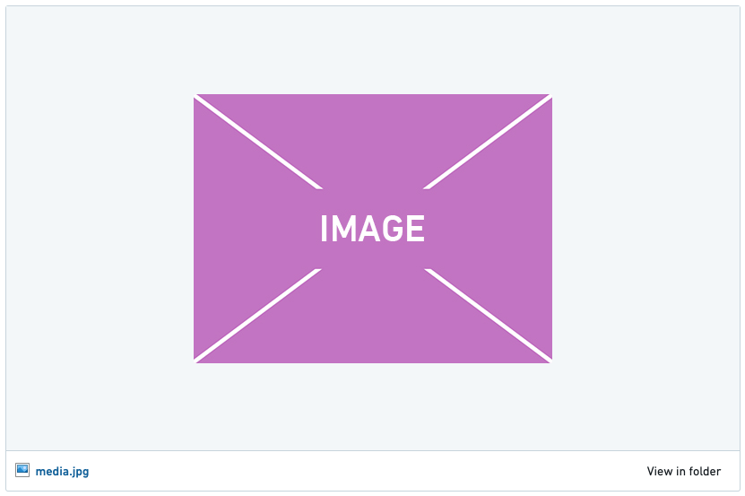   

### Supported file types

#### Images

The following file types are supported for direct image uploads:

* BMP
* GIF
* JPG/JPEG
* PNG

#### Videos

The following file types are supported for direct video uploads:

* MOV
* MP4

## Link to a Foundry resource in a report

You can link to images, videos, and other types of files from your files directory in Foundry. Linked images and videos will appear in the report, whereas other resource types like data sets, PDFs, or DOCX documents will appear as minimal representations (a clickable resource title with a corresponding resource icon).

To link to an image, video, or other resource from your files directory in Foundry:

1. *(If needed)* Switch to Editing mode.

2. Click the link icon next to the “Start typing, or” message.   
      

3. Select a resource from the dialog that appears.   
   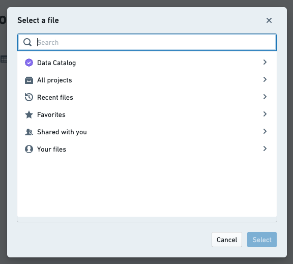   

4. Click **Select** in the dialog to link the resource in your report. Some examples:
   * A Foundry dataset:   
        

   * A Contour analysis:   
        

   * Another report:   
        

   * An image:   
     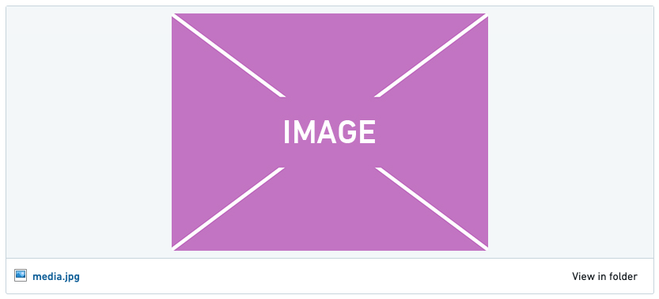   

   * A video:   
        

## Duplicate content within a report

You can make a copy of any widget contained in a report (e.g. a block of text, an image, or a Contour table).

To duplicate a widget:

1. *(If needed)* Switch to Editing mode.
2. Click the gear icon in the top-right corner of the widget you would like to duplicate.   
   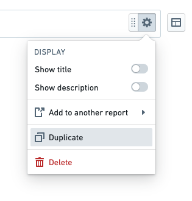   

The duplicated widget will be added immediately beneath the original widget.

## Add content from another report

You can copy any widget (e.g. a block of text, an image, a Contour table) from one report to another, provided you have edit permissions on both reports.

To copy a widget from one report to another:

1. *(If needed)* Switch to Editing mode.

2. Click the gear icon in the top-right corner of the widget you would like to duplicate.

3. Click **Add to another report** in the menu that appears.   
   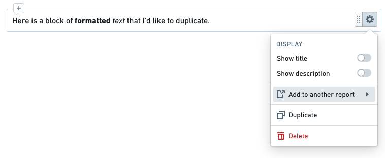   

4. Select a report from the menu that appears.   
   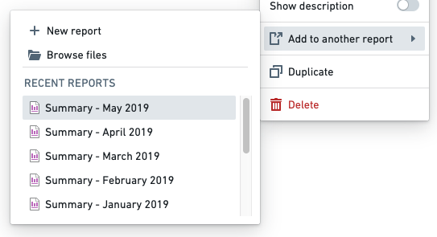   

   You should see a confirmation toast when the widget has been successfully copied to the report that you selected.   
   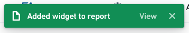   

The copied widget will be added to the bottom of the other report.
