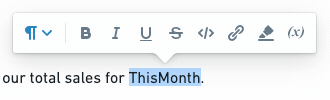
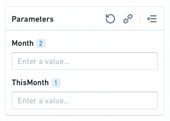
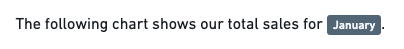
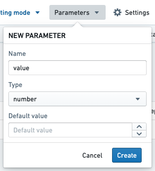
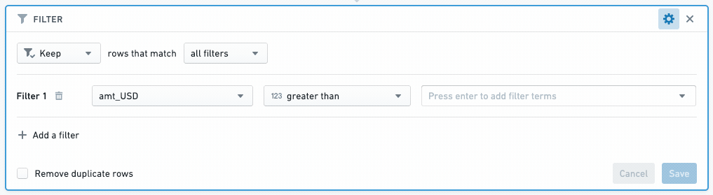
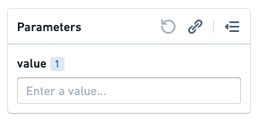

<!-- source: https://palantir.com/docs/foundry/reports/add-parameter/ · mirrored 2026-08-26 from Palantir Foundry docs -->

# Add a parameter

## Add a parameter within text

You may wish to display the current value of a parameter within a block of text. To do this:

1. Select some text.

2. Click the **Parameter** button in the formatting toolbar to create a new string parameter.   
      

3. Merge the new parameter into the desired Contour parameter. [Learn more about merging parameters.](/docs/foundry/reports/merge-multiple-parameters/)   
      

The current value of the merged parameter will now appear inline when in Viewing mode (in Editing mode, only the name of the parameter will appear inline).   
   

## Add a parameter from another Foundry application

Some Foundry Applications allow editors to add parameters to control how data is filtered in a visualization. Adding a widget from another Foundry application to a report (e.g., [Add boards from Contour](/docs/foundry/reports/add-content-from-other-apps/)) will also automatically add any parameters that affect it.

### Add a parameter from Contour

[Learn more about parameters in Contour.](/docs/foundry/reports/parameters-overview/)

1. Open a Contour analysis, then create or open a path.

2. *(If needed)* Switch to Editing mode.

3. Create a parameter (e.g. a String parameter named `$value`).   
      

4. Add a [Filter board](/docs/foundry/contour/boards-filter/) to your path. Enter the name of a column to filter, then enter the name of your parameter (e.g. `$value`) in the value field.   
      

5. Create a visualization board *(e.g. Chart, Table)* below the Filter board.

6. Add the visualization board to a report (see: [Add boards from Contour](/docs/foundry/reports/add-content-from-other-apps/))).

The visualization board will appear in the report you selected, and the `$value` parameter will appear in the report's parameters bar. Changing the parameter value will now change the data that appears in the visualization board.

### Add a parameter from Code Workbook

Like Contour, Code Workbook allows editors to filter data with parameters.

* See [Using Parameters with Templates](/docs/foundry/code-workbook/templates-overview/) to learn how to create parameters in Code Workbook
* See [Add boards from Code Workbook](/docs/foundry/reports/add-content-from-other-apps/) to learn how to add parameterized content from Code Workbook to a report.
