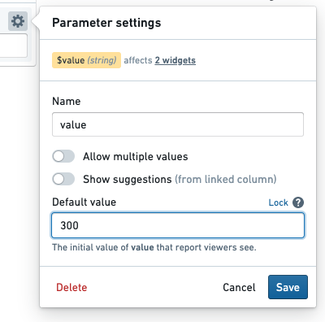
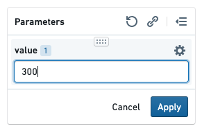
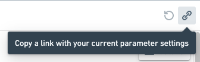

<!-- source: https://palantir.com/docs/foundry/reports/change-parameter/ · mirrored 2026-08-26 from Palantir Foundry docs -->

# Change a parameter

## Set a default parameter value in Editing mode

A parameter's **default value** is the value that the parameter will use when the report is opened.

To edit a default value for a parameter:

1. *(If needed)* Switch to Editing mode.
2. Select the gear icon next to the parameter in the parameters bar.
3. Find the **Default value** field, and change the value as needed.
4. Select **Save**.   
      

The new default value will replace any current value that might have been in place.

## Change parameter values in Viewing mode

Changing a parameter value via the parameter's input field will override the default value with a **current value**. Current parameter values will generally revert to default values when the report is opened again. However, current values *can* be retained by storing them in the URL; see more below.

To change parameter values in a report:

1. *(If needed)* Switch to Viewing mode.
2. Input a new value for one or more parameters in the parameters bar.
3. Click **Apply** to reload the report with the new parameter value. (This ensures that you can change multiple parameter values before beginning a potentially expensive reload.)   
      

### Helpful tips

#### Keep current parameter values when re-opening a report

You may wish to refresh a report and keep the current values in place—or share a report with non-default values in place. Reports allows for this by appending parameter values to the report URL as you modify them.

For example, if you open a report, it may have the following URL initially:

`/workspace/report/ri.report.main.report.123`

Changing the value of a `Month` parameter to `July` (overwriting the parameter's default value) will automatically update the URL to the following:

`/workspace/report/ri.report.main.report.123?Month=July`

Refreshing the page will now pre-populate the value `July` for the month parameter. This can save time when refreshing large, complex reports.

:::callout{theme="success"}
To show default parameter values when a report is opened, remove any trailing parameters in the URL (e.g. `?Month=July&Year=2019`).
:::

#### Copy a link with current parameter values

Click the **Copy Link** button in the parameters bar to copy a shareable URL that will load the report with exactly the same parameter values that you are currently using.

