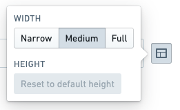
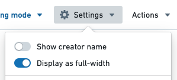

<!-- source: https://palantir.com/docs/foundry/reports/change-width-and-height/ · mirrored 2026-08-26 from Palantir Foundry docs -->

# Change width and height

Content in Foundry Reports is organized into rows, where each row contains at least one widget.

## Change row width

Each row can be displayed with one of three widths:

* **Full.** Fills 100% of the page width. Compresses down to `600px` at minimum.
* **Medium.** Displays at a width of `820px`. Compresses down to `540px` at minimum.
* **Narrow.** Displays at a width of `570px`. Compresses down to `540px` at minimum.

:::callout{theme="success"}
By default, widgets added to a report will appear on their own row with a Medium width.
:::

### Change the width of one row

To change the width of a row:

1. *(If needed)* Switch to Editing mode.

2. Click the **Layout Control** button on the right side of the row.   
      

3. Select a new width (**Narrow**, **Medium**, or **Full**).   
      

### Change the width of all content

As a convenience, you can also change all content in the report to **Full** width with one interaction. See [Display all content in a report as full width](#display-all-content-in-a-report-as-full-width) for details.

## Change row height

Most widgets can also be resized vertically. This is useful for resizing charts and other content that stretches to fill its available container.

### Auto height

Widgets will size themselves automatically by default, choosing a reasonable initial height that varies according to the type of widget.

Some widgets will always adjust their size automatically to fit their content and cannot be manually resized. In particular:

* Text widgets (see [Add text in a report](/docs/foundry/reports/add-content/#add-text-in-a-report))
* Table widgets (see [Add a table to a report](/docs/foundry/reports/add-content/#add-a-table-to-a-report)), and
* Images and videos (see [Add a new image or video to a report](/docs/foundry/reports/add-content/#add-a-new-image-or-video-to-a-report)).

Widgets added from other Foundry applications can typically be vertically resized.

### Fixed height

Where permitted, changing the height of a row will “fix” the height to a value that may be different from the automatic value.

To manually adjust the height of a row:

1. *(If needed)* Switch to Editing mode.

2. Move your mouse cursor over the bottom edge of a widget or row of widgets.

3. Click and hold on the **Row Resize** button if one appears.   
      

4. Drag up or down to resize, then release the mouse.   
      

## Display all content in a report as full width

You can resize individual rows in a report if needed (see [Change the width and height of a row](#change-the-width-of-one-row)). However, some reports may contain many widgets that all look optimal at **Full** width. As a convenience, you can change all content in the report to **Full** width with one interaction.

To change an entire report to **Full** width:

1. *(If needed)* Switch to Editing mode.

2. Click the **Settings button** in the application header.   
      

3. Click **Display as full-width** in the menu that appears.   
      
