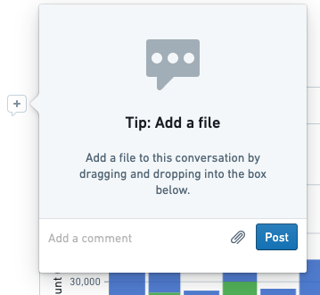
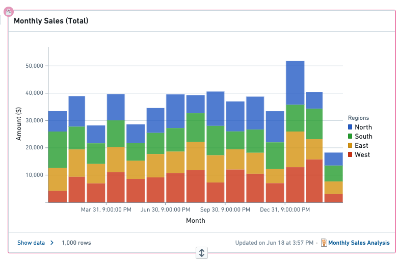

<!-- source: https://palantir.com/docs/foundry/reports/collaborate/ · mirrored 2026-08-26 from Palantir Foundry docs -->

# Collaborate on a report

Reports offers limited capabilities for multiple users to work collaboratively on a single report.

## Commenting on widgets

Editors and viewers can leave comments on any widget in a report—including text blocks, tables, media, content from other Foundry applications, and more.

## Updating after adding and removing widgets

When one user adds or removes widgets in a report, the report will update immediately to reflect the change (or occasionally after a few seconds). Other report editors and viewers will see the change without having to reload the report.

## Locking while editing

Only one user is permitted to edit a widget at a given time. While one report editor is editing a particular widget, other report editors will see that the widget is “locked” and will not be able to edit it. This aims to prevent users from overwriting each other's work.

