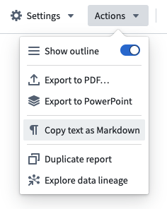

<!-- source: https://palantir.com/docs/foundry/reports/copy-as-markdown/ · mirrored 2026-08-26 from Palantir Foundry docs -->

# Copy a report's text as markdown

Report text can be quickly exported as Markdown.

**Markdown** is a markup language for styling text (such as bold, italic, underline) and specifying document structure (headings, tables, lists, and so on). Markdown is an open-source standard compatible with many applications inside and outside of Palantir Foundry.

Since Markdown syntax is plain text, the Reports application “exports” Markdown by copying the text to your clipboard for you to paste elsewhere. Only text and Table widgets (see [Add a table to a report](/docs/foundry/reports/add-content/#add-a-table-to-a-report)) will be included in a report's Markdown representation.

To export a report as Markdown:

1. Click **Actions** in the top right of the application.
2. Click **Copy text as Markdown**.   
      
