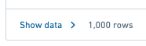

<!-- source: https://palantir.com/docs/foundry/reports/export-board-to-csv/ · mirrored 2026-08-26 from Palantir Foundry docs -->

# Export a board's data to CSV

:::callout{theme="warning"}
The Foundry Reports application has been sunsetted, and legacy reports are now available as view-only. Refer to the [Reports sunset announcement](/docs/foundry/reports/overview/) for further details.
:::

The data that populates a Contour board can be exported to CSV

1. Click **Show data** in the Contour board’s footer   
      

2. Click **Export to CSV** in the header of the table fly out   
      

3. Wait for the export to complete
