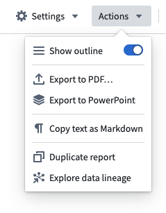
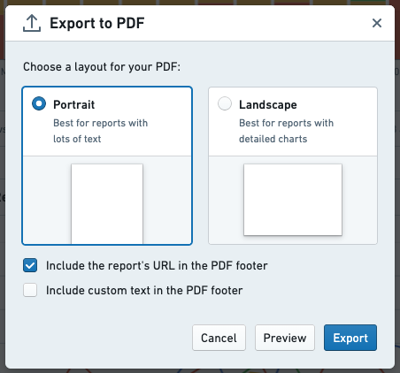
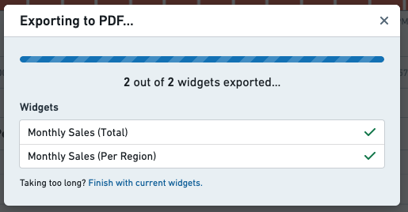
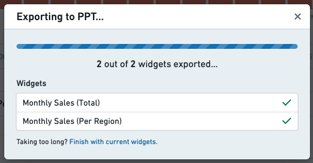

<!-- source: https://palantir.com/docs/foundry/reports/export-to-pdf-ppt/ · mirrored 2026-08-26 from Palantir Foundry docs -->

# Export to PDF or PowerPoint

Reports can be exported to a PDF or PPT.

:::callout{theme="neutral"}
When exported, Contour table boards will attempt to display up to 1000 rows and all columns in the dataset, which can span many pages. Use the preview functionality to see what your report will look like when exported.
:::

## PDF

1. Click **Actions**

2. Click **Export to PDF...**   
      

3. Choose a layout for your PDF, either **Portrait** or **Landscape**   
      

4. *(If needed)* Enable relevant check boxes in order to customize the exported PDF’s footer.

5. Preview your export by clicking the **Preview** button.

6. Wait for the export to complete   
      

## PPT

1. Click **Actions**
2. Click **Export to PowerPoint**
3. Wait for the export to complete   
      
