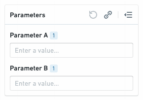
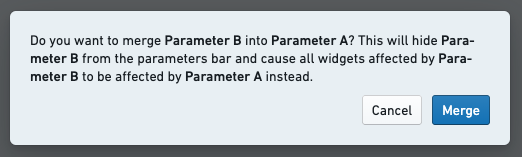
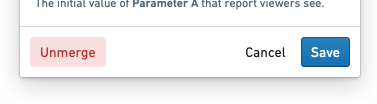
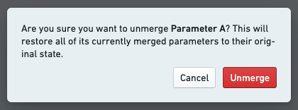

<!-- source: https://palantir.com/docs/foundry/reports/merge-multiple-parameters/ · mirrored 2026-08-26 from Palantir Foundry docs -->

# Merge multiple parameters

Reports lets you merge many parameters into one. This is useful for reducing the number of parameters in a report, particularly in the following cases:

* **If two parameters are conceptually identical.** For example, if you added two Contour widgets from different analyses, they may each have pulled a separate **Year** parameter into the report. Merging the two Year parameters together allows report viewers to control both Contour widgets with one parameter value.
* **To display a parameter value in a text block.** In some cases, you may want to display the current parameter value in a block of text. Merging a parameter created within a text block (as described in [Add a parameter within text](/docs/foundry/reports/add-parameter/#add-a-parameter-within-text)) into a parameter imported from another application (as described in [Add a parameter from another Foundry application](/docs/foundry/reports/add-parameter/#add-a-parameter-from-another-foundry-application)) will accomplish this. *This workflow is also discussed in [Edit text in a report](/docs/foundry/reports/add-content/#inline-parameters)*.)

Concretely, merging Parameter A into Parameter B will:

* Hide Parameter A from the parameters bar, and
* Cause all widgets that were affected by Parameter A to be affected by Parameter B instead.

## Merge parameters

To merge one parameter (“Parameter A”) into another (“Parameter B”):

1. *(If needed)* Switch to Editing mode.

2. Click and hold the drag handle for Parameter A.

3. Drag Parameter A onto Parameter B, still holding the mouse button, until you see a “Merge” icon and label.

4. Release the mouse button.   
      

5. Click **Merge** in the confirmation dialog.   
      

Merged parameters will show a small “merged” label beneath the parameter's title.

:::callout{theme="neutral"}
You can merge as many parameters as you want into a single parameter.
:::

## Unmerge parameters

Merging is a reversible operation. Unmerging a parameter will:

* Display all linked parameters in the parameters bar again, and
* Cause all widgets that were originally affected by the linked parameters to be controlled by those parameters again (instead of the “master” merged parameter).

:::callout{theme="neutral"}
Unmerging a merged parameter will cause all of its linked parameters to be unmerged, not just the most recently linked parameter.
:::

To unmerge a parameter:

1. *(If needed)* Switch to Editing mode.

2. Click the gear icon next to the merged parameter in the parameters bar.

3. Click **Unmerge** in the Parameter Settings menu.   
      

4. Click **Unmerge** in the confirmation dialog.   
      
