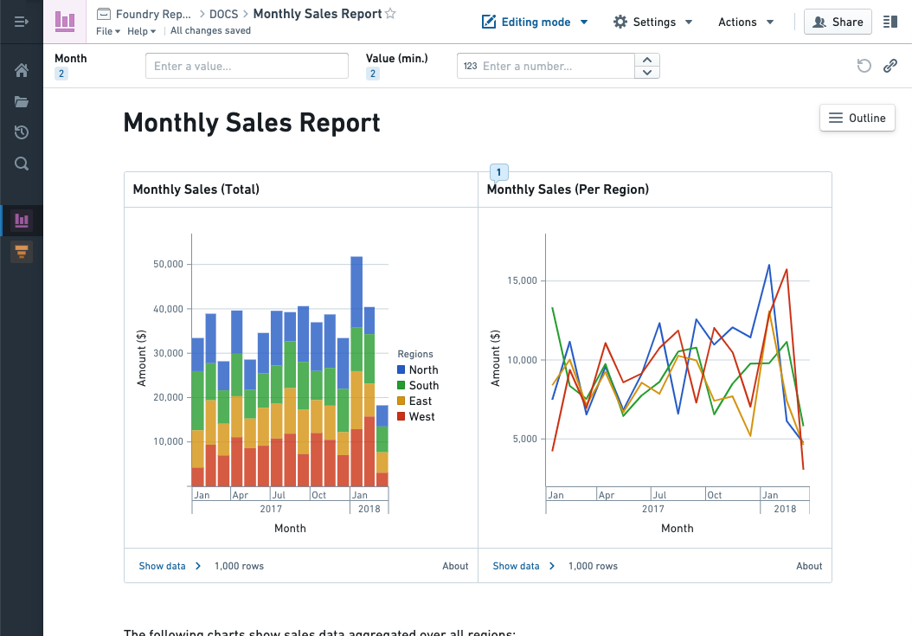
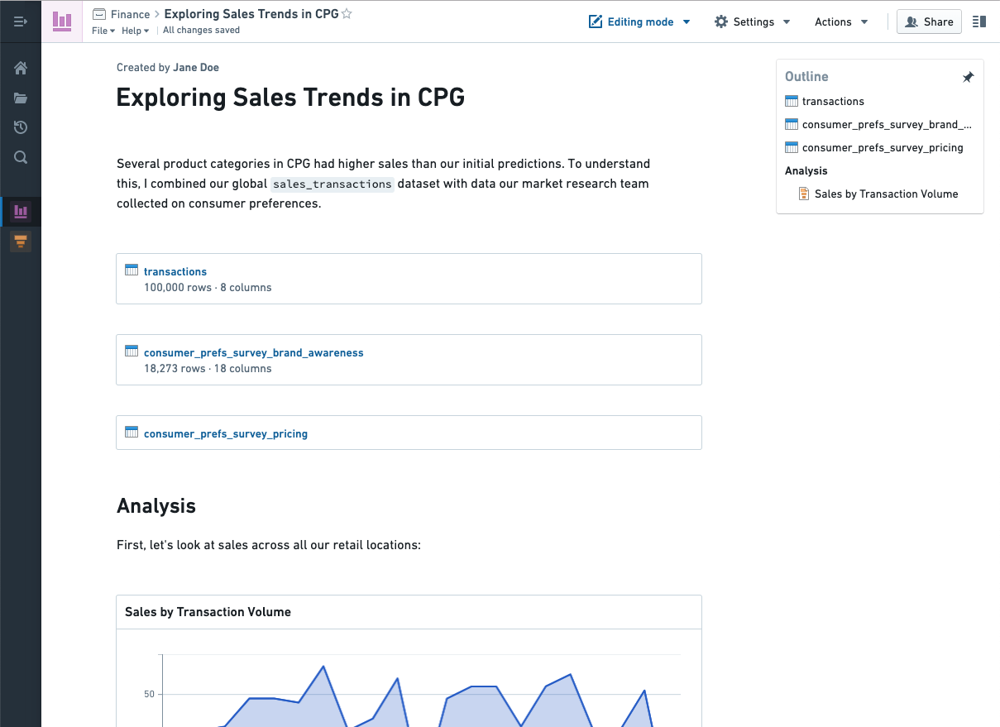

<!-- source: https://palantir.com/docs/foundry/reports/overview/ · mirrored 2026-08-26 from Palantir Foundry docs -->

# Reports \[Sunset]

:::callout{theme="warning" title="Sunset"}
Reports is in the [sunset](/docs/foundry/platform-overview/development-life-cycle/) phase of development and will be deprecated at a future date. Full support remains available. Previously saved reports are still read-only available and do not need to be converted or transitioned to new formats unless they need to be edited. We recommend migrating your workflows to other applications and tools to serve your use case purposes:

* **Contour dashboards** for content driven by a Contour analysis. Contour dashboards provide improved interactivity over Reports, with features like chart-to-chart filtering, and an easy drag-and-drop interface to build a dashboard while iterating on an analysis. Contour dashboards support fullscreen presentation view and PDF exports. [Get started with Contour dashboards.](/docs/foundry/contour/dashboards-overview/)
* **Quiver dashboards** for content that is driven by a Quiver analysis. [Get started with Quiver dashboards.](/docs/foundry/quiver/dashboards-overview/)
* **Notepad** for cross-product reporting. With Notepad, you can create both live-updating and static ("point-in-time") documents, annotate documents, share documents in-platform, and export documents as PDFs. [Get started with Notepad.](/docs/foundry/notepad/overview/)

Contact Palantir Support if you require additional help migrating your workflows.
:::

The Foundry Reports tool enables you to:

* Display charts and visualizations from Foundry’s analysis tools, like [Contour](/docs/foundry/contour/overview/), [Quiver](/docs/foundry/quiver/overview/), [Fusion](/docs/foundry/fusion/overview/), and [Object Explorer](/docs/foundry/object-explorer/overview/).
* Automatically update charts with the latest Foundry data.
* Create **live** reports (with charts that automatically update to the latest Foundry data), or **static** reports of historical data.
* Write rich text descriptions about your analysis work.
* Collaborate with peers through comments on the report.
* Include more context by attaching images or other files.

## Examples

Make a dashboard to keep your team updated on this month’s sales metrics. Use parameters to view sales by geographic region, product category, and date.

Document the results of an investigation. Share the step-by-step process you used to analyze a dataset, and pair interactive charts with your written observations.

