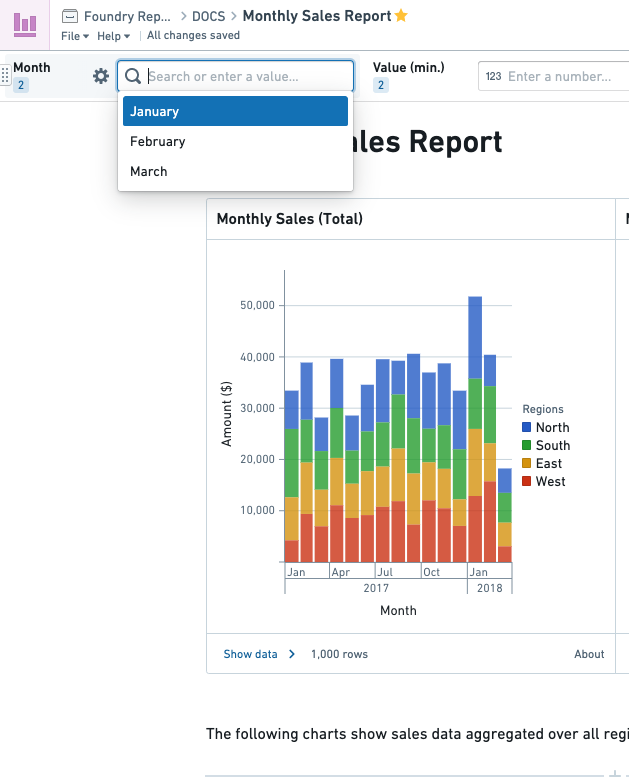
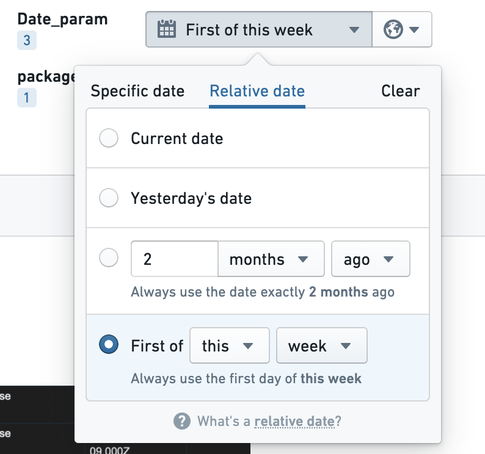

<!-- source: https://palantir.com/docs/foundry/reports/parameters-overview/ · mirrored 2026-08-26 from Palantir Foundry docs -->

# Parameters

A **parameter** allows report viewers to easily switch what category of the data they are seeing. For example:

* If you are writing a report showing **monthly sales** data, you might create a **Month** parameter so your report viewers can view data for January, February, or March. Charts using the Month parameter will update whenever the user selects a different month.

* If you are writing a report with charts relevant to a specific **geographic region**, you might want a **Region** parameter so report viewers can see how the charts differ when looking at North America, Europe, or Asia.

### Types of parameters

There are several different types of parameters:

* **Numbers**
* **Strings**, such as “North America”, “Europe”, “Asia”.
* **Dates**. For a report showing sales data over time, you might create Start Date and End Date parameters, so report viewers can decide what date range to view information about. You can also set a relative date to give the parameter a value relative to when someone is viewing the report. Note that the first day of a week refers to the Sunday of that week.

