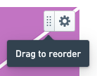

<!-- source: https://palantir.com/docs/foundry/reports/reorder-widgets/ · mirrored 2026-08-26 from Palantir Foundry docs -->

# Reorder widgets

You can drag widgets to reorder content in a report. To reorder content:

1. Find the target widget's drag handle in its upper-right corner:   
      

2. Click and hold the drag handle to begin dragging the widget.

3. Drag the widget to another place in the report. You can drop it above or below any other widget, or you can drop it next to another widget to put multiple pieces of content on the same row:   
      

4. Release the mouse button to drop the widget.   
      

:::callout{theme="success"}
A row can contain up to six widgets.
:::
